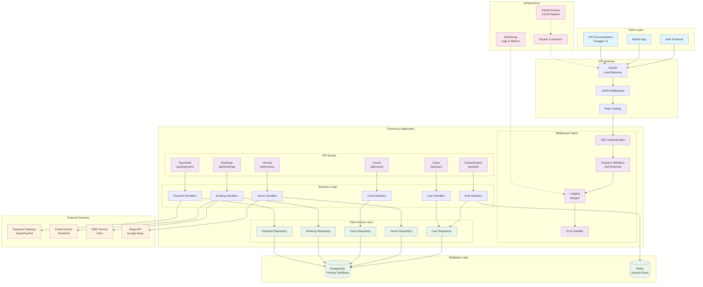

# 🏗️ Padel World Club API - Architecture Documentation

## Overview

The Padel World Club API is built with a modern, scalable architecture following functional programming principles and clean architecture patterns. This document provides a comprehensive overview of the system architecture, components, and data flow.

## 🎯 Architecture Principles

- **Functional Programming**: Pure functions, immutability, and composition
- **Clean Architecture**: Clear separation of concerns and dependency inversion
- **Domain-Driven Design**: Business logic organized around domain entities
- **API-First**: OpenAPI specification drives development
- **Test-Driven Development**: Comprehensive testing at all layers

## 🏛️ System Architecture



## 📋 Layer Descriptions

### 🖥️ Client Layer
- **Web Frontend**: React/Vue.js web application
- **Mobile App**: React Native or native mobile applications
- **API Documentation**: Interactive Swagger UI for developers

### 🌐 API Gateway
- **NGINX**: Load balancing and reverse proxy
- **CORS**: Cross-origin resource sharing configuration
- **Rate Limiting**: API protection against abuse

### ⚡ Express.js Application

#### Middleware Stack
- **JWT Authentication**: Token-based security
- **Request Validation**: Zod schema validation
- **Logging**: Request/response logging with Morgan
- **Error Handler**: Centralized error processing

#### API Routes
- **Authentication**: User registration, login, token management
- **Users**: User profile and management
- **Venues**: Padel facility management
- **Courts**: Court specifications and availability
- **Bookings**: Reservation system
- **Payments**: Payment processing and refunds

#### Business Logic
Functional handlers implementing business rules for each domain.

#### Data Access Layer
Repository pattern for database operations with clean interfaces.

### 🗄️ Database Layer
- **PostgreSQL**: Primary relational database
- **Redis**: Session storage and caching

### 🔌 External Services
- **Payment Gateway**: Stripe/PayPal integration
- **Email Service**: SendGrid for notifications
- **SMS Service**: Twilio for mobile notifications
- **Maps API**: Google Maps for location services

### 🏗️ Infrastructure
- **Docker**: Containerized deployment
- **CI/CD**: GitHub Actions automation
- **Monitoring**: Logging and metrics collection

## 🔄 Data Flow

### 1. Request Flow
```
Client → NGINX → CORS → Rate Limiting → JWT Auth → Validation → Route Handler → Business Logic → Repository → Database
```

### 2. Response Flow
```
Database → Repository → Business Logic → Response Formatter → Error Handler → Client
```

### 3. Authentication Flow
```
Login Request → Auth Handler → User Repository → Password Verification → JWT Generation → Redis Session → Response
```

## 🛡️ Security Architecture

### Authentication & Authorization
- **JWT Tokens**: Stateless authentication
- **Role-based Access**: Admin, Manager, Player roles
- **Session Management**: Redis-based session storage
- **Password Security**: Bcrypt hashing

### Data Protection
- **Input Validation**: Zod schema validation
- **SQL Injection Prevention**: Parameterized queries
- **XSS Protection**: Input sanitization
- **CORS Configuration**: Controlled cross-origin access

## 📊 Database Schema

### Core Entities
- **Users**: Authentication and profile data
- **Venues**: Padel facility information
- **Courts**: Individual court specifications
- **Bookings**: Reservation and scheduling
- **Payments**: Financial transactions

### Relationships
- Users can manage multiple Venues (Manager role)
- Venues contain multiple Courts
- Courts have multiple Bookings
- Bookings are associated with Payments
- Users can participate in multiple Bookings

## 🚀 Scalability Considerations

### Horizontal Scaling
- Stateless API design
- Database connection pooling
- Redis session clustering
- Load balancer configuration

### Performance Optimization
- Database indexing strategy
- Query optimization
- Caching layers
- Async processing for notifications

### Monitoring & Observability
- Request/response logging
- Performance metrics
- Error tracking
- Health checks

## 🧪 Testing Strategy

### Test Pyramid
- **Unit Tests**: Individual function testing
- **Integration Tests**: Database and API integration
- **E2E Tests**: Complete user workflow testing

### Test Coverage
- 85%+ code coverage requirement
- Critical path testing
- Error scenario testing
- Performance testing

## 📈 Future Enhancements

### Planned Features
- Real-time notifications (WebSocket)
- Advanced analytics dashboard
- Mobile push notifications
- Multi-language support
- Advanced booking algorithms

### Technical Improvements
- Microservices migration
- Event-driven architecture
- GraphQL API layer
- Advanced caching strategies

---

This architecture provides a solid foundation for a scalable, maintainable, and secure padel management platform.
