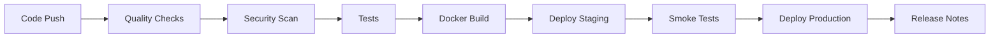
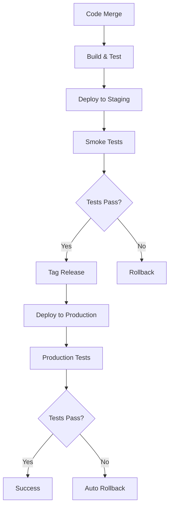

# 🚀 CI/CD Guide - Padel World Club API

This guide covers the complete Continuous Integration and Continuous Deployment pipeline for the Padel World Club API, including automated testing, security scanning, and deployment strategies.

## 📋 Overview

Our CI/CD pipeline is built with GitHub Actions and provides:

- **Automated Testing**: Unit, Integration, and E2E tests
- **Code Quality**: TypeScript, ESLint, and Prettier checks
- **Security Scanning**: Vulnerability detection and secret scanning
- **Docker Build**: Multi-stage containerization
- **Automated Deployment**: Staging and production deployments
- **Release Management**: Semantic versioning and changelog generation

## 🔄 Pipeline Architecture



## 🧪 Workflows

### 1. Main CI Pipeline (`.github/workflows/ci.yml`)

**Triggers**: Push to `main`/`develop`, Pull Requests

**Jobs**:
- **Quality**: TypeScript, ESLint, Prettier
- **Security**: Trivy, dependency audit
- **Test**: Unit, Integration, E2E tests with PostgreSQL/Redis
- **Docker**: Build and test Docker images
- **Performance**: Load testing (main branch only)

**Example**:
```yaml
name: 🚀 CI/CD Pipeline
on:
  push:
    branches: [ main, develop ]
  pull_request:
    branches: [ main, develop ]
```

### 2. Deployment Pipeline (`.github/workflows/deploy.yml`)

**Triggers**: Push to `main`, Tags, Manual dispatch

**Jobs**:
- **Deploy Staging**: Automatic deployment to staging
- **Deploy Production**: Tag-based production deployment
- **Release**: GitHub release creation

**Features**:
- Blue-green deployment strategy
- Automatic rollback on failure
- Smoke tests after deployment
- Slack notifications

### 3. Security Analysis (`.github/workflows/codeql.yml`)

**Triggers**: Push, PR, Schedule (weekly), Manual

**Jobs**:
- **CodeQL**: GitHub's semantic code analysis
- **Security Scan**: Trivy, Snyk vulnerability scanning
- **Secret Scan**: TruffleHog, GitLeaks
- **SAST**: Static Application Security Testing
- **License Compliance**: FOSSA license checking

### 4. Dependency Management (`.github/workflows/dependencies.yml`)

**Triggers**: Schedule (weekly), Manual

**Jobs**:
- **Update Dependencies**: Automated dependency updates
- **Security Audit**: Weekly vulnerability checks
- **License Check**: License compliance monitoring
- **Outdated Report**: Dependency freshness tracking

### 5. Release Management (`.github/workflows/release.yml`)

**Triggers**: Push to `main`, Manual dispatch

**Jobs**:
- **Semantic Release**: Automated versioning
- **Manual Release**: Manual version control
- **Release Notes**: Comprehensive changelog generation

## 🔧 Configuration

### Environment Variables

#### Repository Secrets
```bash
# AWS Deployment
AWS_ACCESS_KEY_ID=your_aws_access_key
AWS_SECRET_ACCESS_KEY=your_aws_secret_key
AWS_REGION=us-east-1

# Database
DATABASE_URL_SECRET_ARN=arn:aws:secretsmanager:...
JWT_SECRET_ARN=arn:aws:secretsmanager:...

# ECS Configuration
ECS_TASK_ROLE_ARN=arn:aws:iam::...
ECS_EXECUTION_ROLE_ARN=arn:aws:iam::...

# Notifications
SLACK_WEBHOOK_URL=https://hooks.slack.com/...

# Security Tools
SNYK_TOKEN=your_snyk_token
SEMGREP_APP_TOKEN=your_semgrep_token
FOSSA_API_KEY=your_fossa_key

# Monitoring
GRAFANA_API_KEY=your_grafana_key
```

#### Environment-Specific Variables
```bash
# Staging
STAGING_CLUSTER=padel-staging-cluster
STAGING_SERVICE=padel-api-staging

# Production
PRODUCTION_CLUSTER=padel-production-cluster
PRODUCTION_SERVICE=padel-api-production
```

### Semantic Release Configuration

The `.releaserc.json` file configures automated versioning:

```json
{
  "branches": ["main", {"name": "develop", "prerelease": "beta"}],
  "plugins": [
    "@semantic-release/commit-analyzer",
    "@semantic-release/release-notes-generator",
    "@semantic-release/changelog",
    "@semantic-release/git",
    "@semantic-release/github"
  ]
}
```

**Commit Convention**:
- `feat:` → Minor version bump
- `fix:` → Patch version bump
- `BREAKING CHANGE:` → Major version bump

## 🧪 Testing Strategy

### Test Matrix

| Test Type | Environment | Database | Coverage |
|-----------|-------------|----------|----------|
| Unit | Node.js 18 | Mock | Functions |
| Integration | Node.js 18 + PostgreSQL | Real | API endpoints |
| E2E | Docker | Real | User workflows |
| Performance | Docker | Real | Load testing |

### Test Commands
```bash
# Local testing
bun run test:unit        # Unit tests
bun run test:integration # Integration tests
bun run test:e2e         # End-to-end tests
bun run test:coverage    # Coverage report

# CI testing
bun run test             # All tests
bun run test:performance # Load tests
```

## 🔒 Security Pipeline

### Security Checks

1. **Static Analysis**:
   - CodeQL semantic analysis
   - ESLint security rules
   - Semgrep SAST scanning

2. **Dependency Scanning**:
   - Trivy vulnerability scanner
   - Snyk dependency analysis
   - GitHub dependency review

3. **Secret Detection**:
   - TruffleHog secret scanning
   - GitLeaks credential detection
   - GitHub secret scanning

4. **License Compliance**:
   - FOSSA license analysis
   - Allowed/denied license checking

### Security Thresholds

- **Vulnerability Severity**: Block on HIGH/CRITICAL
- **License Compliance**: Block on GPL/AGPL licenses
- **Secret Detection**: Block on any secrets found
- **Code Quality**: Require passing ESLint/TypeScript

## 🚀 Deployment Strategy

### Environments

1. **Development**: Local Docker environment
2. **Staging**: AWS ECS with automatic deployment
3. **Production**: AWS ECS with manual approval

### Deployment Flow



### Blue-Green Deployment

Production deployments use blue-green strategy:

1. Deploy new version to "green" environment
2. Run health checks and smoke tests
3. Switch traffic from "blue" to "green"
4. Keep "blue" as rollback option
5. Decommission "blue" after verification

### Rollback Strategy

Automatic rollback triggers:
- Health check failures
- Smoke test failures
- High error rates (monitored)
- Manual intervention

## 📊 Monitoring & Observability

### Metrics Collection

- **Application Metrics**: Response times, error rates
- **Infrastructure Metrics**: CPU, memory, disk usage
- **Business Metrics**: API usage, user activity

### Alerting

- **Critical**: Production failures, security issues
- **Warning**: Performance degradation, dependency issues
- **Info**: Deployment notifications, dependency updates

### Dashboards

- **CI/CD Dashboard**: Pipeline status and metrics
- **Security Dashboard**: Vulnerability trends
- **Performance Dashboard**: Application performance
- **Business Dashboard**: Usage analytics

## 🔧 Troubleshooting

### Common Issues

1. **Test Failures**:
   ```bash
   # Check test logs
   gh run view --log
   
   # Run tests locally
   bun run test:debug
   ```

2. **Build Failures**:
   ```bash
   # Check Docker build
   docker build --target builder .
   
   # Verify dependencies
   bun install --frozen-lockfile
   ```

3. **Deployment Failures**:
   ```bash
   # Check ECS service status
   aws ecs describe-services --cluster production --services api
   
   # View application logs
   aws logs tail /ecs/padel-api-production
   ```

### Debug Commands

```bash
# Local debugging
bun run dev:debug        # Debug mode
bun run test:watch       # Watch mode testing
bun run typecheck:watch  # Watch mode type checking

# CI debugging
gh run list              # List workflow runs
gh run view <run-id>     # View specific run
gh run rerun <run-id>    # Rerun failed workflow
```

## 📈 Performance Optimization

### Build Optimization

- Multi-stage Docker builds
- Dependency caching
- Parallel job execution
- Artifact reuse

### Test Optimization

- Test parallelization
- Database connection pooling
- Test data fixtures
- Selective test execution

### Deployment Optimization

- Container image caching
- Blue-green deployments
- Health check optimization
- Resource allocation tuning

## 🔄 Maintenance

### Regular Tasks

- **Weekly**: Dependency updates, security scans
- **Monthly**: Performance reviews, cost optimization
- **Quarterly**: Pipeline architecture review

### Monitoring

- Pipeline success rates
- Build times and performance
- Security scan results
- Deployment frequency

---

This CI/CD pipeline provides a robust, secure, and automated approach to software delivery for the Padel World Club API, ensuring high quality and reliable deployments.
