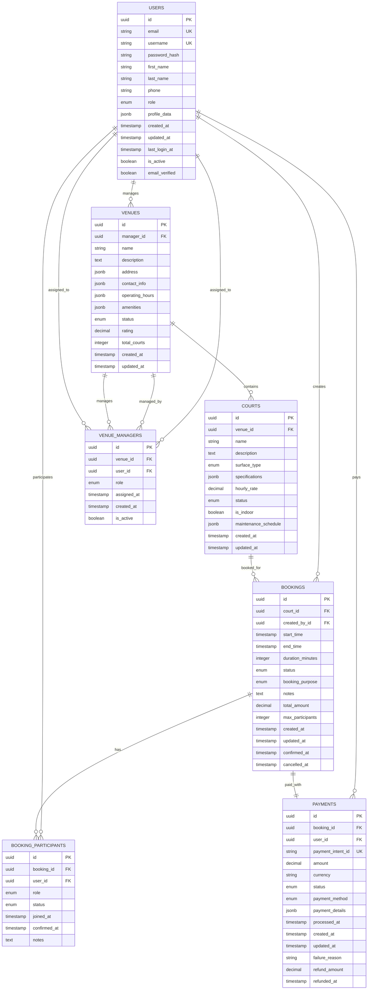

# 🗄️ Database Schema Documentation

## Overview

The Padel World Club API uses a PostgreSQL database with a well-structured relational schema designed for scalability and data integrity. This document provides a comprehensive overview of the database structure, relationships, and design decisions.

## 📊 Entity Relationship Diagram

## 📋 Table Specifications

### 👥 Users Table

**Purpose**: Central user management for authentication and profiles

| Column | Type | Constraints | Description |
|--------|------|-------------|-------------|
| id | UUID | PRIMARY KEY | Unique user identifier |
| email | VARCHAR(255) | UNIQUE, NOT NULL | User email address |
| username | VARCHAR(50) | UNIQUE, NOT NULL | Unique username |
| password_hash | VARCHAR(255) | NOT NULL | Bcrypt hashed password |
| first_name | VARCHAR(100) | NOT NULL | User's first name |
| last_name | VARCHAR(100) | NOT NULL | User's last name |
| phone | VARCHAR(20) | | Phone number |
| role | ENUM | NOT NULL | admin, manager, player |
| profile_data | JSONB | | Additional profile information |
| created_at | TIMESTAMP | NOT NULL | Account creation time |
| updated_at | TIMESTAMP | NOT NULL | Last profile update |
| last_login_at | TIMESTAMP | | Last login timestamp |
| is_active | BOOLEAN | DEFAULT true | Account status |
| email_verified | BOOLEAN | DEFAULT false | Email verification status |

**Indexes**:
- `idx_users_email` on email
- `idx_users_username` on username
- `idx_users_role` on role
- `idx_users_created_at` on created_at

### 🏢 Venues Table

**Purpose**: Padel facility information and management

| Column | Type | Constraints | Description |
|--------|------|-------------|-------------|
| id | UUID | PRIMARY KEY | Unique venue identifier |
| manager_id | UUID | FOREIGN KEY | Reference to managing user |
| name | VARCHAR(200) | NOT NULL | Venue name |
| description | TEXT | | Venue description |
| address | JSONB | NOT NULL | Complete address with coordinates |
| contact_info | JSONB | | Phone, email, website |
| operating_hours | JSONB | | Weekly operating schedule |
| amenities | JSONB | | Available facilities |
| status | ENUM | NOT NULL | active, inactive, maintenance |
| rating | DECIMAL(3,2) | | Average rating (0.00-5.00) |
| total_courts | INTEGER | DEFAULT 0 | Number of courts |
| created_at | TIMESTAMP | NOT NULL | Venue creation time |
| updated_at | TIMESTAMP | NOT NULL | Last update time |

**Indexes**:
- `idx_venues_manager_id` on manager_id
- `idx_venues_status` on status
- `idx_venues_location` on address (GiST index for geographic queries)
- `idx_venues_rating` on rating

### 🎾 Courts Table

**Purpose**: Individual court specifications and management

| Column | Type | Constraints | Description |
|--------|------|-------------|-------------|
| id | UUID | PRIMARY KEY | Unique court identifier |
| venue_id | UUID | FOREIGN KEY | Reference to venue |
| name | VARCHAR(100) | NOT NULL | Court name/number |
| description | TEXT | | Court description |
| surface_type | ENUM | NOT NULL | artificial_grass, concrete, clay |
| specifications | JSONB | | Dimensions, lighting, etc. |
| hourly_rate | DECIMAL(10,2) | NOT NULL | Cost per hour |
| status | ENUM | NOT NULL | available, maintenance, retired |
| is_indoor | BOOLEAN | DEFAULT false | Indoor/outdoor flag |
| maintenance_schedule | JSONB | | Maintenance information |
| created_at | TIMESTAMP | NOT NULL | Court creation time |
| updated_at | TIMESTAMP | NOT NULL | Last update time |

**Indexes**:
- `idx_courts_venue_id` on venue_id
- `idx_courts_status` on status
- `idx_courts_surface_type` on surface_type
- `idx_courts_hourly_rate` on hourly_rate

### 📅 Bookings Table

**Purpose**: Court reservation and scheduling system

| Column | Type | Constraints | Description |
|--------|------|-------------|-------------|
| id | UUID | PRIMARY KEY | Unique booking identifier |
| court_id | UUID | FOREIGN KEY | Reference to court |
| created_by_id | UUID | FOREIGN KEY | User who created booking |
| start_time | TIMESTAMP | NOT NULL | Booking start time |
| end_time | TIMESTAMP | NOT NULL | Booking end time |
| duration_minutes | INTEGER | NOT NULL | Duration in minutes |
| status | ENUM | NOT NULL | pending, confirmed, cancelled, completed |
| booking_purpose | ENUM | NOT NULL | training, match, free_play, tournament |
| notes | TEXT | | Additional booking notes |
| total_amount | DECIMAL(10,2) | NOT NULL | Total booking cost |
| max_participants | INTEGER | DEFAULT 4 | Maximum participants |
| created_at | TIMESTAMP | NOT NULL | Booking creation time |
| updated_at | TIMESTAMP | NOT NULL | Last update time |
| confirmed_at | TIMESTAMP | | Confirmation timestamp |
| cancelled_at | TIMESTAMP | | Cancellation timestamp |

**Indexes**:
- `idx_bookings_court_id` on court_id
- `idx_bookings_created_by_id` on created_by_id
- `idx_bookings_start_time` on start_time
- `idx_bookings_status` on status
- `idx_bookings_time_range` on (court_id, start_time, end_time)

### 👥 Booking Participants Table

**Purpose**: Manage participants in bookings

| Column | Type | Constraints | Description |
|--------|------|-------------|-------------|
| id | UUID | PRIMARY KEY | Unique participant record |
| booking_id | UUID | FOREIGN KEY | Reference to booking |
| user_id | UUID | FOREIGN KEY | Reference to user |
| role | ENUM | NOT NULL | organizer, player, substitute |
| status | ENUM | NOT NULL | invited, confirmed, declined |
| joined_at | TIMESTAMP | NOT NULL | When user joined |
| confirmed_at | TIMESTAMP | | Confirmation timestamp |
| notes | TEXT | | Participant notes |

**Indexes**:
- `idx_booking_participants_booking_id` on booking_id
- `idx_booking_participants_user_id` on user_id
- `unique_booking_user` on (booking_id, user_id)

### 💳 Payments Table

**Purpose**: Payment processing and financial records

| Column | Type | Constraints | Description |
|--------|------|-------------|-------------|
| id | UUID | PRIMARY KEY | Unique payment identifier |
| booking_id | UUID | FOREIGN KEY | Reference to booking |
| user_id | UUID | FOREIGN KEY | User making payment |
| payment_intent_id | VARCHAR(255) | UNIQUE | External payment ID |
| amount | DECIMAL(10,2) | NOT NULL | Payment amount |
| currency | VARCHAR(3) | NOT NULL | Currency code (USD, EUR) |
| status | ENUM | NOT NULL | pending, completed, failed, refunded |
| payment_method | ENUM | NOT NULL | card, bank_transfer, cash |
| payment_details | JSONB | | Payment method details |
| processed_at | TIMESTAMP | | Processing timestamp |
| created_at | TIMESTAMP | NOT NULL | Payment creation time |
| updated_at | TIMESTAMP | NOT NULL | Last update time |
| failure_reason | TEXT | | Failure description |
| refund_amount | DECIMAL(10,2) | | Refunded amount |
| refunded_at | TIMESTAMP | | Refund timestamp |

**Indexes**:
- `idx_payments_booking_id` on booking_id
- `idx_payments_user_id` on user_id
- `idx_payments_status` on status
- `idx_payments_payment_intent_id` on payment_intent_id

### 🏢 Venue Managers Table

**Purpose**: Manage venue access and permissions

| Column | Type | Constraints | Description |
|--------|------|-------------|-------------|
| id | UUID | PRIMARY KEY | Unique assignment record |
| venue_id | UUID | FOREIGN KEY | Reference to venue |
| user_id | UUID | FOREIGN KEY | Reference to user |
| role | ENUM | NOT NULL | owner, manager, staff |
| assigned_at | TIMESTAMP | NOT NULL | Assignment timestamp |
| created_at | TIMESTAMP | NOT NULL | Record creation time |
| is_active | BOOLEAN | DEFAULT true | Assignment status |

**Indexes**:
- `idx_venue_managers_venue_id` on venue_id
- `idx_venue_managers_user_id` on user_id
- `unique_venue_user_active` on (venue_id, user_id) WHERE is_active = true

## 🔗 Key Relationships

### User-Centric Relationships
- **Users → Venues**: One-to-many (managers can manage multiple venues)
- **Users → Bookings**: One-to-many (users can create multiple bookings)
- **Users → Payments**: One-to-many (users can make multiple payments)

### Venue-Centric Relationships
- **Venues → Courts**: One-to-many (venues contain multiple courts)
- **Venues → Venue Managers**: One-to-many (multiple managers per venue)

### Booking-Centric Relationships
- **Courts → Bookings**: One-to-many (courts can have multiple bookings)
- **Bookings → Participants**: One-to-many (multiple participants per booking)
- **Bookings → Payments**: One-to-one (each booking has one payment)

## 🛡️ Data Integrity

### Constraints
- **Foreign Key Constraints**: Ensure referential integrity
- **Check Constraints**: Validate enum values and data ranges
- **Unique Constraints**: Prevent duplicate records
- **Not Null Constraints**: Ensure required fields

### Triggers
- **Updated At Triggers**: Automatically update timestamp fields
- **Audit Triggers**: Track data changes for compliance
- **Validation Triggers**: Complex business rule validation

## 📈 Performance Considerations

### Indexing Strategy
- **Primary Keys**: Clustered indexes on UUID fields
- **Foreign Keys**: Indexes on all foreign key columns
- **Query Optimization**: Composite indexes for common query patterns
- **Geographic Queries**: GiST indexes for location-based searches

### Partitioning
- **Bookings Table**: Partitioned by date for historical data management
- **Payments Table**: Partitioned by status for performance optimization

## 🔄 Migration Strategy

### Version Control
- **Sequential Migrations**: Numbered migration files
- **Rollback Support**: Down migrations for each change
- **Data Migrations**: Separate scripts for data transformations

### Deployment
- **Zero-Downtime Migrations**: Compatible schema changes
- **Backup Strategy**: Automated backups before migrations
- **Testing**: Migration testing in staging environment

---

This database schema provides a robust foundation for the Padel World Club platform, ensuring data integrity, performance, and scalability.
