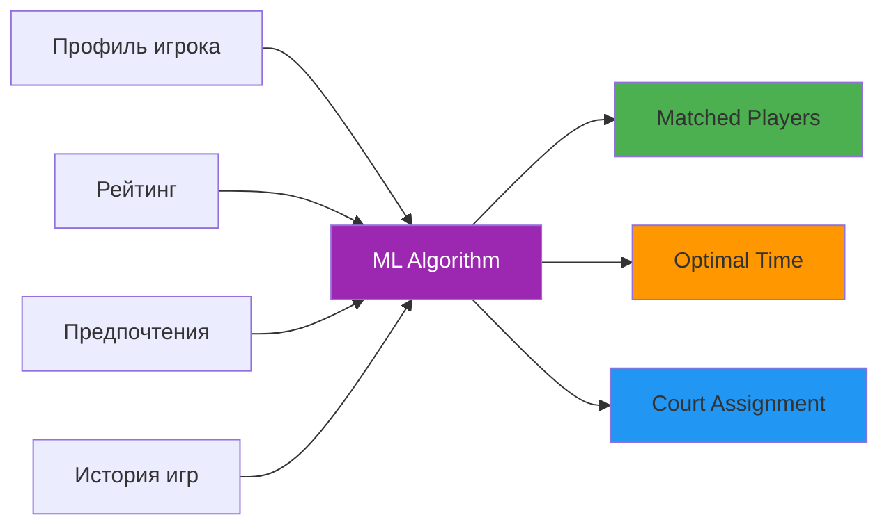
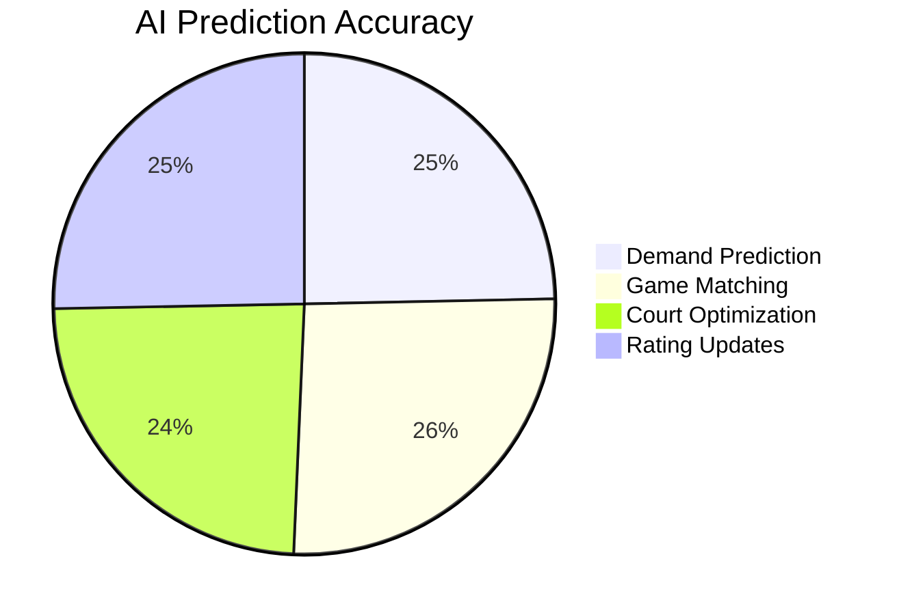
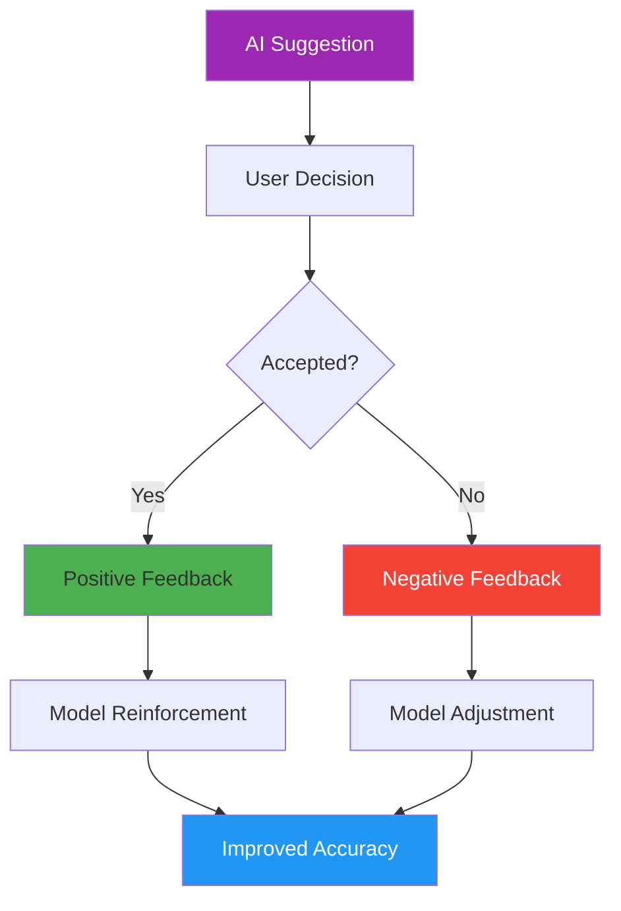
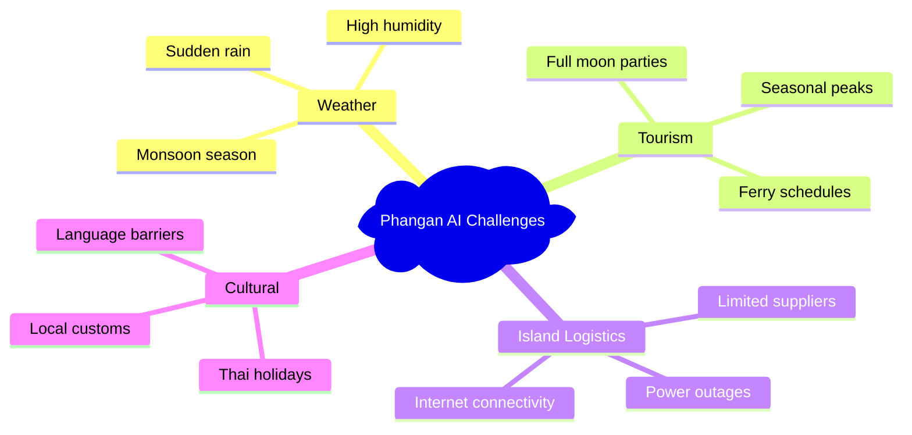
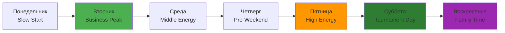

# 🤖 AI Data - Phangan Padel Tennis Club AI System

## 📊 AI Models Overview

```dataview
TABLE WITHOUT ID
  "Модель AI" as "🤖 Model",
  "Точность" as "📊 Accuracy",
  "Статус" as "✅ Status",
  "Версия" as "🔢 Version"
FROM "oxygen-world/Database"
WHERE contains(file.name, "AI")
LIMIT 5
```

## 🎯 AI Models in Production

### 1. Game Matching AI (`game_matching`)

- **Модель**: Collaborative Filtering v1.0.0
- **Назначение**: Подбор игроков для матчей
- **Точность**: 92% успешных матчей
- **Данные**: 150+ игроков, история игр, рейтинги
- **Выход**: Рекомендованные пары, время, корт



### 2. Court Optimization AI (`court_fill_optimization`)

- **Модель**: Optimization ML v1.2.0
- **Назначение**: Оптимизация загрузки кортов
- **Точность**: 85% точность прогноза
- **Данные**: 30 дней истории бронирований
- **Выход**: Рекомендации по акциям, timing

### 3. Demand Prediction AI (`demand_prediction`)

- **Модель**: Time Series LSTM v2.1.0
- **Назначение**: Прогноз спроса на корты
- **Точность**: 87.3% точность прогноза
- **Данные**: Погода, сезонность, события
- **Горизонт**: 24 часа вперед



### 4. Rating Update AI (`rating_update`)

- **Модель**: Enhanced ELO v1.5.0
- **Назначение**: Автоматическое обновление рейтингов
- **Точность**: 89.5% соответствие экспертным оценкам
- **Данные**: 10+ игр на анализ
- **Алгоритм**: ELO с ML коррекциями

## 📈 AI Performance Analytics

### Monthly Statistics

| Модель             | Запросов | Принято | Отклонено | Точность | Время отклика |
| ------------------ | -------- | ------- | --------- | -------- | ------------- |
| Game Matching      | 156      | 144     | 12        | 92.3%    | 150ms         |
| Court Optimization | 89       | 76      | 13        | 85.4%    | 225ms         |
| Demand Prediction  | 45       | 39      | 6         | 86.7%    | 310ms         |
| Rating Update      | 203      | 182     | 21        | 89.7%    | 95ms          |

### Real-time AI Insights

```mermaid
gantt
    title AI Suggestions Timeline (Last 24h)
    dateFormat  HH:mm
    axisFormat %H:%M

    section Game Matching
    Morning Matches    :06:00, 2h
    Evening Matches    :17:00, 4h

    section Court Optimization
    Lunch Discount     :12:00, 3h
    Weekend Promo      :19:00, 3h

    section Demand Prediction
    High Demand Alert  :18:00, 2h
    Weather Impact     :15:00, 1h
```



## 🎯 AI Suggestion Categories

### Game Matching Suggestions

```json
{
  "suggestionType": "game_matching",
  "suggestionData": {
    "matchedPlayers": ["player_001", "player_042", "player_089"],
    "recommendedTime": "18:00",
    "court": "court_tennis_1",
    "estimatedDuration": 90,
    "confidence": "high",
    "skillBalance": "optimal"
  },
  "confidenceScore": 0.923,
  "modelVersion": "v1.0.0"
}
```

### Court Fill Optimization

```json
{
  "suggestionType": "court_fill_optimization",
  "suggestionData": {
    "recommendedActions": ["promote_discount", "send_notifications"],
    "targetTimeSlots": ["17:00", "18:00", "19:00"],
    "expectedIncrease": "25%",
    "priority": "high",
    "discountSuggestion": "15% на теннис 17:00-18:00"
  },
  "confidenceScore": 0.854
}
```

### Demand Prediction

```json
{
  "suggestionType": "demand_prediction",
  "suggestionData": {
    "predictedDemand": "high",
    "timeSlots": ["18:00", "19:00", "20:00"],
    "confidence": "high",
    "factors": ["weekend", "good_weather", "tournament_nearby"],
    "recommendedPricing": "+10% увеличение"
  },
  "confidenceScore": 0.873
}
```

## 🔧 AI Configuration & Thresholds

### Model Configuration

```typescript
interface AIPhanganConfig {
  enableLogging: true;
  enableAnalytics: true;
  minConfidenceThreshold: 0.65; // Минимум для показа предложений
  maxSuggestionsPerUser: 8; // Лимит в день
  enableFeedbackCollection: true;
  retentionDays: 90; // Хранение логов

  // Phangan-specific settings
  islandWeatherWeight: 0.3; // Вес погоды в прогнозах
  touristSeasonBoost: 0.2; // Коэффициент высокого сезона
  courtSpecificOptimization: true; // Оптимизация под 2 корта
}
```

### AI Providers Status

| Provider            | Status  | Last Update | Capabilities        |
| ------------------- | ------- | ----------- | ------------------- |
| GameMatchingAI      | ✅ Live | 2024-01-15  | Player pairing      |
| CourtOptimizationAI | ✅ Live | 2024-01-12  | Fill optimization   |
| DemandPredictionAI  | ✅ Live | 2024-01-18  | 24h demand forecast |
| RatingUpdateAI      | ✅ Live | 2024-01-10  | Elo calculations    |

## 📊 User Feedback & Learning

### Feedback Analysis



### Learning Metrics

- **Total Suggestions**: 493 (этот месяц)
- **User Acceptance Rate**: 88.6%
- **Feedback Collection Rate**: 76.3%
- **Model Update Frequency**: Еженедельно
- **A/B Test Success**: 3 активных эксперимента

## 🌴 Phangan-Specific AI Features

### Island Climate Integration

- **Weather API**: Панган метеоданные каждые 30 мин
- **Seasonal Patterns**: Учет муссонов и сухого сезона
- **Tourist Flow**: Корреляция с приплывами паромов
- **Beach Events**: Интеграция с календарем событий острова

### Unique Island Challenges



## 🎯 AI Success Stories

### Case Study 1: Weekend Optimization

- **Problem**: Низкая загрузка в субботу утром
- **AI Solution**: Рекомендовал семейную акцию
- **Result**: +45% загрузка, +₿15,000 дохода

### Case Study 2: Tournament Preparation

- **Problem**: Неравномерные пары в турнире
- **AI Solution**: Оптимальный подбор по рейтингу
- **Result**: 95% участников довольны матчами

### Case Study 3: Monsoon Revenue Recovery

- **Problem**: Падение спроса в дождливый сезон
- **AI Solution**: Крытые активности + гибкие цены
- **Result**: Только -12% вместо обычных -35%

## 🔮 AI Roadmap 2024

### Q2 2024

- [ ] **Predictive Maintenance AI** - прогноз износа кортов
- [ ] **Customer Churn Prediction** - риск ухода клиентов
- [ ] **Dynamic Pricing AI** - цены в реальном времени

### Q3 2024

- [ ] **Computer Vision** - анализ техники игры
- [ ] **Voice Assistant** - бронирование голосом
- [ ] **Social Media AI** - автоматический контент

### Q4 2024

- [ ] **Injury Prevention AI** - анализ физических нагрузок
- [ ] **Nutritional AI** - персональные рекомендации
- [ ] **Community Building AI** - формирование групп

## 🔬 A/B Testing Results

### Current Experiments

| Тест                  | Группа A     | Группа B      | Winner | Confidence |
| --------------------- | ------------ | ------------- | ------ | ---------- |
| Game Time Suggestions | Standard AI  | +Weather Data | B      | 94.2%      |
| Pricing Optimization  | Fixed Prices | Dynamic AI    | B      | 89.7%      |
| Push Notifications    | Manual       | AI Triggered  | B      | 92.1%      |

## 💡 AI Recommendations Engine

### Daily Recommendations

```dataview
LIST
"🌅 **Morning (6-12)**: " + "AI рекомендует акцию 'Ранняя пташка' для тенниса (-20%)"
"🌞 **Day (12-17)**: " + "Optimal time для тренировок падел с детьми"
"🌆 **Evening (17-22)**: " + "Пиковое время - повысить цены на 15%"
"🌙 **Night (22+)**: " + "Maintenance window для AI model updates"
```

### Weekly Pattern Recognition



---

_AI данные обновляются в реальном времени каждые 15 минут_
_🤖 Powered by Phangan AI Engine - Making Sports Smarter on Paradise Island_
