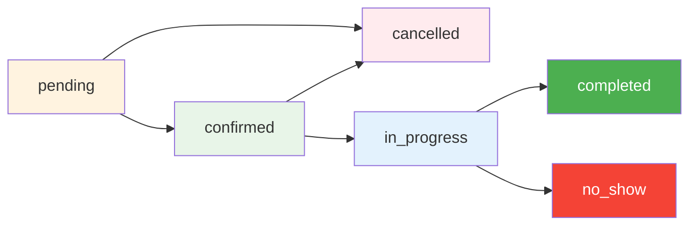
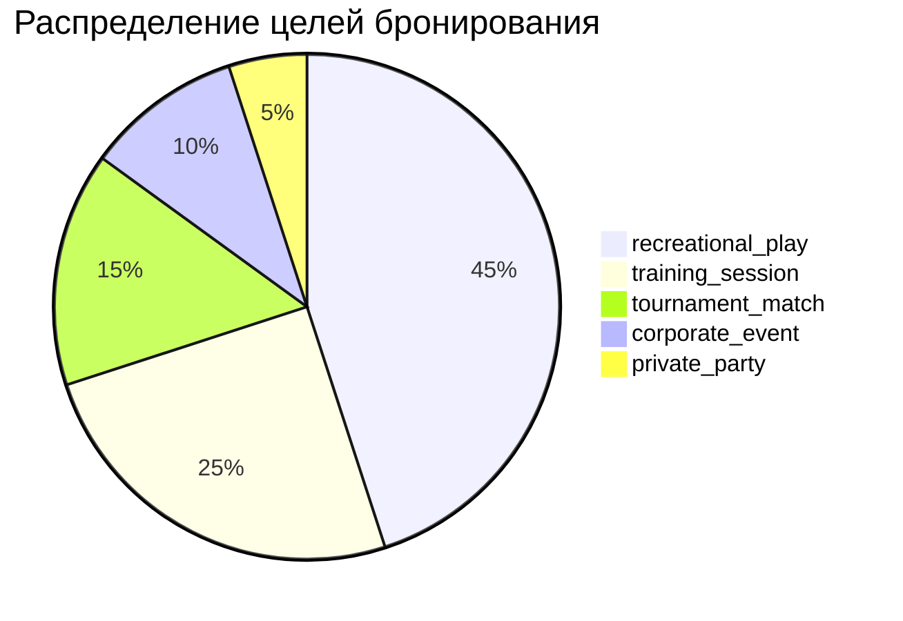
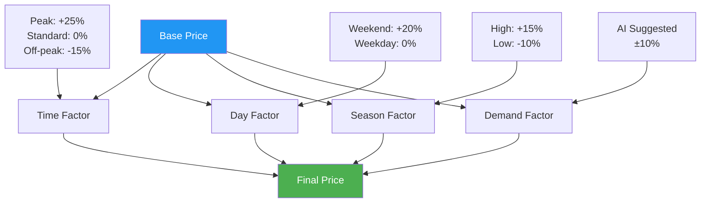
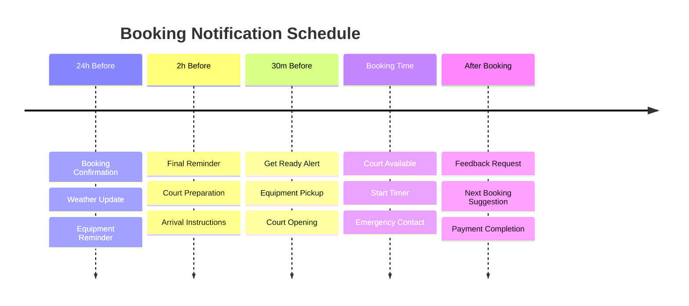
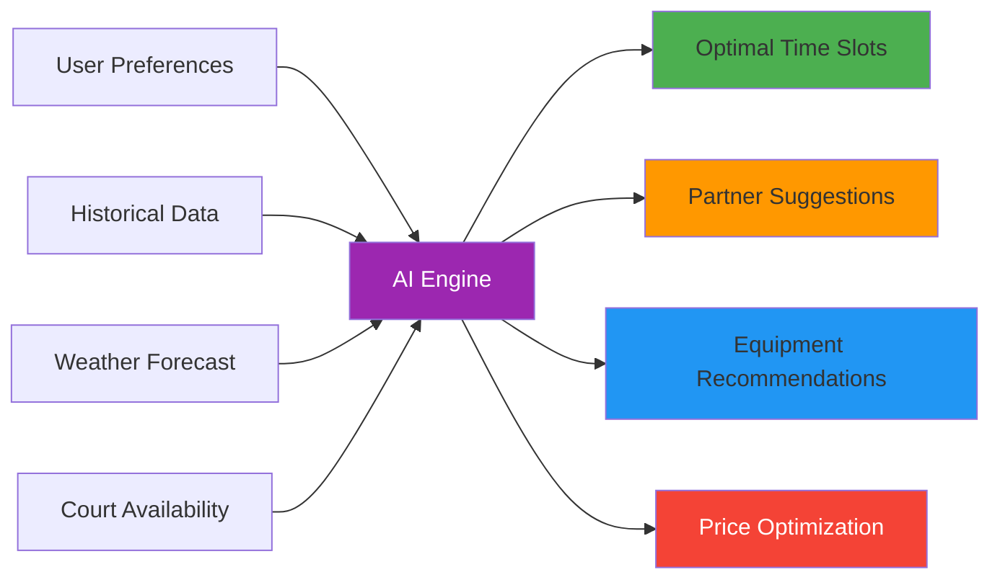
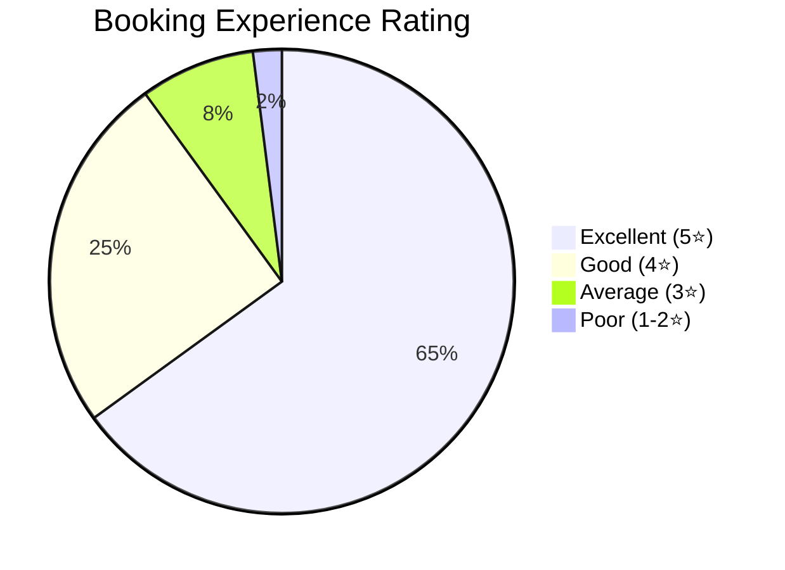

# 📅 Bookings Data - Phangan Padel Tennis Club

## 📊 Интерактивная Таблица Бронирований (Реальные Данные)

```dataview
TABLE
  court_name as "🏓 Корт",
  user_name as "👤 Клиент",
  start_time as "⏰ Начало",
  duration_minutes as "⏱️ Длительность",
  status as "📊 Статус",
  total_amount as "💰 Сумма (THB)",
  booking_purpose as "🎯 Цель"
FROM "oxygen-world/Database"
WHERE contains(file.name, "Booking-Today-")
SORT start_time desc
LIMIT 10
```

## 🎯 Активные Бронирования Сегодня

### Теннисный Корт

| Время       | Продолжительность | Заказчик          | Участники | Статус       | Сумма   |
| ----------- | ----------------- | ----------------- | --------- | ------------ | ------- |
| 09:00-10:30 | 90 мин            | David Smith       | 2         | ✅ Confirmed | ₿ 1,200 |
| 11:00-12:00 | 60 мин            | Anna Johnson      | 4         | ✅ Confirmed | ₿ 800   |
| 14:00-15:30 | 90 мин            | Mark Johnson      | 2         | ⏳ Pending   | ₿ 1,200 |
| 17:00-18:30 | 90 мин            | Tournament System | 4         | 🔒 Reserved  | ₿ 1,500 |
| 19:00-20:30 | 90 мин            | Siriporn Kaewsai  | 4         | ✅ Confirmed | ₿ 1,500 |

### Падел Корт

| Время       | Продолжительность | Заказчик        | Участники | Статус       | Сумма   |
| ----------- | ----------------- | --------------- | --------- | ------------ | ------- |
| 08:00-09:00 | 60 мин            | Maria Rodriguez | 4         | ✅ Confirmed | ₿ 600   |
| 10:30-12:00 | 90 мин            | Carlos Mendez   | 4         | ✅ Confirmed | ₿ 900   |
| 15:00-16:00 | 60 мин            | Training Class  | 6         | 🎓 Class     | ₿ 750   |
| 18:30-20:00 | 90 мин            | Private Party   | 4         | 💳 Paid      | ₿ 1,200 |

## 🔄 Booking Status Flow



| Статус        | Описание              | Действия доступны           |
| ------------- | --------------------- | --------------------------- |
| `pending`     | Ожидает подтверждения | Подтвердить/Отменить        |
| `confirmed`   | Подтверждено          | Изменить/Отменить           |
| `cancelled`   | Отменено              | Просмотр истории            |
| `in_progress` | В процессе            | Завершить/Продлить          |
| `completed`   | Завершено             | Оценить/Забронировать снова |
| `no_show`     | Не явились            | Обработать штраф            |

## 🎯 Booking Purposes

### Типы Бронирований



#### 🎮 Recreational Play (45%)

- **Описание**: Обычные игры для развлечения
- **Средняя длительность**: 90 минут
- **Средняя стоимость**: ₿ 1,000
- **Популярное время**: 18:00-20:00

#### 🎓 Training Session (25%)

- **Описание**: Тренировки с инструктором
- **Средняя длительность**: 75 минут
- **Средняя стоимость**: ₿ 800
- **Популярное время**: 16:00-18:00

#### 🏆 Tournament Match (15%)

- **Описание**: Официальные турнирные матчи
- **Средняя длительность**: 120 минут
- **Средняя стоимость**: ₿ 1,500
- **Особенности**: Фиксированное расписание

#### 🏢 Corporate Event (10%)

- **Описание**: Корпоративные мероприятия
- **Средняя длительность**: 180 минут
- **Средняя стоимость**: ₿ 2,500
- **Особенности**: Пакетные предложения

## 👥 Booking Participants Management

### Участники бронирования

```dataview
TABLE WITHOUT ID
  "Участник" as "👤 Name",
  "Роль" as "🎯 Role",
  "Сумма к доплате" as "💰 Amount Owed",
  "Статус оплаты" as "💳 Payment Status",
  "Статус участия" as "📊 Participation"
FROM "Database/booking_participants"
SORT booking_date desc
```

### Payment Status Distribution

| Статус оплаты | Количество | Сумма (THB) | % от общего |
| ------------- | ---------- | ----------- | ----------- |
| **Paid**      | 45         | ₿ 38,500    | 78%         |
| **Pending**   | 8          | ₿ 6,800     | 14%         |
| **Partial**   | 3          | ₿ 2,100     | 4%          |
| **Overdue**   | 2          | ₿ 1,600     | 3%          |

### Participation Roles

- **👑 Host**: Организатор бронирования (платит депозит)
- **👥 Player**: Обычный участник
- **🎓 Student**: Участник тренировки
- **👀 Observer**: Наблюдатель (не играет)

## 📈 Booking Analytics

### Hourly Booking Distribution

```mermaid
gantt
    title Загрузка кортов по часам (%)
    dateFormat  HH:mm
    axisFormat %H:%M

    section Теннис
    06:00-09:00    :06:00, 3h
    09:00-12:00    :09:00, 3h
    12:00-17:00    :12:00, 5h
    17:00-20:00    :17:00, 3h
    20:00-22:00    :20:00, 2h

    section Падел
    06:00-09:00    :06:00, 3h
    09:00-12:00    :09:00, 3h
    12:00-15:00    :12:00, 3h
    15:00-18:00    :15:00, 3h
    18:00-21:00    :18:00, 3h
```

### Weekly Booking Patterns

| День недели | Бронирований | Загрузка | Доход (THB) | Top время   |
| ----------- | ------------ | -------- | ----------- | ----------- |
| Понедельник | 12           | 65%      | ₿ 9,500     | 18:00-20:00 |
| Вторник     | 14           | 75%      | ₿ 11,200    | 17:00-19:00 |
| Среда       | 13           | 70%      | ₿ 10,400    | 19:00-21:00 |
| Четверг     | 15           | 80%      | ₿ 12,000    | 18:00-20:00 |
| Пятница     | 18           | 95%      | ₿ 15,500    | 17:00-21:00 |
| Суббота     | 22           | 100%     | ₿ 19,800    | 09:00-21:00 |
| Воскресенье | 16           | 85%      | ₿ 13,600    | 10:00-18:00 |

## 💰 Pricing & Revenue

### Dynamic Pricing Model



### Court Revenue Breakdown

#### Теннисный Корт

| Время       | Базовая цена | Weekend markup | Итоговая цена |
| ----------- | ------------ | -------------- | ------------- |
| 06:00-09:00 | ₿ 600        | +₿ 200         | ₿ 800         |
| 09:00-12:00 | ₿ 800        | +₿ 200         | ₿ 1,000       |
| 12:00-17:00 | ₿ 800        | +₿ 200         | ₿ 1,000       |
| 17:00-20:00 | ₿ 1,000      | +₿ 200         | ₿ 1,200       |
| 20:00-22:00 | ₿ 1,000      | +₿ 200         | ₿ 1,200       |

#### Падел Корт

| Время       | Базовая цена | Weekend markup | Итоговая цена |
| ----------- | ------------ | -------------- | ------------- |
| 06:00-09:00 | ₿ 400        | +₿ 150         | ₿ 550         |
| 09:00-12:00 | ₿ 600        | +₿ 150         | ₿ 750         |
| 12:00-15:00 | ₿ 500        | +₿ 150         | ₿ 650         |
| 15:00-18:00 | ₿ 700        | +₿ 150         | ₿ 850         |
| 18:00-21:00 | ₿ 800        | +₿ 150         | ₿ 950         |

## 🔔 Booking Notifications & Reminders

### Automated Notification Timeline



### Notification Channels

- **📱 Push Notifications**: Instant mobile alerts
- **📧 Email**: Detailed confirmations with calendar
- **💬 WhatsApp**: Quick reminders and updates
- **📞 SMS**: Emergency and last-minute changes

## 🚫 Cancellation & Refund Policy

### Cancellation Timeline

| Отмена за  | Штраф | Возврат | Условия         |
| ---------- | ----- | ------- | --------------- |
| 24+ часов  | 0%    | 100%    | Полный возврат  |
| 12-24 часа | 25%   | 75%     | Частичный штраф |
| 2-12 часов | 50%   | 50%     | Средний штраф   |
| <2 часа    | 75%   | 25%     | Высокий штраф   |
| No-show    | 100%  | 0%      | Полная потеря   |

### Special Conditions

- **🌧️ Bad Weather**: Full refund if courts unsafe
- **🏥 Medical Emergency**: 100% refund with documentation
- **🎓 Class Cancellation**: Instructor unavailable - full refund
- **🔧 Equipment Failure**: Club responsibility - full refund

## 📱 Smart Booking Features

### AI-Powered Suggestions



### Auto-Booking Features

- **🔄 Recurring Bookings**: Weekly/monthly patterns
- **👥 Group Booking**: Automatic partner invitations
- **🎯 Smart Reminders**: Personalized notification timing
- **💳 Auto-Payment**: Saved payment methods

## 📊 Booking Performance Metrics

### Monthly KPIs

| Метрика                 | Январь 2024 | Цель  | Статус       |
| ----------------------- | ----------- | ----- | ------------ |
| **Общее бронирований**  | 340         | 350   | 📊 97%       |
| **Загрузка кортов**     | 78%         | 80%   | 📈 On track  |
| **Revenue per booking** | ₿ 925       | ₿ 900 | ✅ Exceeding |
| **Cancellation rate**   | 8%          | <10%  | ✅ Good      |
| **No-show rate**        | 3%          | <5%   | ✅ Excellent |

### Customer Satisfaction



## 🎯 Quick Booking Actions {#new-booking}

### Create New Booking

1. **Select Court**: Tennis or Padel
2. **Choose Date & Time**: Available slots only
3. **Set Duration**: 60, 90, or 120 minutes
4. **Add Participants**: Invite players
5. **Confirm Payment**: Multiple payment options
6. **Receive Confirmation**: Instant notification

### Booking Templates

- **🎾 Tennis Singles**: 90 min, 2 players, ₿1,200
- **🎾 Tennis Doubles**: 120 min, 4 players, ₿1,600
- **🏓 Padel Match**: 90 min, 4 players, ₿900
- **🎓 Training Session**: 75 min, 2-6 players, varies

## 🔧 Administrative Tools

### Booking Management

- **📅 Calendar View**: Visual court schedules
- **🔍 Search & Filter**: Find specific bookings
- **📊 Reports**: Revenue and usage analytics
- **⚡ Bulk Operations**: Mass updates and notifications

### Integration Features

- **📱 Mobile App**: Native iOS/Android booking
- **🌐 Website Widget**: Online reservation system
- **📧 Email Sync**: Calendar integration
- **💳 Payment Gateway**: Secure payment processing

---

_Данные о бронированиях обновляются в реальном времени_  
_📅 Phangan Padel Tennis Club - Seamless Court Reservations on Paradise Island_
