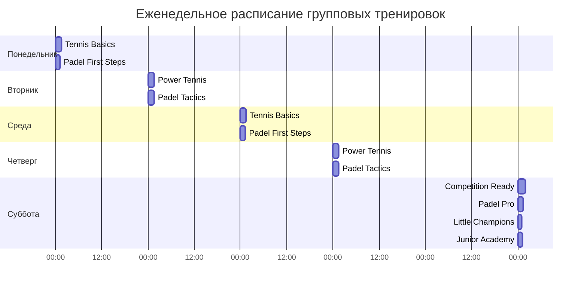
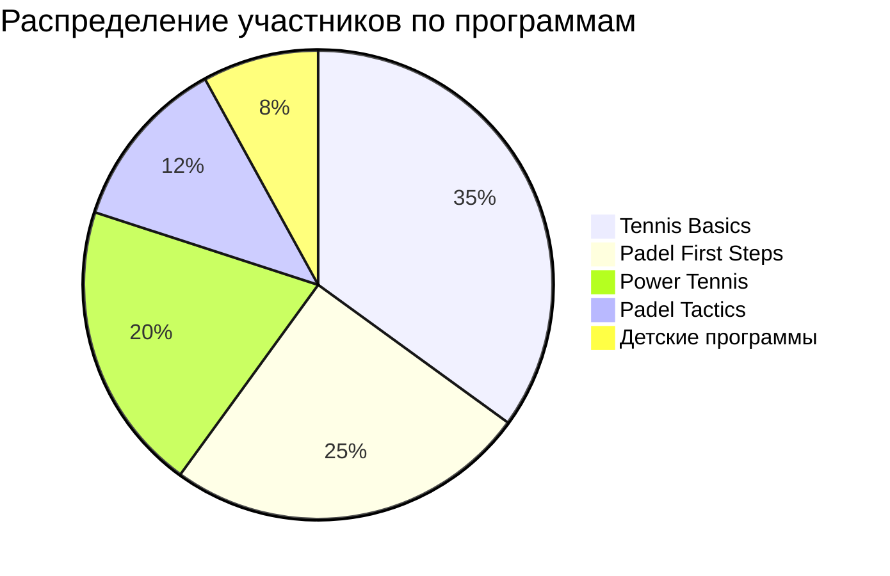
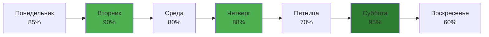

# 🎓 Classes & Training Data - Phangan Padel Tennis Club

## 📊 Интерактивная Таблица Тренировок

```dataview
TABLE
  name as "🎓 Название",
  class_type as "📚 Тип",
  skill_level as "⭐ Уровень",
  max_participants as "👥 Макс участников",
  price_per_session as "💰 Цена/сессия (THB)",
  is_active as "✅ Статус"
FROM "Database/classes"
SORT class_type, skill_level
```

## 🎾 Теннисные Тренировки

### Групповые Программы

#### 🟢 Начинающие (Beginner)

- **"Tennis Basics"** - Основы тенниса
  - Участников: до 4 человек
  - Цена: ₿ 800/сессия (90 мин)
  - Расписание: Пн, Ср, Пт 09:00-10:30

#### 🟡 Средний уровень (Intermediate)

- **"Power Tennis"** - Техника и тактика
  - Участников: до 4 человек
  - Цена: ₿ 1,000/сессия (90 мин)
  - Расписание: Вт, Чт 17:00-18:30

#### 🟠 Продвинутые (Advanced)

- **"Competition Ready"** - Подготовка к турнирам
  - Участников: до 3 человек
  - Цена: ₿ 1,500/сессия (120 мин)
  - Расписание: Сб 08:00-10:00

### Индивидуальные Тренировки

| Тренер       | Квалификация     | Цена/час | Специализация      |
| ------------ | ---------------- | -------- | ------------------ |
| David Smith  | ITF Level 3      | ₿ 2,000  | Техника, стратегия |
| Anna Johnson | PTR Professional | ₿ 1,800  | Начинающие, юниоры |

## 🏓 Падел Тренировки

### Групповые Программы

#### 🟢 Новички (Beginner)

- **"Padel First Steps"** - Введение в падел
  - Участников: до 4 человек
  - Цена: ₿ 600/сессия (75 мин)
  - Расписание: Пн, Ср 18:00-19:15

#### 🟡 Развитие (Intermediate)

- **"Padel Tactics"** - Тактика и парная игра
  - Участников: до 4 человек
  - Цена: ₿ 800/сессия (90 мин)
  - Расписание: Вт, Чт 19:00-20:30

#### 🟠 Мастерство (Advanced)

- **"Padel Pro"** - Профессиональная техника
  - Участников: до 4 человек
  - Цена: ₿ 1,200/сессия (90 мин)
  - Расписание: Сб 16:00-17:30

### Индивидуальные Тренировки

| Тренер          | Квалификация | Цена/час | Специализация      |
| --------------- | ------------ | -------- | ------------------ |
| Maria Rodriguez | FIP Trainer  | ₿ 1,500  | Техника, стратегия |
| Carlos Mendez   | FIP Level 2  | ₿ 1,300  | Новички, тактика   |

## 👶 Детские Программы

### Мини-Теннис (Ages 6-10)

- **"Little Champions"**
  - Участников: до 6 детей
  - Цена: ₿ 500/сессия (60 мин)
  - Расписание: Сб, Вс 10:00-11:00
  - Оборудование: мини-ракетки, мягкие мячи

### Юниорский Теннис (Ages 11-16)

- **"Junior Academy"**
  - Участников: до 4 подростков
  - Цена: ₿ 700/сессия (75 мин)
  - Расписание: Сб, Вс 11:00-12:15

## 📅 Расписание Тренировок



## 💰 Пакеты и Абонементы

### Месячные Абонементы

| Пакет              | Включает                    | Цена (THB) | Экономия |
| ------------------ | --------------------------- | ---------- | -------- |
| **Tennis Starter** | 8 групповых занятий (нач.)  | ₿ 5,500    | ₿ 900    |
| **Tennis Pro**     | 8 групповых + 2 инд.        | ₿ 9,500    | ₿ 1,500  |
| **Padel Explorer** | 8 групповых занятий падел   | ₿ 4,200    | ₿ 600    |
| **All Sports**     | Теннис + Падел (12 занятий) | ₿ 8,800    | ₿ 1,200  |

### Семейные Пакеты

- **Семья 2+1**: 2 взрослых + 1 ребенок - скидка 15%
- **Семья 2+2**: 2 взрослых + 2 детей - скидка 20%
- **Детский лагерь**: 5 дней программы - ₿ 2,000

## 📊 Статистика Участия

### Популярность Программ



### Загрузка по Дням



## 👨‍🏫 Команда Тренеров

### Теннисные Тренеры

#### David Smith - Главный тренер

- **Опыт**: 15 лет
- **Сертификация**: ITF Level 3, PTR Professional
- **Специализация**: Техника, стратегия, турнирная подготовка
- **Языки**: Английский, Тайский

#### Anna Johnson - Тренер

- **Опыт**: 8 лет
- **Сертификация**: PTR Professional, First Aid
- **Специализация**: Начинающие, детские программы
- **Языки**: Английский, Немецкий

### Падел Тренеры

#### Maria Rodriguez - Главный тренер падел

- **Опыт**: 12 лет
- **Сертификация**: FIP Trainer Level 2
- **Специализация**: Техника, тактика парной игры
- **Языки**: Испанский, Английский, Тайский

#### Carlos Mendez - Тренер падел

- **Опыт**: 6 лет
- **Сертификация**: FIP Level 2, Sports Psychology
- **Специализация**: Начинающие, ментальная подготовка
- **Языки**: Испанский, Английский

## 🎯 Специальные Программы

### Интенсивы выходного дня

#### "Weekend Warrior" (Теннис)

- **Формат**: 2 дня, 3 часа в день
- **Цена**: ₿ 3,500
- **Включает**: Техника + спарринги + видео анализ

#### "Padel Bootcamp"

- **Формат**: 2 дня, 2.5 часа в день
- **Цена**: ₿ 2,800
- **Включает**: Базовая техника + тактика + игровая практика

### Корпоративные Программы

- **Team Building**: Групповые занятия для команд
- **Executive Training**: VIP тренировки для руководителей
- **Corporate Tournaments**: Организация корпоративных турниров

## 📝 Форма Записи на Тренировку {#new-class}

**Шаблон для новой записи:**

```
Участник: ___________
Телефон: +66 __-___-____
Email: ___________@_____
Программа: ___________
Уровень: [beginner/intermediate/advanced]
Предпочитаемое время: ___________
Особые требования: ___________
```

## 🏆 Результаты и Достижения

### Успехи Учеников 2024

- **3 ученика** прошли в финал Phangan Open
- **85% участников** улучшили свой уровень игры
- **15 детей** из программы перешли в юниорский теннис
- **Средняя оценка тренировок**: 4.9/5

### Планы на 2024

- [ ] Запуск программы "Падел для пожилых"
- [ ] Летний детский лагерь (июль-август)
- [ ] Сертификация еще 2 тренеров
- [ ] Видео анализ для всех уровней

---

_Расписание тренировок обновляется еженедельно_
_🏝️ Phangan Padel Tennis Club - профессиональное обучение на острове Панган_
