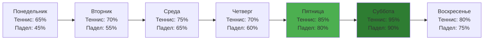

# 🏓 Courts Data - Phangan Padel Tennis Club

## 📊 Интерактивная Таблица Кортов (Реальные Данные)

```dataview
TABLE
  court_name as "🏓 Название",
  court_type as "🎾 Тип",
  hourly_rate as "💰 Цена/час (THB)",
  status as "✅ Статус",
  total_bookings_today as "📅 Бронирований",
  revenue_today as "💰 Доход",
  utilization_rate as "📈 Загрузка %"
FROM "oxygen-world/Database"
WHERE contains(file.name, "Court-")
SORT court_type, court_name
```

## 🎯 Статистика Кортов Сегодня

```dataview
TABLE
  court_type as "🎾 Тип",
  sum(rows.total_bookings_today) as "📅 Всего Бронирований",
  sum(rows.revenue_today) as "💰 Общий Доход",
  round(average(rows.utilization_rate), 1) as "📈 Средняя Загрузка %"
FROM "oxygen-world/Database"
WHERE contains(file.name, "Court-")
GROUP BY court_type
```

## 🎾 Теннисный Корт

### 🏟️ Корт #1 - "Center Court"

- **Название**: Center Court
- **Тип**: Теннис (tennis)
- **Покрытие**: Жесткое покрытие (Hard Court)
- **Размеры**: 23.77м x 10.97м (стандарт ITF)
- **Базовая цена**: ₿ 800/час
- **Описание**: Профессиональный теннисный корт с LED освещением

#### 🔧 Техническая Информация

- **Поверхность**: Акриловое покрытие DecoTurf
- **Цвет**: Синий с белой разметкой
- **Освещение**: 8 LED прожекторов по 400W
- **Сетка**: Wilson Championship Net
- **Высота сетки**: 91.4 см (центр), 107 см (столбы)

#### 🌟 Особенности

- **Дренажная система** - быстрое высыхание после дождя
- **Ветрозащитные экраны** - 2м высотой по периметру
- **Скамейки для игроков** - 2 профессиональные скамейки
- **Счетчик** - электронное табло для счета
- **Видеонаблюдение** - запись игр по запросу

### 💰 Ценообразование Теннис

| Время       | Будни (THB) | Выходные (THB) | Скидки             |
| ----------- | ----------- | -------------- | ------------------ |
| 06:00-09:00 | 600         | 800            | Утренняя -20%      |
| 09:00-12:00 | 800         | 1,000          | -                  |
| 12:00-17:00 | 800         | 1,000          | Обеденная -10%     |
| 17:00-20:00 | 1,000       | 1,200          | Прайм-тайм         |
| 20:00-22:00 | 1,000       | 1,200          | Вечерняя подсветка |

## 🏓 Падел Корт

### 🏟️ Корт #2 - "Island Court"

- **Название**: Island Court
- **Тип**: Падел (paddle)
- **Покрытие**: Искусственная трава с песком
- **Размеры**: 20м x 10м (стандарт FIP)
- **Базовая цена**: ₿ 600/час
- **Описание**: Единственный падел корт на острове Панган

#### 🔧 Техническая Информация

- **Поверхность**: Artificial grass с кварцевым песком
- **Стены**:
  - Стекло: 3м высотой (закаленное стекло 12мм)
  - Сетка: 1м металлическая сетка сверху
- **Освещение**: 6 LED прожекторов по 300W
- **Цвет разметки**: Белая разметка на зеленом фоне

#### 🌟 Особенности Падел

- **Панорамный вид** - корт открыт с одной стороны на джунгли
- **Тропический дизайн** - интеграция с природным ландшафтом
- **Система орошения** - охлаждение в жаркие дни
- **Ракетки для аренды** - полный набор Wilson и Bullpadel
- **Шкафчики** - хранение личных вещей рядом с кортом

### 💰 Ценообразование Падел

| Время       | Будни (THB) | Выходные (THB) | Скидки         |
| ----------- | ----------- | -------------- | -------------- |
| 06:00-09:00 | 400         | 550            | Утренняя -20%  |
| 09:00-12:00 | 600         | 750            | -              |
| 12:00-15:00 | 500         | 650            | Обеденная -15% |
| 15:00-18:00 | 700         | 850            | -              |
| 18:00-21:00 | 800         | 950            | Прайм-тайм     |
| 21:00-22:00 | 700         | 850            | Поздний вечер  |

## 📊 Аналитика Использования

### Загрузка Кортов

```mermaid
gantt
    title Средняя загрузка кортов по часам (%)
    dateFormat  HH:mm
    axisFormat %H:%M

    section Теннис
    06:00-09:00    :06:00, 3h
    09:00-12:00    :09:00, 3h
    12:00-17:00    :12:00, 5h
    17:00-20:00    :17:00, 3h
    20:00-22:00    :20:00, 2h

    section Падел
    06:00-09:00    :06:00, 3h
    09:00-12:00    :09:00, 3h
    12:00-15:00    :12:00, 3h
    15:00-18:00    :15:00, 3h
    18:00-21:00    :18:00, 3h
    21:00-22:00    :21:00, 1h
```

### Популярность по Дням



## 🔧 Техническое Обслуживание

### График Обслуживания

| Корт   | Ежедневно           | Еженедельно                    | Ежемесячно                 |
| ------ | ------------------- | ------------------------------ | -------------------------- |
| Теннис | Уборка, полив сетки | Мойка покрытия, проверка сетки | Обновление разметки        |
| Падел  | Полив травы, уборка | Досыпка песка, мойка стекла    | Проверка сетки и креплений |

### 🛠️ Состояние Оборудования

#### Теннис Корт

- ✅ Покрытие: Отличное состояние
- ✅ Освещение: Все прожекторы работают
- ✅ Сетка: Заменена 2 месяца назад
- ⚠️ Ветрозащита: Требует мелкого ремонта

#### Падел Корт

- ✅ Трава: Отличное состояние
- ✅ Стеклянные стены: Чистые, без трещин
- ✅ Освещение: Все LED работают
- ✅ Дренаж: Функционирует нормально

## 🎯 Будущие Планы

### 2024 Улучшения

- [ ] **Кондиционируемая зона ожидания** - между кортами
- [ ] **Система видеоанализа** - AI анализ техники игроков
- [ ] **Мобильное приложение** - бронирование и счет
- [ ] **Солнечные панели** - экологичное освещение

### 2025 Расширение

- [ ] **Третий корт** - многофункциональный (теннис/падел)
- [ ] **Детская площадка** - мини-корт для обучения
- [ ] **VIP ложа** - премиум зона для наблюдения
- [ ] **Спа зона** - восстановление после игры

## 📞 Контакты Технической Службы

- **Главный техник**: Somchai Jaidee
- **Телефон**: +66 77-374-856 доб. 102
- **Экстренная связь**: +66 89-123-4567
- **Email**: tech@Phanganclub.th

---

_Данные о кортах обновляются в реальном времени_
_🏝️ Phangan Padel Tennis Club - единственные профессиональные корты на острове Панган_
