# 💬 Feedback Data - Phangan Padel Tennis Club

## 📊 Интерактивная Таблица Отзывов

```dataview
TABLE
  customer_name as "👤 Клиент",
  rating as "⭐ Оценка",
  category as "📂 Категория",
  status as "📊 Статус",
  created_at as "📅 Дата"
FROM "Database/feedback"
SORT created_at desc
LIMIT 10
```

## 🌟 Customer Satisfaction Overview

### Overall Satisfaction Metrics

```mermaid
pie title Распределение оценок клиентов
    "5 ⭐ Отлично" : 68
    "4 ⭐ Хорошо" : 22
    "3 ⭐ Средне" : 7
    "2 ⭐ Плохо" : 2
    "1 ⭐ Ужасно" : 1
```



### Satisfaction Trends


## 📝 Feedback Categories

### Service Area Ratings

| Категория                | Avg Rating | Total Reviews | Trend   | Action Needed |
| ------------------------ | ---------- | ------------- | ------- | ------------- |
| **Court Quality**        | 4.9⭐      | 156           | ↗️ +0.2 | None          |
| **Staff Service**        | 4.8⭐      | 189           | ↗️ +0.3 | None          |
| **Booking System**       | 4.7⭐      | 142           | ↗️ +0.1 | None          |
| **Facility Cleanliness** | 4.8⭐      | 167           | →       | Maintain      |
| **Equipment Quality**    | 4.6⭐      | 134           | ↘️ -0.1 | Attention     |
| **Pricing Value**        | 4.3⭐      | 198           | ↗️ +0.2 | Monitor       |

### Detailed Feedback Analysis


## 🎯 Feedback Collection Methods

### Collection Channels


### Collection Response Rates

| Channel              | Response Rate | Quality Score | Actionability |
| -------------------- | ------------- | ------------- | ------------- |
| **Post-Game Survey** | 34%           | 4.8/5.0       | High          |
| **Mobile App**       | 12%           | 4.2/5.0       | Medium        |
| **Email Follow-up**  | 8%            | 4.6/5.0       | High          |
| **Social Media**     | 45%           | 3.9/5.0       | Medium        |
| **Google Reviews**   | 6%            | 4.1/5.0       | Low           |
| **On-site Feedback** | 28%           | 4.7/5.0       | High          |

## 📱 Smart Feedback System

### AI-Powered Sentiment Analysis


### Sentiment Distribution

| Sentiment    | Count | Percentage | Avg Rating | Response Required |
| ------------ | ----- | ---------- | ---------- | ----------------- |
| **Positive** | 312   | 78%        | 4.7⭐      | Thank & Share     |
| **Neutral**  | 67    | 17%        | 3.2⭐      | Follow-up         |
| **Negative** | 21    | 5%         | 2.1⭐      | Immediate Action  |

## 🔄 Feedback Response Workflow

### Response Process


### Response Time SLAs

| Feedback Type | Response Time | Resolution Time | Success Rate |
| ------------- | ------------- | --------------- | ------------ |
| **Critical**  | <1 hour       | <24 hours       | 98%          |
| **Negative**  | <4 hours      | <72 hours       | 95%          |
| **Neutral**   | <24 hours     | <7 days         | 89%          |
| **Positive**  | <2 hours      | N/A             | 100%         |

## 📊 Customer Journey Feedback

### Touchpoint Satisfaction Mapping


### Journey Stage Analysis

| Stage         | Satisfaction | Pain Points             | Improvement Actions        |
| ------------- | ------------ | ----------------------- | -------------------------- |
| **Discovery** | 4.2⭐        | Price transparency      | Better pricing display     |
| **Booking**   | 4.7⭐        | Time slot availability  | Real-time availability     |
| **Arrival**   | 4.6⭐        | Parking during peak     | Valet service trial        |
| **Playing**   | 4.9⭐        | Equipment rental queue  | Mobile equipment request   |
| **Payment**   | 4.5⭐        | Limited payment options | Add cryptocurrency payment |
| **Follow-up** | 4.3⭐        | Generic communications  | Personalized messages      |

## 🎯 Feedback-Driven Improvements

### Recent Improvements Based on Feedback


### Impact Measurement

| Improvement               | Feedback Score Before | After | Impact |
| ------------------------- | --------------------- | ----- | ------ |
| **Extended Hours**        | 3.8⭐                 | 4.6⭐ | +21%   |
| **PromptPay Integration** | 3.9⭐                 | 4.7⭐ | +20%   |
| **Mobile Equipment**      | 3.5⭐                 | 4.4⭐ | +26%   |
| **Weather Notifications** | 4.1⭐                 | 4.8⭐ | +17%   |

## 📝 Review Management

### Platform Management


### Review Statistics

| Platform        | Total Reviews | Avg Rating | Response Rate | Last Updated |
| --------------- | ------------- | ---------- | ------------- | ------------ |
| **Google**      | 287           | 4.8⭐      | 98%           | Today        |
| **Facebook**    | 156           | 4.7⭐      | 95%           | Today        |
| **TripAdvisor** | 89            | 4.9⭐      | 100%          | Yesterday    |
| **Foursquare**  | 45            | 4.6⭐      | 87%           | 2 days ago   |

## 🔔 Proactive Feedback Collection

### Smart Timing System


### Trigger Conditions

| Trigger                      | Timing         | Type           | Success Rate |
| ---------------------------- | -------------- | -------------- | ------------ |
| **Post-Excellent Game**      | 30 min after   | Rating Request | 67%          |
| **First Visit Complete**     | 2 hours after  | Experience     | 45%          |
| **Membership Renewal**       | 7 days before  | Value Survey   | 38%          |
| **Issue Resolution**         | 24 hours after | Follow-up      | 72%          |
| **Tournament Participation** | Next day       | Event Feedback | 58%          |

## 📈 Analytics & Insights

### Feedback Trends Dashboard


### Key Performance Indicators

| KPI                          | Current | Target | Trend   |
| ---------------------------- | ------- | ------ | ------- |
| **Overall Satisfaction**     | 4.8⭐   | 4.5⭐  | ↗️ +6%  |
| **Net Promoter Score (NPS)** | +78     | +70    | ↗️ +8   |
| **Response Rate**            | 23%     | 20%    | ↗️ +3%  |
| **Resolution Time**          | 4.2h    | 6h     | ↗️ -30% |
| **Customer Retention**       | 94%     | 90%    | ↗️ +4%  |

### Sentiment Analysis Insights

```json
{
  "common_positive_themes": [
    "excellent_court_quality",
    "professional_staff",
    "convenient_booking",
    "great_location",
    "value_for_money"
  ],

  "improvement_opportunities": [
    "equipment_variety",
    "peak_hour_availability",
    "parking_convenience",
    "food_beverage_options"
  ],

  "emerging_trends": [
    "demand_for_coaching",
    "interest_in_tournaments",
    "corporate_event_requests",
    "family_friendly_times"
  ]
}
```

## 🎁 Feedback Incentives

### Reward System


### Incentive Performance

| Incentive Type         | Participation | Cost/Response | ROI  |
| ---------------------- | ------------- | ------------- | ---- |
| **Discount Coupons**   | 89%           | ₿15           | 340% |
| **Free Beverages**     | 76%           | ₿8            | 280% |
| **Court Hour Credits** | 34%           | ₿120          | 180% |
| **VIP Status Upgrade** | 12%           | ₿200          | 220% |

## 🌐 Multi-Channel Integration

### Omnichannel Feedback

- **Mobile App**: In-app rating prompts and detailed surveys
- **Website**: Exit intent surveys and satisfaction widgets
- **Email**: Post-visit follow-up campaigns
- **SMS**: Quick rating requests via text
- **Social Media**: Social listening and engagement
- **QR Codes**: Physical feedback stations at venue

### Integration Benefits

```typescript
interface FeedbackIntegration {
  channels: {
    mobile_app: {
      rating_prompts: boolean;
      push_notifications: boolean;
      in_game_feedback: boolean;
    };

    website: {
      exit_surveys: boolean;
      chat_widget: boolean;
      review_portal: boolean;
    };

    physical: {
      qr_codes: boolean;
      tablet_stations: boolean;
      staff_tablets: boolean;
    };
  };

  unified_dashboard: boolean;
  real_time_alerts: boolean;
  cross_platform_analytics: boolean;
}
```

## 🔮 Predictive Feedback Analytics

### Customer Satisfaction Prediction

- **Booking Patterns**: Frequency changes predict satisfaction
- **Service Usage**: Feature adoption correlates with happiness
- **Payment Behavior**: Late payments often precede complaints
- **Communication Engagement**: Response rates indicate satisfaction

### Early Warning System


---

_Feedback system powered by AI with 99.9% uptime and 4.8⭐ customer satisfaction_  
_💬 Phangan Customer Voice - Every Opinion Matters on Paradise Island_
