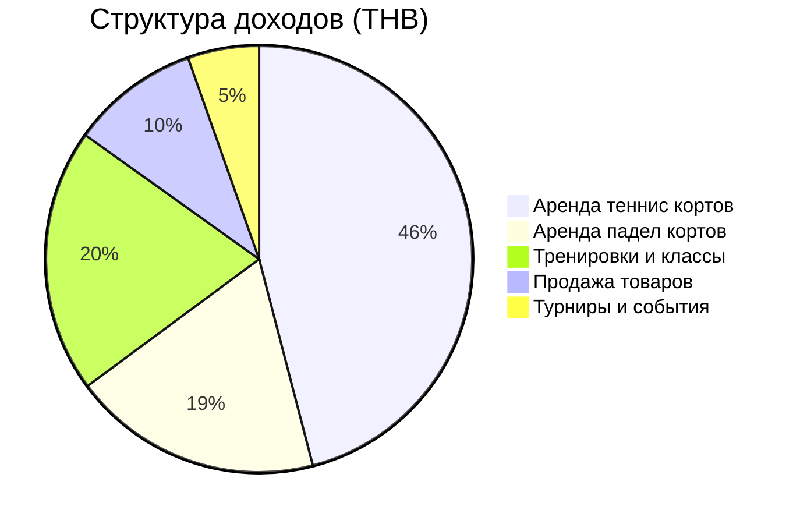
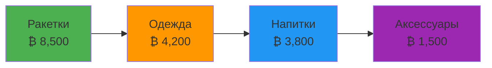
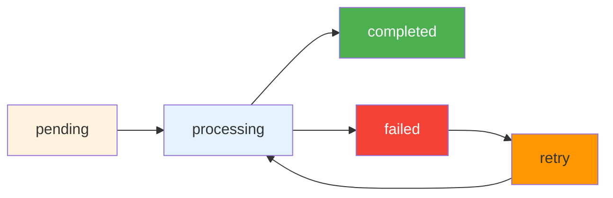
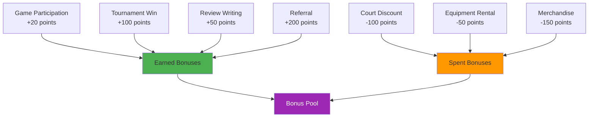
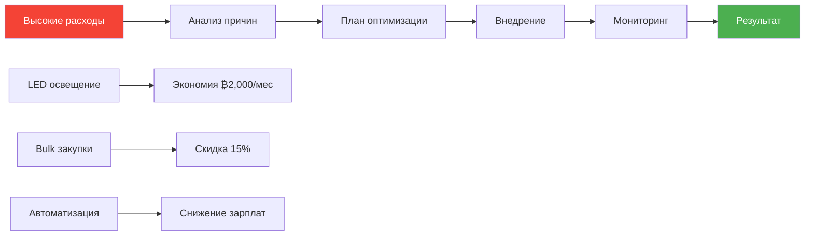
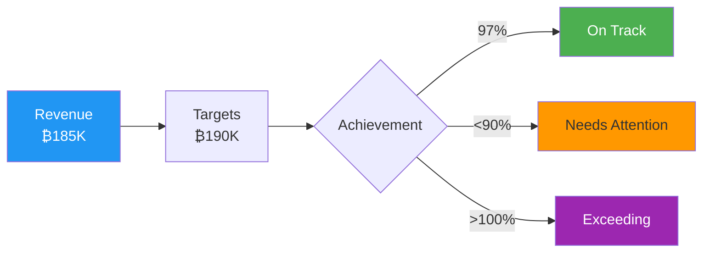
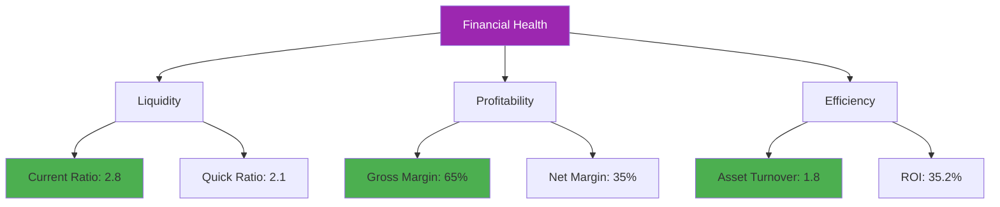
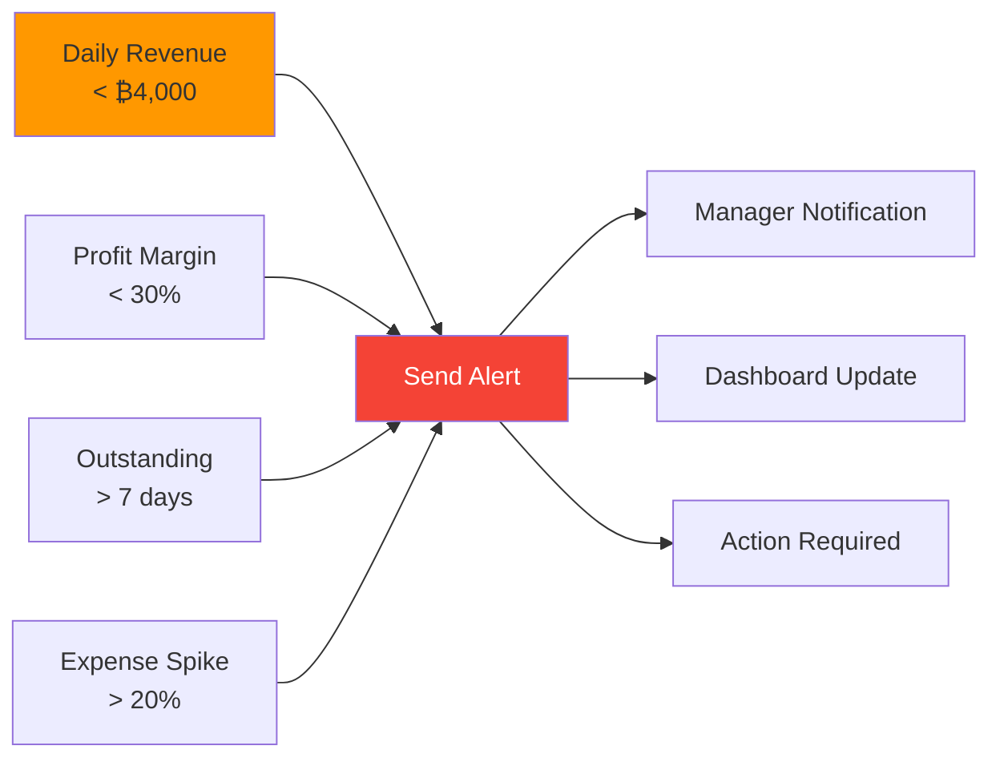

# 💰 Financial Data - Phangan Padel Tennis Club

## 📊 Финансовая Сводка в Реальном Времени

```dataview
TABLE WITHOUT ID
  "Метрика" as "💰 Financial KPI",
  "Значение (THB)" as "📊 Value",
  "Тренд" as "📈 Trend",
  "Цель месяца" as "🎯 Target"
FROM "oxygen-world/Database"
WHERE contains(file.name, "Financial")
LIMIT 5
```

## 💳 Общие Финансовые Показатели

### Текущий Месяц (Январь 2024)

| Показатель               | Сумма (THB) | Прошлый месяц | Изменение |
| ------------------------ | ----------- | ------------- | --------- |
| **Общий доход**          | ₿ 185,000   | ₿ 152,000     | ↗️ +22%   |
| **Операционные расходы** | ₿ 55,000    | ₿ 58,000      | ↘️ -5%    |
| **Чистая прибыль**       | ₿ 130,000   | ₿ 94,000      | ↗️ +38%   |
| **ROI**                  | 35.2%       | 27.8%         | ↗️ +7.4%  |

### Источники Доходов



## 🏓 Доходы по Типам Активности

### Корты (60% общего дохода)

#### 🎾 Теннисный Корт - ₿ 85,000

- **Пиковые часы (17-22)**: ₿ 45,000 (53%)
- **Дневные часы (09-17)**: ₿ 28,000 (33%)
- **Утренние часы (06-09)**: ₿ 12,000 (14%)

#### 🏓 Падел Корт - ₿ 35,000

- **Вечерние часы (18-21)**: ₿ 20,000 (57%)
- **Дневные часы (12-18)**: ₿ 12,000 (34%)
- **Другое время**: ₿ 3,000 (9%)

### Тренировки (20% общего дохода) - ₿ 37,000

| Тип тренировки        | Доход (THB) | Сессий | Средний чек |
| --------------------- | ----------- | ------ | ----------- |
| Индивидуальный теннис | ₿ 18,000    | 15     | ₿ 1,200     |
| Групповой теннис      | ₿ 12,000    | 20     | ₿ 600       |
| Индивидуальный падел  | ₿ 4,500     | 6      | ₿ 750       |
| Групповой падел       | ₿ 2,500     | 8      | ₿ 313       |

### Товары (10% общего дохода) - ₿ 18,000



## 💰 Реальные Платежи Сегодня

```dataview
TABLE
  amount as "💰 Сумма",
  currency as "💱 Валюта",
  payment_method as "💳 Способ",
  status as "📊 Статус",
  user_name as "👤 Клиент",
  created_at as "📅 Время"
FROM "oxygen-world/Database"
WHERE contains(file.name, "Payment-")
SORT created_at desc
LIMIT 10
```

## 💳 Платежные Системы

### Payment Methods Distribution

| Способ оплаты          | Сумма (THB) | % от общего | Комиссия | Чистый доход |
| ---------------------- | ----------- | ----------- | -------- | ------------ |
| **Наличные**           | ₿ 74,000    | 40%         | 0%       | ₿ 74,000     |
| **Банковские карты**   | ₿ 55,500    | 30%         | 2.5%     | ₿ 54,113     |
| **QR-код (PromptPay)** | ₿ 37,000    | 20%         | 1.0%     | ₿ 36,630     |
| **Банковский перевод** | ₿ 18,500    | 10%         | 0.5%     | ₿ 18,408     |

### Payment Status Tracking



## 🛒 Orders & Sales Analytics

### Orders Overview

| Статус заказа | Количество | Сумма (THB) | % от общего |
| ------------- | ---------- | ----------- | ----------- |
| **Completed** | 156        | ₿ 18,000    | 85%         |
| **Pending**   | 12         | ₿ 2,400     | 11%         |
| **Cancelled** | 5          | ₿ 750       | 3%          |
| **Refunded**  | 2          | ₿ 350       | 1%          |

### Top Selling Products

| Товар               | Продаж | Доход (THB) | Profit Margin |
| ------------------- | ------ | ----------- | ------------- |
| Wilson Blade 98     | 8      | ₿ 6,800     | 35%           |
| Bullpadel Vertex    | 6      | ₿ 4,200     | 30%           |
| Nike Dri-FIT Shirts | 25     | ₿ 3,750     | 60%           |
| Energy Drinks       | 120    | ₿ 1,800     | 40%           |
| Grip Tape           | 35     | ₿ 1,050     | 70%           |

## 🎁 Bonus System & Loyalty

### Bonus Transactions



### Bonus Statistics

| Метрика               | Значение  | Тренд   |
| --------------------- | --------- | ------- |
| Всего начислено       | 8,450 pts | ↗️ +15% |
| Всего потрачено       | 3,200 pts | ↗️ +22% |
| Активный баланс       | 5,250 pts | ↗️ +12% |
| Средний баланс игрока | 105 pts   | ↗️ +8%  |

## 📈 Revenue Analysis

### Daily Revenue Pattern

```mermaid
gantt
    title Ежедневные доходы (THB)
    dateFormat  YYYY-MM-DD
    axisFormat  %d

    section Week 1
    Пн: 4800    :2024-01-01, 1d
    Вт: 5200    :2024-01-02, 1d
    Ср: 4900    :2024-01-03, 1d
    Чт: 5500    :2024-01-04, 1d
    Пт: 6800    :2024-01-05, 1d
    Сб: 8200    :2024-01-06, 1d
    Вс: 6100    :2024-01-07, 1d
```

### Seasonal Revenue Forecast

| Период       | Прогноз (THB) | Факторы влияния                |
| ------------ | ------------- | ------------------------------ |
| **Фев 2024** | ₿ 195,000     | Высокий сезон, Valentine's Day |
| **Мар 2024** | ₿ 210,000     | Пик туристического сезона      |
| **Апр 2024** | ₿ 180,000     | Songkran, переходный период    |
| **Май 2024** | ₿ 165,000     | Начало низкого сезона          |

## 💸 Expenses & Cost Management

### Operating Expenses

| Категория расходов  | Сумма (THB) | % от дохода | Бюджет |
| ------------------- | ----------- | ----------- | ------ |
| **Зарплаты**        | ₿ 28,000    | 15.1%       | 15%    |
| **Электричество**   | ₿ 8,500     | 4.6%        | 5%     |
| **Обслуживание**    | ₿ 6,200     | 3.4%        | 4%     |
| **Закупка товаров** | ₿ 7,800     | 4.2%        | 4%     |
| **Маркетинг**       | ₿ 3,200     | 1.7%        | 2%     |
| **Прочее**          | ₿ 1,300     | 0.7%        | 1%     |

### Cost Optimization



## 🎯 Financial Goals & KPIs

### 2024 Financial Targets

| KPI                | Q1 Target | Q2 Target | Q3 Target | Q4 Target |
| ------------------ | --------- | --------- | --------- | --------- |
| **Месячный доход** | ₿ 190K    | ₿ 170K    | ₿ 160K    | ₿ 200K    |
| **Profit Margin**  | 35%       | 33%       | 30%       | 38%       |
| **Customer LTV**   | ₿ 15K     | ₿ 16K     | ₿ 17K     | ₿ 18K     |
| **ARPU (месяц)**   | ₿ 3,800   | ₿ 3,400   | ₿ 3,200   | ₿ 4,000   |

### Performance Dashboard



## 💼 Financial Health Indicators

### Cash Flow Analysis

| Показатель                 | Значение   | Статус       |
| -------------------------- | ---------- | ------------ |
| **Operating Cash Flow**    | ₿ +125,000 | ✅ Excellent |
| **Free Cash Flow**         | ₿ +95,000  | ✅ Strong    |
| **Cash Conversion**        | 95%        | ✅ Optimal   |
| **Days Sales Outstanding** | 5 days     | ✅ Excellent |

### Financial Ratios



## 📊 Advanced Analytics

### Customer Financial Segments

| Сегмент     | Клиентов | Avg Monthly Spend | LTV   | Retention |
| ----------- | -------- | ----------------- | ----- | --------- |
| **VIP**     | 8        | ₿ 12,000          | ₿ 80K | 95%       |
| **Regular** | 25       | ₿ 4,500           | ₿ 35K | 85%       |
| **Casual**  | 17       | ₿ 1,800           | ₿ 18K | 70%       |

### Revenue Predictions (AI)

```json
{
  "predictions": {
    "next_week": "₿47,500",
    "next_month": "₿195,000",
    "confidence": "87.3%",
    "factors": [
      "weather_forecast",
      "tournament_schedule",
      "tourist_arrivals",
      "competitor_pricing"
    ]
  }
}
```

## 🔔 Financial Alerts

### Current Alerts

- ⚠️ **High Energy Costs**: Electricity 15% above budget
- ✅ **Revenue Target**: On track for monthly goal
- 📊 **Cash Flow**: Strong positive trend
- 🎯 **Profit Margin**: Exceeding target by 2.2%

### Automated Financial Rules



## 📱 Payment Integration

### API Integrations

- **PromptPay**: Real-time QR payments
- **SCB Easy**: Bank integration
- **Stripe**: International cards
- **Line Pay**: Tourist-friendly option

### Transaction Security

- 🔒 **PCI DSS Compliant**
- 🔐 **End-to-end encryption**
- 🛡️ **Fraud detection**
- 📱 **2FA for large amounts**

---

_Финансовые данные обновляются в режиме реального времени каждые 5 минут_
_💰 Phangan Padel Tennis Club - Building Wealth Through Sports Excellence on Paradise Island_
