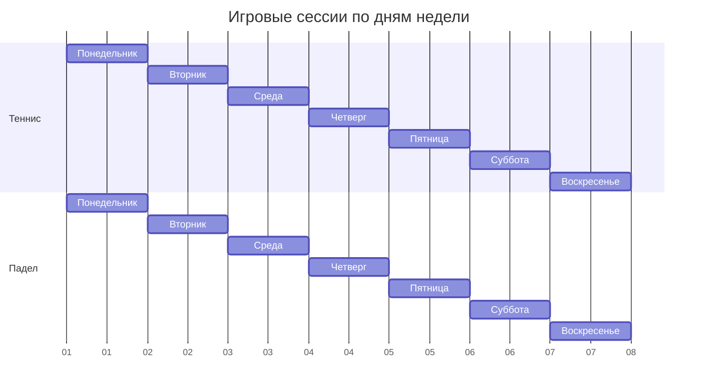
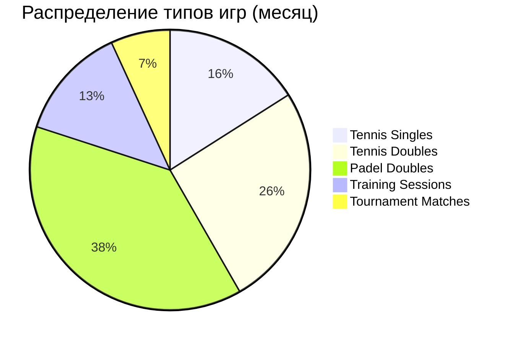
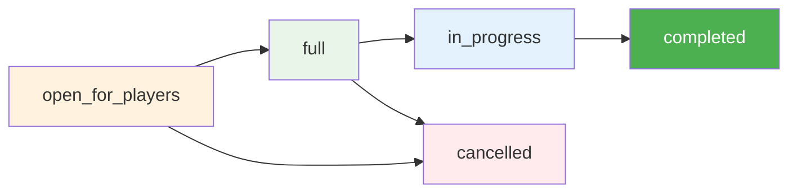
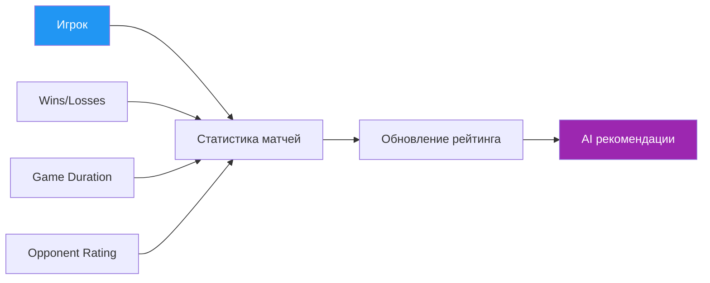
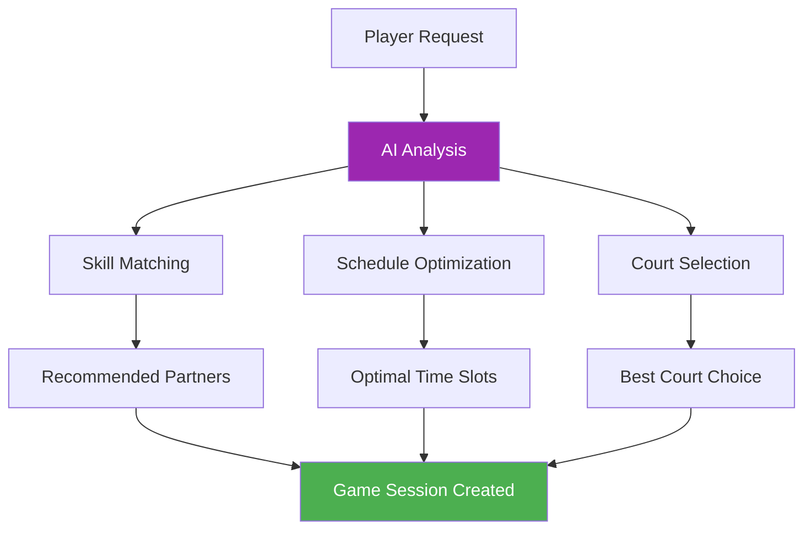
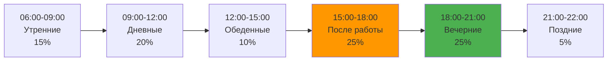
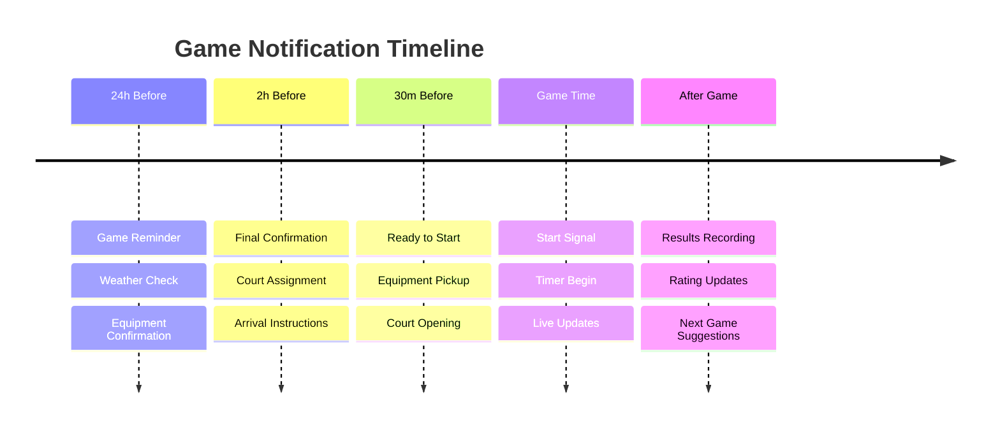

# 🎮 Games & Sessions Data - Phangan Padel Tennis Club

## 📊 Интерактивная Таблица Игровых Сессий

```dataview
TABLE
  name as "🎮 Название сессии",
  game_type as "🏓 Тип игры",
  status as "📊 Статус",
  max_players as "👥 Макс игроков",
  current_players as "👤 Текущих",
  start_time as "⏰ Начало"
FROM "Database/games"
SORT start_time desc
```

## 🎯 Активные Игровые Сессии

### Сегодня ({{date:YYYY-MM-DD}})

| Время | Корт         | Тип игры | Игроки | Статус       | Host              |
| ----- | ------------ | -------- | ------ | ------------ | ----------------- |
| 09:00 | Tennis Court | singles  | 2/2    | В процессе   | David Smith       |
| 10:30 | Padel Court  | doubles  | 4/4    | Завершено    | Maria Rodriguez   |
| 14:00 | Tennis Court | doubles  | 3/4    | Ждет игрока  | Anna Johnson      |
| 16:00 | Padel Court  | doubles  | 4/4    | Полная       | Carlos Mendez     |
| 18:30 | Tennis Court | singles  | 0/2    | Открыта      | Mark Johnson      |
| 19:00 | Padel Court  | doubles  | 2/4    | Ждет игрока  | Siriporn Kaewsai  |
| 20:30 | Tennis Court | doubles  | 4/4    | Забронирован | Tournament System |

## 🏓 Types of Game Sessions

### 🎾 Tennis Sessions

#### Singles (1v1)

- **Игроков**: 2
- **Продолжительность**: 60-90 минут
- **Уровни**: Beginner, Intermediate, Advanced
- **Популярность**: 35% от всех теннисных игр

#### Doubles (2v2)

- **Игроков**: 4
- **Продолжительность**: 90-120 минут
- **Уровни**: Mixed levels welcome
- **Популярность**: 65% от всех теннисных игр

### 🏓 Padel Sessions

#### Standard Doubles (2v2)

- **Игроков**: 4 (всегда)
- **Продолжительность**: 60-90 минут
- **Особенность**: Только парная игра
- **Популярность**: 100% падел игр

#### Training Sessions

- **Игроков**: 2-6 (с тренером)
- **Продолжительность**: 60-75 минут
- **Фокус**: Техника и тактика
- **Частота**: 3-4 раза в неделю

## 📈 Game Session Analytics

### Weekly Statistics



### Game Type Distribution



## 🎮 Game Session Statuses

### Status Flow



| Статус             | Описание         | Действия             |
| ------------------ | ---------------- | -------------------- |
| `open_for_players` | Ищут игроков     | Присоединиться       |
| `full`             | Все места заняты | Лист ожидания        |
| `in_progress`      | Игра идет        | Только наблюдение    |
| `completed`        | Игра завершена   | Просмотр результатов |
| `cancelled`        | Отменена         | Создать новую        |

## 👥 Player Management

### Game Players

```dataview
TABLE WITHOUT ID
  "Игрок" as "👤 Player",
  "Статус участия" as "📊 Status",
  "Роль" as "🎯 Role",
  "Рейтинг" as "⭐ Rating"
FROM "Database/game_players"
SORT rating desc
```

### Participation Status

- **✅ confirmed** - Подтвердил участие
- **⏳ pending** - Ожидает подтверждения
- **❌ declined** - Отклонил приглашение
- **🚫 no_show** - Не явился

## 🏆 Game Results & Statistics

### Recent Completed Games

| Дата       | Игра           | Игроки                    | Счет          | Продолжительность |
| ---------- | -------------- | ------------------------- | ------------- | ----------------- |
| 2024-01-20 | Tennis Singles | David vs Mark             | 6-4, 6-2      | 75 мин            |
| 2024-01-20 | Padel Doubles  | Maria/Carlos vs Anna/Tom  | 6-3, 4-6, 6-2 | 95 мин            |
| 2024-01-19 | Tennis Doubles | Siriporn/John vs Alex/Sam | 6-4, 7-5      | 110 мин           |
| 2024-01-19 | Padel Training | Группа начинающих         | -             | 60 мин            |

### Player Performance Trends



## 🎯 Game Creation & Hosting

### How to Create a Game Session {#new-session}

1. **Select Court & Time**

   - Choose available court
   - Pick time slot
   - Set duration

2. **Game Configuration**

   - Game type (singles/doubles)
   - Skill level preference
   - Maximum players

3. **Invitation Settings**

   - Public (open to all)
   - Private (invite only)
   - Skill-based matching

4. **Additional Options**
   - Equipment rental
   - Coaching request
   - Recording permission

### Host Responsibilities

- **Pre-Game**: Confirm players, check equipment
- **During**: Manage game flow, resolve disputes
- **Post-Game**: Record results, rate players

## 📱 Smart Game Matching

### AI-Powered Matching



### Matching Factors

- **Skill Level**: ±100 rating points
- **Playing Style**: Aggressive vs Defensive
- **Availability**: Compatible schedules
- **Court Preference**: Tennis vs Padel
- **Language**: Communication preference

## 🌟 Special Game Types

### Tournament Matches

- **Format**: Elimination or Round Robin
- **Timing**: Fixed schedule
- **Stakes**: Prize money/trophies
- **Recording**: Mandatory for semifinals+

### Training Games

- **With Instructor**: Professional guidance
- **Practice Matches**: Low pressure environment
- **Skill Development**: Focus on improvement
- **Video Analysis**: Optional recording

### Social Games

- **Mixed Levels**: Beginners welcome
- **Fun Format**: Modified rules
- **Community Building**: Meeting new players
- **After-Game**: Drinks and socializing

## 📊 Game Analytics Dashboard

### Monthly Overview

| Метрика                 | Значение | Тренд   |
| ----------------------- | -------- | ------- |
| Всего игр               | 175      | ↗️ +18% |
| Средняя длительность    | 85 мин   | ↗️ +5%  |
| Рейтинг удовлетворения  | 4.7/5    | ↗️ +0.2 |
| Отмены последней минуты | 8%       | ↘️ -2%  |
| Повторные игроки        | 78%      | ↗️ +12% |

### Peak Playing Times



## 🎮 Game Equipment & Setup

### Court Equipment Status

| Корт         | Ракетки | Мячи | Сетка | Освещение | Статус   |
| ------------ | ------- | ---- | ----- | --------- | -------- |
| Tennis Court | 8/10    | 50   | ✅ OK | ✅ LED    | ✅ Ready |
| Padel Court  | 6/8     | 30   | ✅ OK | ✅ LED    | ✅ Ready |

### Rental Equipment

- **Tennis Rackets**: Wilson Pro Staff, Head Radical
- **Padel Rackets**: Bullpadel Vertex, Head Delta
- **Balls**: Wilson Championship (tennis), Head Padel Pro
- **Accessories**: Grips, wristbands, towels

## 🔔 Game Notifications

### Automated Notifications



### Notification Types

- **📱 Push Notifications**: Mobile app alerts
- **📧 Email**: Detailed confirmations
- **💬 WhatsApp**: Quick updates
- **📞 SMS**: Emergency only

## 🎯 Upcoming Features

### Q2 2024

- [ ] **Live Streaming**: Watch games remotely
- [ ] **Game Replay**: Video analysis
- [ ] **Virtual Coaching**: AI-powered tips

### Q3 2024

- [ ] **VR Training**: Immersive practice
- [ ] **Biometric Tracking**: Heart rate, calories
- [ ] **Social Gaming**: Multi-club tournaments

---

_Данные об играх обновляются в реальном времени_
_🎮 Phangan Padel Tennis Club - Where Every Game Creates Memories on Paradise Island_
