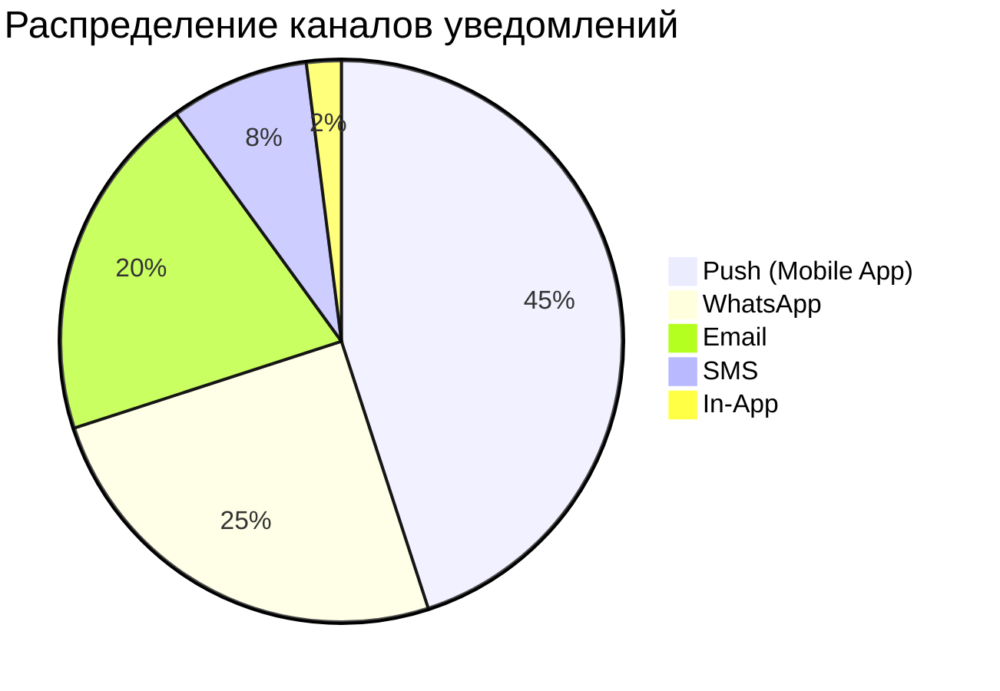
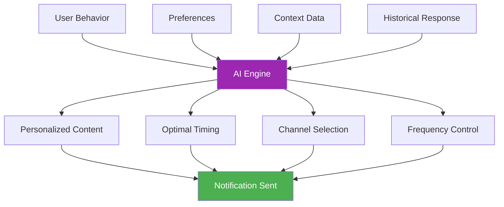
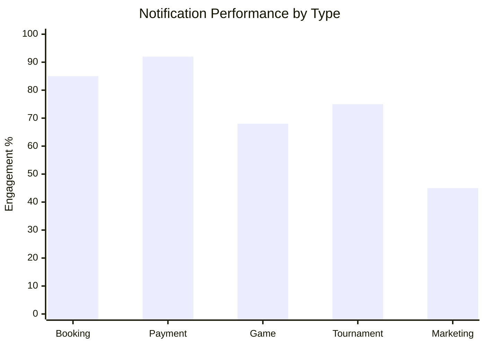
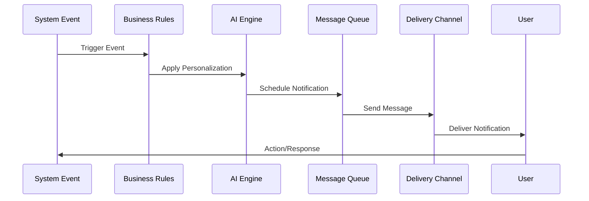
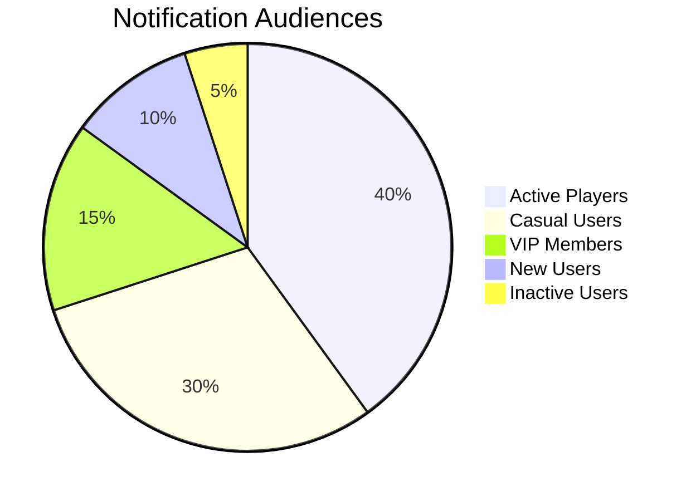
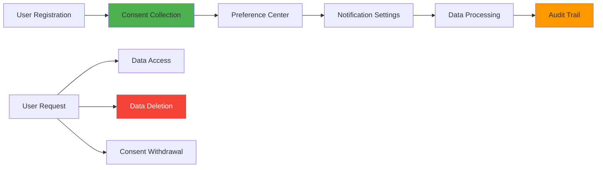
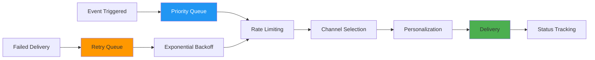

# 🔔 Notifications Data - Phangan Padel Tennis Club

## 📊 Интерактивная Таблица Уведомлений

```dataview
TABLE
  notification_type as "📝 Тип",
  recipient_type as "👤 Получатель",
  channel as "📱 Канал",
  status as "📊 Статус",
  created_at as "📅 Дата"
FROM "Database/notifications"
SORT created_at desc
LIMIT 10
```

## 📱 Communication Channels

### Каналы Доставки



### Channel Performance

| Канал             | Delivery Rate | Open Rate | Response Rate | Avg Time to Open |
| ----------------- | ------------- | --------- | ------------- | ---------------- |
| **Push Mobile**   | 98.5%         | 85%       | 32%           | 3 минуты         |
| **WhatsApp**      | 99.2%         | 95%       | 78%           | 1 минута         |
| **Email**         | 97.8%         | 45%       | 12%           | 2 часа           |
| **SMS**           | 99.9%         | 98%       | 85%           | 30 секунд        |
| **In-App Banner** | 100%          | 65%       | 45%           | 5 минут          |

## 📝 Notification Types & Templates

### Booking Notifications

#### Booking Confirmation

```json
{
  "type": "booking_confirmation",
  "template": {
    "push": "✅ Booking confirmed for {court_name} on {date} at {time}",
    "whatsapp": "🎾 Your court is booked!\n📅 Date: {date}\n⏰ Time: {time}\n🏓 Court: {court_name}\n📍 Phangan Club",
    "email": {
      "subject": "Booking Confirmation - {court_name}",
      "template": "booking_confirmation_email.html"
    }
  },
  "trigger": "booking_status_change:confirmed"
}
```

#### Booking Reminder (24h)

```json
{
  "type": "booking_reminder_24h",
  "template": {
    "push": "🕐 Tomorrow: {court_name} at {time}. Weather: {weather}",
    "whatsapp": "🌅 See you tomorrow!\n🎾 {court_name} at {time}\n🌤️ Weather: {weather}\n💡 Bring sunscreen!"
  },
  "trigger": "scheduled:24h_before"
}
```

#### Last Minute Reminder (30min)

```json
{
  "type": "booking_reminder_30min",
  "template": {
    "push": "⏰ 30 min until your game at {court_name}",
    "sms": "🎾 Phangan: Your game starts in 30min at {court_name}. See you soon!"
  },
  "trigger": "scheduled:30min_before"
}
```

### Payment Notifications

#### Payment Success

```json
{
  "type": "payment_success",
  "template": {
    "push": "💳 Payment successful! ₿{amount} for {service}",
    "whatsapp": "✅ Payment confirmed\n💰 Amount: ₿{amount}\n🎾 Service: {service}\n📋 Receipt: {receipt_url}"
  },
  "trigger": "payment_status:completed"
}
```

#### Payment Failed

```json
{
  "type": "payment_failed",
  "template": {
    "push": "❌ Payment failed. Please try again or contact support",
    "email": {
      "subject": "Payment Issue - Action Required",
      "template": "payment_failed_email.html"
    }
  },
  "trigger": "payment_status:failed"
}
```

### Game & Tournament Notifications

#### Game Invitation

```json
{
  "type": "game_invitation",
  "template": {
    "push": "🎾 {host_name} invited you to play {game_type}",
    "whatsapp": "🎾 Game Invitation!\n👤 Host: {host_name}\n🏓 Game: {game_type}\n📅 {date} at {time}\n👥 Current players: {current_players}/{max_players}"
  },
  "trigger": "game_invitation_sent"
}
```

#### Tournament Registration Open

```json
{
  "type": "tournament_registration",
  "template": {
    "push": "🏆 {tournament_name} registration is now open!",
    "email": {
      "subject": "🏆 Tournament Registration Open - {tournament_name}",
      "template": "tournament_registration_email.html"
    }
  },
  "trigger": "tournament_status:registration_open"
}
```

## 🎯 Smart Notification System

### AI-Powered Personalization



### Personalization Factors

| Factor                 | Weight | Description                       |
| ---------------------- | ------ | --------------------------------- |
| **Playing History**    | 35%    | Preferred times, courts, partners |
| **Response Patterns**  | 25%    | Open rates, click rates, actions  |
| **Device Usage**       | 20%    | Mobile vs web, preferred apps     |
| **Geographic Context** | 15%    | Location, timezone, weather       |
| **Social Preferences** | 5%     | Group size, friend connections    |

## 📊 Notification Analytics

### Performance Metrics



### User Engagement Trends

| Метрика                | This Month | Last Month | Change   |
| ---------------------- | ---------- | ---------- | -------- |
| **Total Sent**         | 2,456      | 2,184      | ↗️ +12%  |
| **Delivery Rate**      | 98.3%      | 97.8%      | ↗️ +0.5% |
| **Open Rate**          | 78.5%      | 75.2%      | ↗️ +3.3% |
| **Click-through Rate** | 34.2%      | 31.8%      | ↗️ +2.4% |
| **Unsubscribe Rate**   | 0.8%       | 1.2%       | ↘️ -0.4% |

### Peak Activity Times

```mermaid
gantt
    title Optimal Notification Times
    dateFormat  HH:mm
    axisFormat %H:%M

    section Morning
    High Response    :07:00, 2h

    section Lunch
    Medium Response  :12:00, 1h

    section Evening
    Peak Response    :18:00, 3h

    section Night
    Low Response     :22:00, 1h
```



## 🔧 Notification Automation

### Trigger-Based System



### Automation Rules

#### Booking Flow

```yaml
booking_automation:
  - trigger: "booking_created"
    delay: "immediate"
    notification: "booking_confirmation"

  - trigger: "booking_confirmed"
    delay: "24_hours_before"
    notification: "booking_reminder_24h"

  - trigger: "booking_confirmed"
    delay: "30_minutes_before"
    notification: "booking_reminder_30min"
```

#### Payment Flow

```yaml
payment_automation:
  - trigger: "payment_initiated"
    delay: "immediate"
    notification: "payment_processing"

  - trigger: "payment_failed"
    delay: "immediate"
    notification: "payment_failed"

  - trigger: "payment_failed"
    delay: "1_hour"
    notification: "payment_retry_reminder"
```

## 👥 Audience Segmentation

### User Segments



### Segment-Specific Strategies

| Segment            | Frequency        | Content Type   | Primary Channel | Response Goal |
| ------------------ | ---------------- | -------------- | --------------- | ------------- |
| **Active Players** | High (daily)     | Game updates   | Push + WhatsApp | 85%+          |
| **Casual Users**   | Medium (3x/week) | Special offers | Email + Push    | 60%+          |
| **VIP Members**    | Premium          | Exclusive info | WhatsApp        | 90%+          |
| **New Users**      | Onboarding       | Tutorials      | Email series    | 70%+          |
| **Inactive**       | Re-engagement    | Win-back deals | Email campaign  | 30%+          |

## 🌐 Multi-Language Support

### Language Distribution

| Language    | Users | Templates | Completion |
| ----------- | ----- | --------- | ---------- |
| **Thai**    | 60%   | 45        | 100%       |
| **English** | 35%   | 45        | 100%       |
| **Chinese** | 5%    | 20        | 45%        |

### Localization Features

- **Dynamic Language**: Auto-detect from user profile
- **Cultural Adaptation**: Local holidays, customs
- **Time Zones**: Appropriate sending times
- **Currency Display**: THB for locals, USD for tourists

## 📱 Mobile App Integration

### Push Notification Categories

```typescript
interface PushCategories {
  booking: {
    identifier: "BOOKING_UPDATES";
    options: ["sound", "badge", "alert"];
    actions: ["view", "modify", "cancel"];
  };

  games: {
    identifier: "GAME_INVITES";
    options: ["sound", "alert"];
    actions: ["accept", "decline"];
  };

  payments: {
    identifier: "PAYMENT_ALERTS";
    options: ["sound", "badge"];
    actions: ["view_receipt", "retry"];
  };

  marketing: {
    identifier: "PROMOTIONS";
    options: ["badge"];
    actions: ["view_offer", "dismiss"];
  };
}
```

### Rich Notifications

- **Images**: Court photos, weather icons
- **Actions**: Quick reply buttons
- **Interactive**: Booking confirmations, game responses
- **Deep Links**: Direct navigation to specific screens

## 🔐 Privacy & Consent Management

### GDPR Compliance



### Consent Categories

| Category            | Required | Default | Description             |
| ------------------- | -------- | ------- | ----------------------- |
| **Essential**       | Yes      | On      | Booking confirmations   |
| **Service Updates** | No       | On      | Game invites, schedules |
| **Marketing**       | No       | Off     | Promotions, events      |
| **Analytics**       | No       | Off     | Usage tracking          |

## 🎯 A/B Testing Framework

### Current Tests

| Test Name            | Variant A      | Variant B        | Winner | Improvement |
| -------------------- | -------------- | ---------------- | ------ | ----------- |
| **Booking Reminder** | 2h before      | 4h before        | B      | +15%        |
| **Game Invite**      | Direct message | Rich card        | B      | +23%        |
| **Payment Success**  | Simple text    | Receipt included | B      | +18%        |

### Testing Metrics

- **Delivery Rate**: Message successfully sent
- **Open Rate**: User opened notification
- **Click Rate**: User tapped action button
- **Conversion Rate**: User completed desired action

## 🔄 Notification Queue Management

### Queue Processing



### Priority Levels

| Priority   | Type                  | SLA         | Retry Logic    |
| ---------- | --------------------- | ----------- | -------------- |
| **High**   | Payment confirmations | <30 seconds | 3x immediate   |
| **Medium** | Booking reminders     | <5 minutes  | 2x (1h apart)  |
| **Low**    | Marketing messages    | <1 hour     | 1x (24h later) |

## 📊 Advanced Analytics

### Real-Time Dashboard

```json
{
  "current_stats": {
    "notifications_sent_today": 327,
    "delivery_rate": "98.5%",
    "average_response_time": "2.3 minutes",
    "top_performing_type": "booking_confirmation",
    "active_campaigns": 3
  },

  "live_metrics": {
    "queue_size": 12,
    "processing_rate": "145/minute",
    "failed_deliveries": 2,
    "retry_queue": 1
  }
}
```

### Predictive Analytics

- **Optimal Send Times**: AI-predicted best times per user
- **Content Optimization**: A/B test winning variations
- **Churn Prevention**: Early warning for notification fatigue
- **Engagement Prediction**: Forecast user response likelihood

---

_Notification data processed in real-time with 99.9% uptime_  
_🔔 Phangan Communication System - Keeping Paradise Connected_
