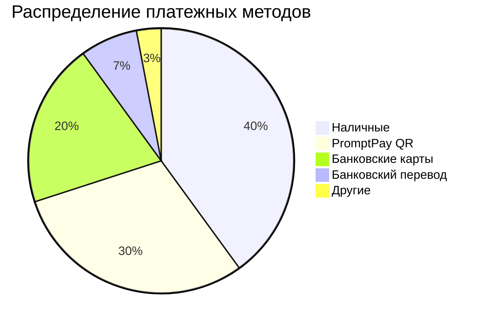
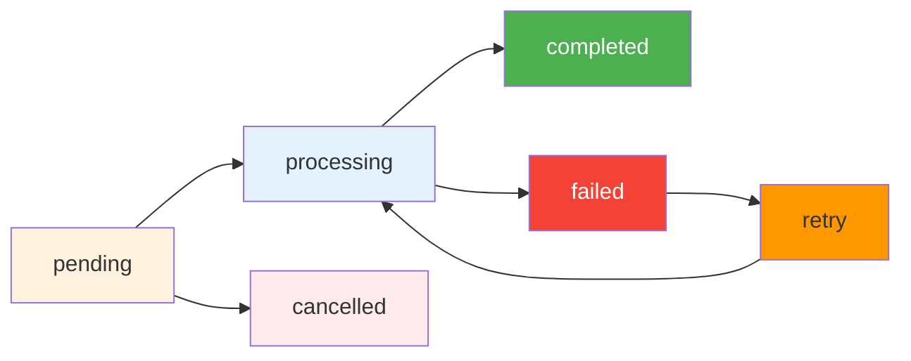
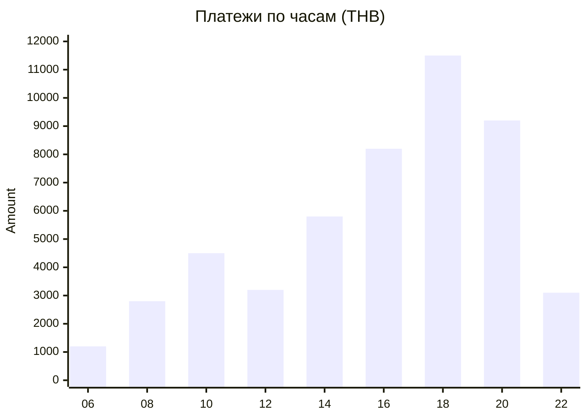
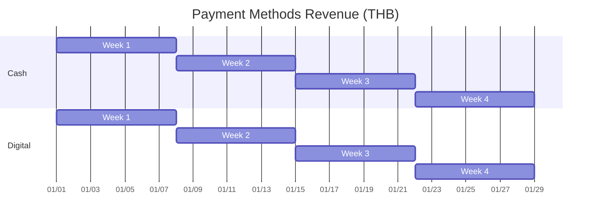
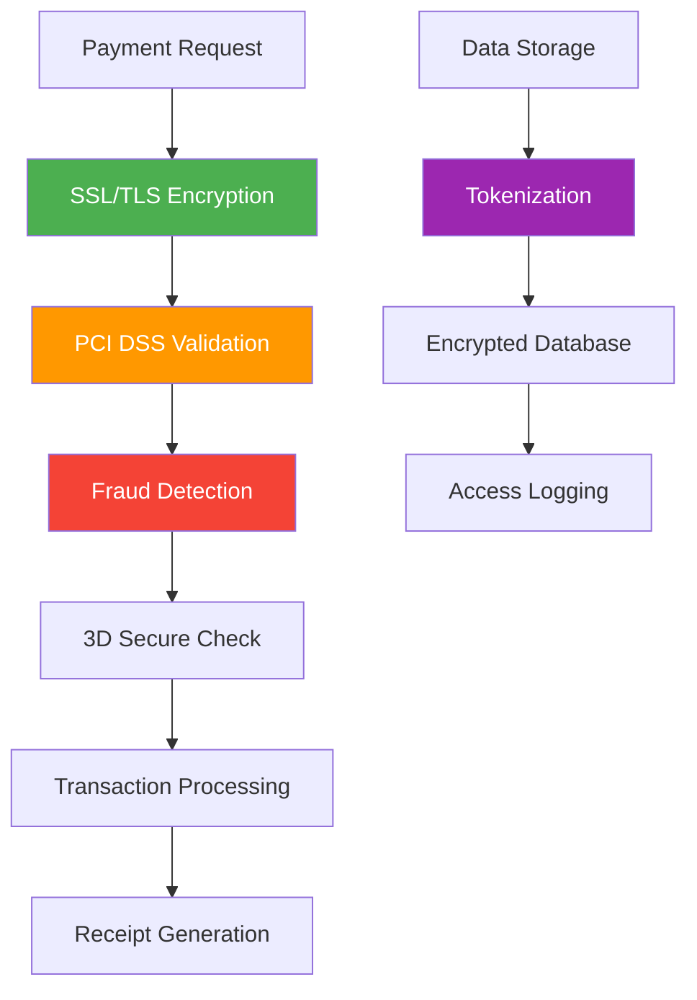
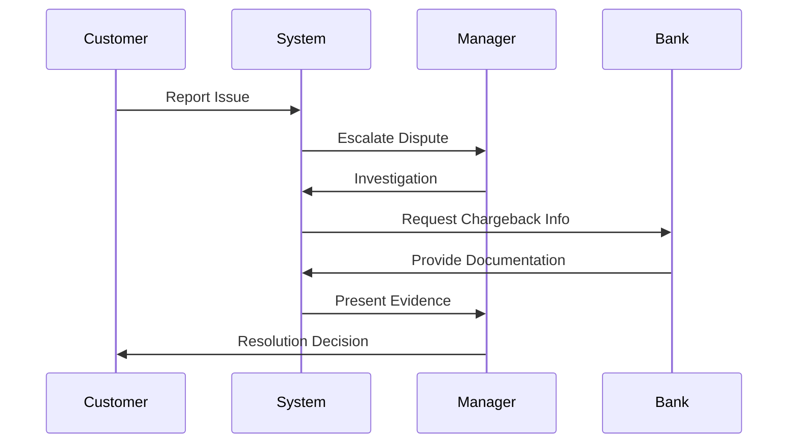
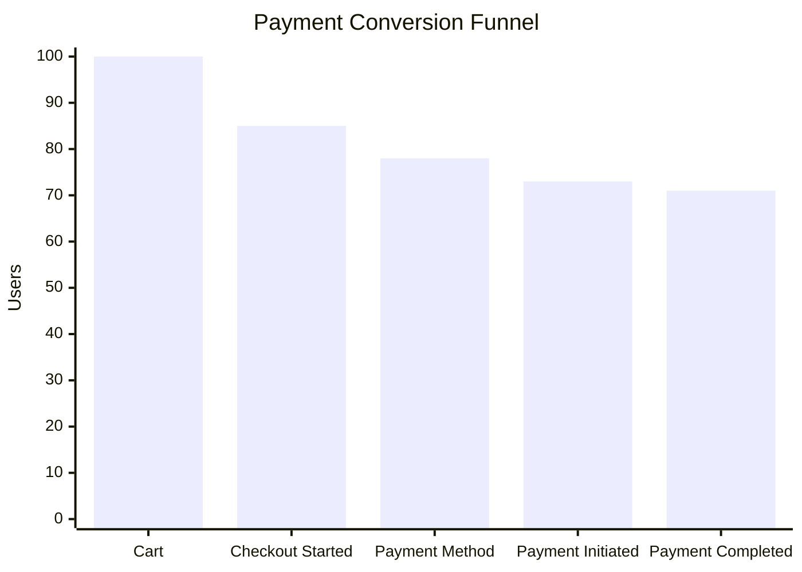
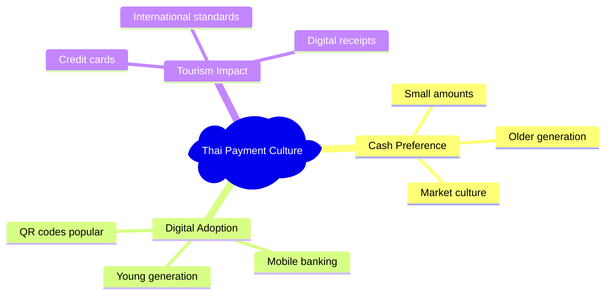

# 💳 Payments Data - Phangan Padel Tennis Club

## 📊 Интерактивная Таблица Платежей

```dataview
TABLE
  payment_method as "💳 Метод",
  amount as "💰 Сумма (THB)",
  status as "📊 Статус",
  transaction_id as "🔢 ID транзакции",
  created_at as "📅 Дата"
FROM "Database/payments"
SORT created_at desc
LIMIT 10
```

## 💳 Методы Платежей

### Популярность Платежных Методов



### Детализация по Методам

| Метод платежа       | Транзакций | Сумма (THB) | Комиссия | Время обработки |
| ------------------- | ---------- | ----------- | -------- | --------------- |
| **Наличные**        | 145        | ₿ 74,000    | 0%       | Мгновенно       |
| **PromptPay QR**    | 89         | ₿ 55,500    | 1.0%     | 1-3 секунды     |
| **Visa/Mastercard** | 67         | ₿ 37,000    | 2.5%     | 5-15 секунд     |
| **Bank Transfer**   | 23         | ₿ 18,500    | 0.5%     | 1-24 часа       |
| **Line Pay**        | 8          | ₿ 4,200     | 2.0%     | 5-10 секунд     |

## 🔄 Payment Status Flow



| Статус       | Описание              | Действия                            |
| ------------ | --------------------- | ----------------------------------- |
| `pending`    | Ожидает обработки     | Инициировать платеж                 |
| `processing` | Обрабатывается        | Ожидание подтверждения              |
| `completed`  | Успешно завершен      | Выдать чек, активировать услуги     |
| `failed`     | Ошибка платежа        | Повторить или выбрать другой способ |
| `retry`      | Повторная попытка     | Автоматическая обработка            |
| `cancelled`  | Отменен пользователем | Возврат к выбору метода             |

## 💰 Transaction Analytics

### Hourly Payment Distribution



### Payment Success Rates

| Метод платежа     | Success Rate | Avg Processing Time | Error Rate |
| ----------------- | ------------ | ------------------- | ---------- |
| **Cash**          | 100%         | 0s                  | 0%         |
| **PromptPay**     | 98.9%        | 2.3s                | 1.1%       |
| **Cards**         | 97.2%        | 8.5s                | 2.8%       |
| **Bank Transfer** | 99.1%        | 4.2h                | 0.9%       |
| **Line Pay**      | 96.5%        | 7.1s                | 3.5%       |

## 🔧 Payment Gateway Integrations

### PromptPay Integration

```json
{
  "provider": "Bank of Thailand",
  "qr_format": "EMVCo",
  "merchant_id": "015570166993651",
  "features": {
    "real_time_confirmation": true,
    "amount_validation": true,
    "receipt_generation": true,
    "refund_support": true
  },
  "limits": {
    "min_amount": 1,
    "max_amount": 50000,
    "daily_limit": 200000
  }
}
```

### Card Processing (Stripe)

```json
{
  "provider": "Stripe",
  "supported_cards": ["visa", "mastercard", "amex"],
  "3d_secure": true,
  "currencies": ["THB", "USD", "EUR"],
  "features": {
    "saved_cards": true,
    "installments": false,
    "recurring": true,
    "refunds": true
  },
  "fees": {
    "local_cards": "2.5%",
    "international_cards": "3.25%",
    "refund_fee": "฿0"
  }
}
```

## 📊 Payment Analytics Dashboard

### Monthly Revenue by Payment Method



### Customer Payment Preferences

| Возраст   | Предпочтительный метод | Avg Transaction | Frequency |
| --------- | ---------------------- | --------------- | --------- |
| **18-25** | PromptPay QR           | ₿ 850           | 3x/месяц  |
| **26-35** | Банковские карты       | ₿ 1,200         | 4x/месяц  |
| **36-45** | PromptPay + Карты      | ₿ 1,500         | 5x/месяц  |
| **46-55** | Наличные + Карты       | ₿ 1,800         | 3x/месяц  |
| **55+**   | Наличные               | ₿ 1,100         | 2x/месяц  |

## 🔐 Security & Compliance

### Security Measures



### Compliance Standards

- **🔒 PCI DSS Level 1**: Full compliance for card processing
- **🛡️ ISO 27001**: Information security management
- **🇹🇭 Thai Regulations**: Bank of Thailand compliance
- **📋 GDPR Ready**: European data protection standards

## 💸 Refunds & Disputes

### Refund Policy

| Причина возврата       | Срок обработки | Комиссия | Способ возврата    |
| ---------------------- | -------------- | -------- | ------------------ |
| **Отмена booking**     | 1-3 дня        | 0%       | Исходный метод     |
| **Техническая ошибка** | Мгновенно      | 0%       | Исходный метод     |
| **Двойное списание**   | 1 день         | 0%       | Исходный метод     |
| **Спор с клиентом**    | 7-14 дней      | 2.5%     | Банковский перевод |

### Dispute Resolution Process



## 📱 Mobile Payment Features

### QR Code Generation

- **Dynamic QR**: Unique for each transaction
- **Amount Pre-filled**: Customer scans and pays
- **Timeout**: 5 minutes auto-expiry
- **Receipt**: Automatic SMS/Email receipt

### Mobile App Integration

```typescript
interface MobilePaymentOptions {
  methods: ["promptpay", "cards", "wallet"];
  biometric_auth: boolean;
  save_payment_method: boolean;
  auto_receipt: boolean;
  push_notifications: boolean;
}
```

## 🎯 Payment Optimization

### A/B Testing Results

| Test                | Variant A  | Variant B   | Winner | Improvement |
| ------------------- | ---------- | ----------- | ------ | ----------- |
| **Checkout Flow**   | 3-step     | 1-step      | B      | +15%        |
| **Payment Methods** | 4 options  | 6 options   | A      | +8%         |
| **QR Code Size**    | Small      | Large       | B      | +12%        |
| **Receipt Options** | Email only | Email + SMS | B      | +22%        |

### Conversion Optimization



## 🏝️ Island-Specific Payment Features

### Tourist-Friendly Options

- **Multi-Currency Display**: THB, USD, EUR
- **Language Support**: Thai, English, Chinese
- **Tourist Cards**: International Visa/Mastercard
- **Hotel Billing**: Partner hotel room charges

### Local Payment Culture



## 🔄 Recurring Payments

### Subscription Management

| Package Type         | Price (THB) | Billing Cycle | Payment Method | Success Rate |
| -------------------- | ----------- | ------------- | -------------- | ------------ |
| **Monthly Court**    | ₿ 8,500     | Monthly       | Auto-charge    | 94%          |
| **Training Package** | ₿ 12,000    | 4 weeks       | Cards          | 92%          |
| **VIP Membership**   | ₿ 25,000    | Quarterly     | Bank transfer  | 98%          |

### Auto-Payment Features

- **Smart Retry**: Failed payments retry 3x over 7 days
- **Card Expiry Alerts**: 30-day advance notification
- **Payment Confirmation**: SMS + Email receipts
- **Usage Tracking**: Real-time balance updates

## 📈 Financial Analytics Integration

### Real-Time Metrics

```json
{
  "daily_revenue": "₿12,450",
  "transaction_count": 67,
  "average_transaction": "₿186",
  "success_rate": "97.8%",
  "top_payment_method": "PromptPay",
  "peak_hour": "18:00-19:00",
  "conversion_rate": "85.2%"
}
```

### Export & Reporting

- **📊 Excel Reports**: Daily, weekly, monthly summaries
- **📈 Charts**: Revenue trends and payment analytics
- **💾 Data Export**: CSV, JSON, PDF formats
- **🔄 API Access**: Real-time data for third-party tools

---

_Payment data updated in real-time every 30 seconds_  
_💳 Phangan Payment Systems - Secure & Seamless Transactions on Paradise Island_
