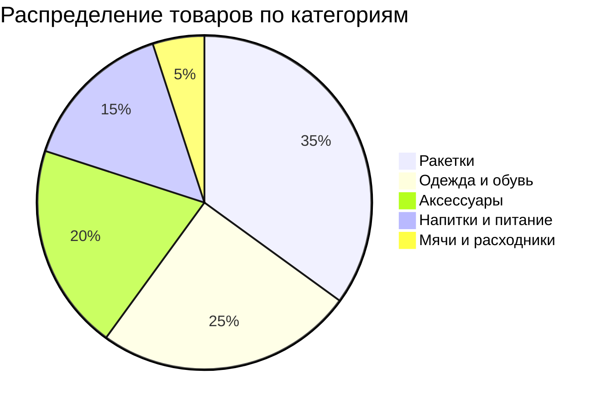
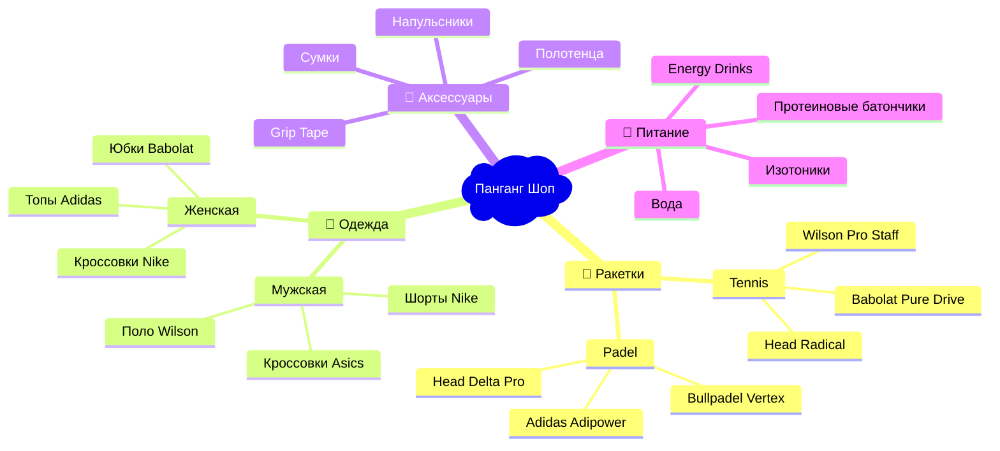
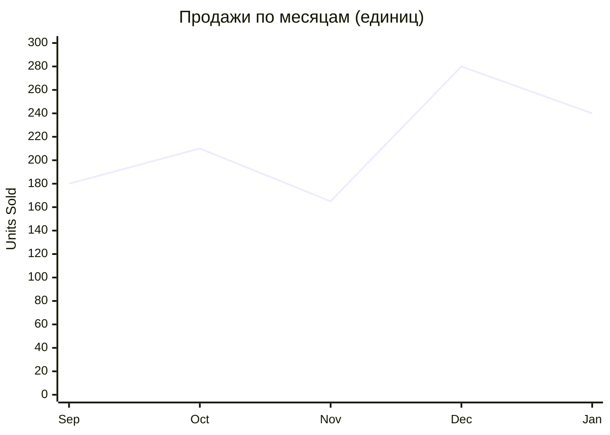
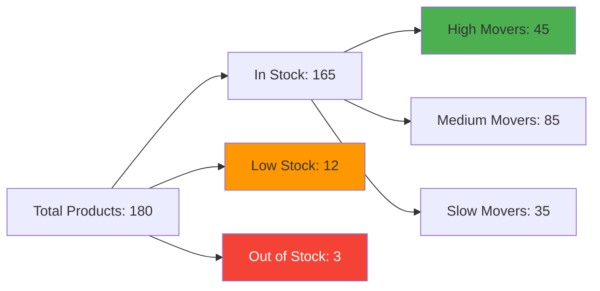
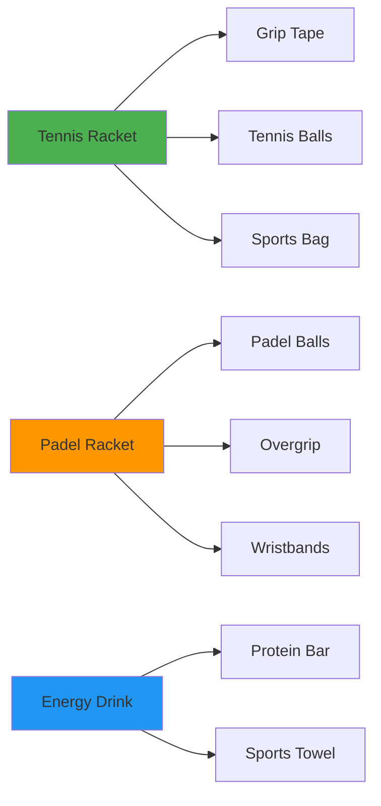
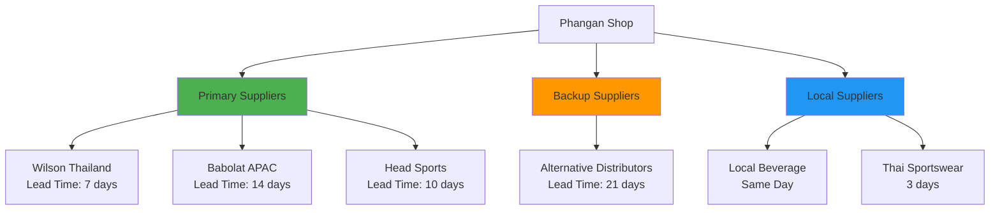
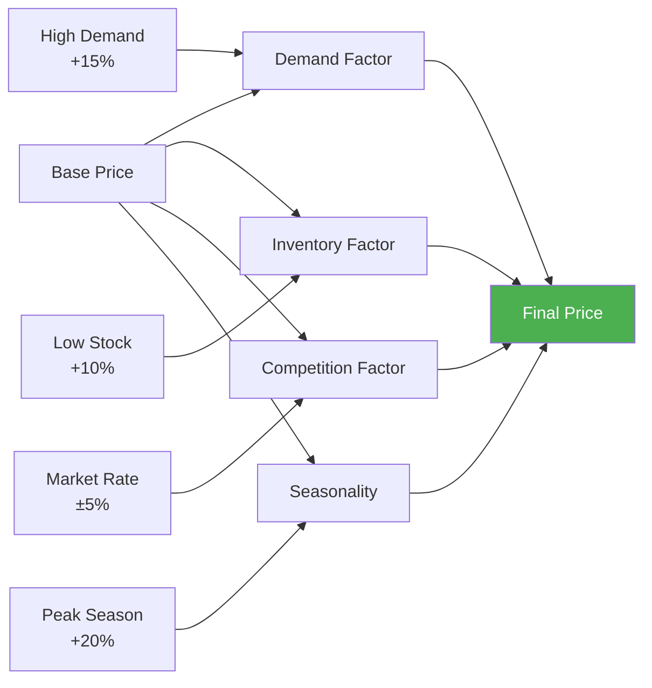
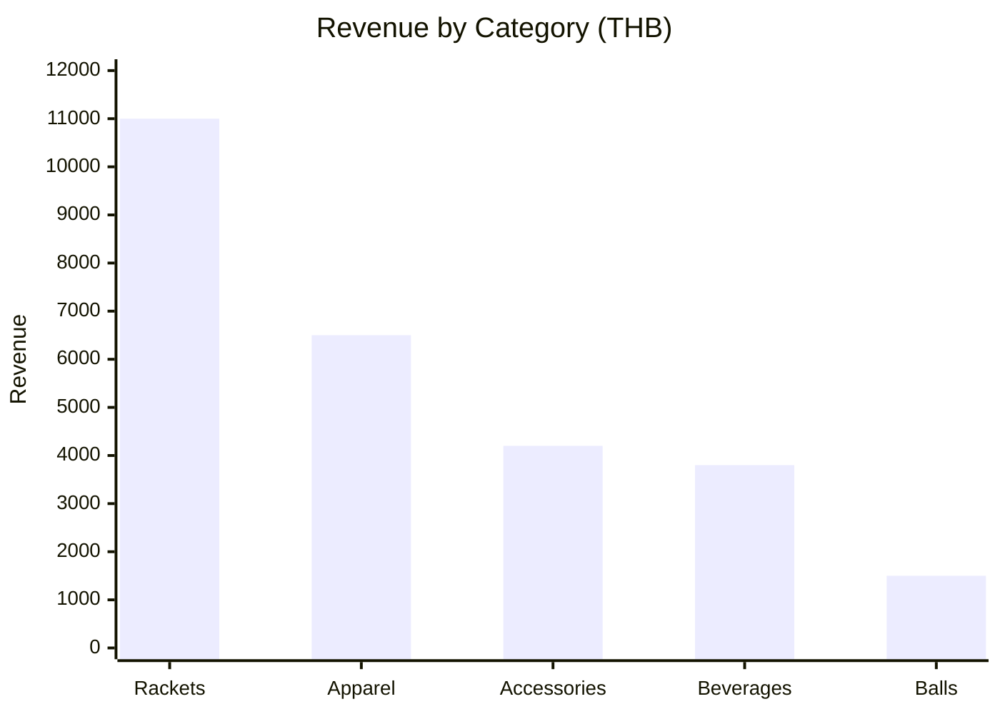
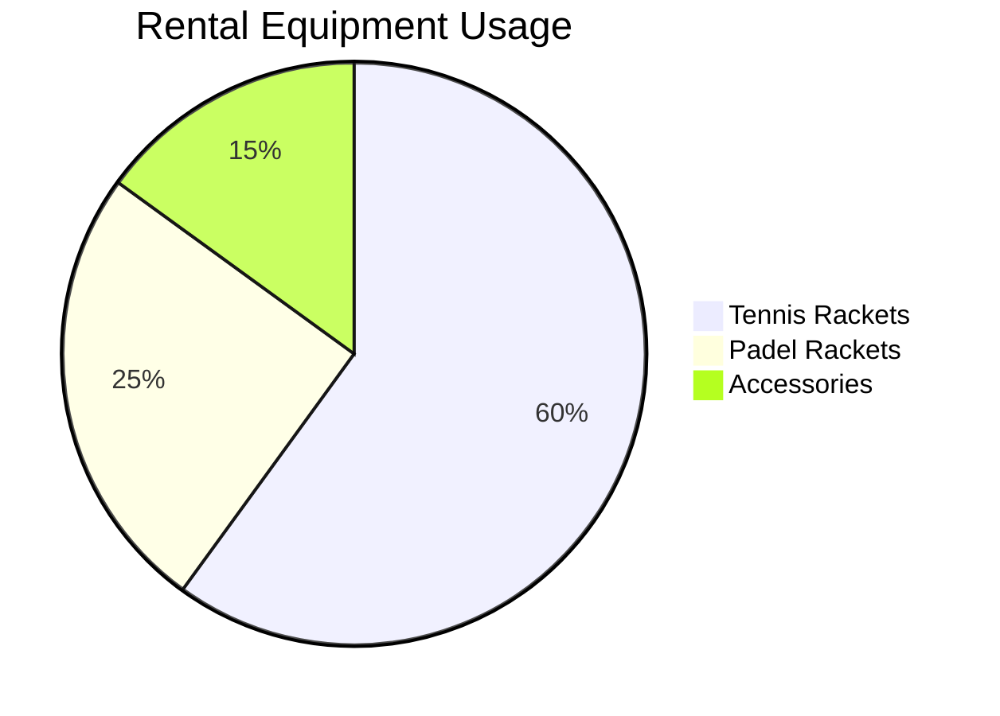
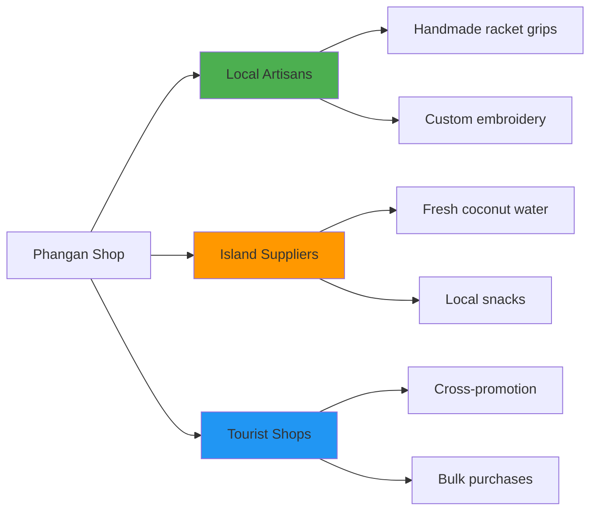

# 📦 Products Data - Phangan Padel Tennis Club

## 📊 Интерактивная Таблица Товаров

```dataview
TABLE
  name as "🏷️ Товар",
  category as "📂 Категория",
  price as "💰 Цена (THB)",
  stock_quantity as "📦 На складе",
  sales_count as "📈 Продаж"
FROM "Database/products"
SORT sales_count desc
LIMIT 10
```

## 🛒 Категории Товаров

### Структура Ассортимента



### Подробная Структура Каталога



## 🏷️ Топ Товары по Продажам

### Месячные Лидеры

| Товар                    | Категория  | Продаж | Доход (THB) | Margin | Rating |
| ------------------------ | ---------- | ------ | ----------- | ------ | ------ |
| **Wilson Blade 98**      | Ракетки    | 8      | ₿ 6,800     | 35%    | 4.9⭐  |
| **Bullpadel Vertex**     | Ракетки    | 6      | ₿ 4,200     | 30%    | 4.8⭐  |
| **Nike Dri-FIT Polo**    | Одежда     | 25     | ₿ 3,750     | 60%    | 4.7⭐  |
| **Energy Drink RedBull** | Напитки    | 120    | ₿ 1,800     | 40%    | 4.5⭐  |
| **Wilson Grip Tape**     | Аксессуары | 35     | ₿ 1,050     | 70%    | 4.6⭐  |

### Сезонные Тренды



## 💰 Ценовые Сегменты

### Ракетки (Tennis)

| Модель                 | Бренд   | Цена (THB) | Уровень      | В наличии |
| ---------------------- | ------- | ---------- | ------------ | --------- |
| **Wilson Pro Staff**   | Wilson  | ₿ 8,500    | Professional | 3         |
| **Babolat Pure Drive** | Babolat | ₿ 7,200    | Advanced     | 5         |
| **Head Radical**       | Head    | ₿ 6,800    | Intermediate | 4         |
| **Wilson Clash**       | Wilson  | ₿ 5,900    | Beginner     | 8         |

### Ракетки (Padel)

| Модель               | Бренд     | Цена (THB) | Форма    | В наличии |
| -------------------- | --------- | ---------- | -------- | --------- |
| **Bullpadel Vertex** | Bullpadel | ₿ 7,000    | Diamond  | 4         |
| **Head Delta Pro**   | Head      | ₿ 6,200    | Round    | 6         |
| **Adidas Adipower**  | Adidas    | ₿ 5,800    | Teardrop | 3         |
| **Wilson Bela**      | Wilson    | ₿ 5,200    | Round    | 7         |

## 📈 Inventory Management

### Stock Levels Overview



### Stock Alerts

| Товар                | Текущий запас | Min Level | Status      | Action Needed     |
| -------------------- | ------------- | --------- | ----------- | ----------------- |
| **Wilson Pro Staff** | 2             | 3         | 🟡 Low      | Заказать 5 штук   |
| **Energy Drinks**    | 8             | 20        | 🔴 Critical | Срочный заказ 100 |
| **Grip Tape White**  | 1             | 5         | 🟡 Low      | Заказать 20 штук  |
| **Padel Balls**      | 0             | 10        | 🔴 Out      | Экстренный заказ  |

## 🛍️ Customer Purchase Patterns

### Popular Product Combinations



### Customer Segments Preferences

| Сегмент          | Top Category | Avg Spend | Freq/Month | Preferred Brand |
| ---------------- | ------------ | --------- | ---------- | --------------- |
| **Beginners**    | Аксессуары   | ₿ 850     | 1.2x       | Wilson          |
| **Intermediate** | Ракетки      | ₿ 2,400   | 2.1x       | Babolat         |
| **Advanced**     | Ракетки      | ₿ 4,200   | 1.8x       | Head            |
| **Tourists**     | Напитки      | ₿ 320     | 1x         | Local brands    |

## 📦 Supplier & Procurement

### Supplier Network



### Order Management

| Supplier            | Next Order Date | Order Value (THB) | Payment Terms | Delivery |
| ------------------- | --------------- | ----------------- | ------------- | -------- |
| **Wilson Thailand** | 2024-02-01      | ₿ 45,000          | Net 30        | Free     |
| **Local Beverage**  | Weekly          | ₿ 3,500           | Cash          | Same day |
| **Head Sports**     | 2024-02-15      | ₿ 28,000          | Net 45        | ₿ 500    |
| **Thai Sportswear** | 2024-02-10      | ₿ 12,000          | Net 15        | ₿ 200    |

## 💡 Smart Inventory Features

### AI-Powered Predictions

```json
{
  "weekly_forecast": {
    "tennis_rackets": {
      "predicted_sales": 3,
      "confidence": "87%",
      "factors": ["tournament_week", "good_weather"]
    },
    "energy_drinks": {
      "predicted_sales": 45,
      "confidence": "94%",
      "factors": ["high_activity", "tourist_season"]
    }
  },
  "reorder_recommendations": [
    {
      "product": "Wilson Pro Staff",
      "current_stock": 2,
      "recommended_order": 5,
      "reason": "Below minimum threshold"
    }
  ]
}
```

### Dynamic Pricing



## 🎯 Product Performance Analytics

### Revenue by Category (Monthly)



### Product Lifecycle Analysis

| Stage            | Products Count | Revenue % | Strategy           |
| ---------------- | -------------- | --------- | ------------------ |
| **Introduction** | 8              | 5%        | Marketing boost    |
| **Growth**       | 25             | 35%       | Inventory increase |
| **Maturity**     | 85             | 55%       | Cost optimization  |
| **Decline**      | 12             | 5%        | Clearance sales    |

## 🔄 Rental Equipment

### Equipment Rental Program

| Оборудование      | Цена/час (THB) | Цена/день | Залог   | В наличии |
| ----------------- | -------------- | --------- | ------- | --------- |
| **Tennis Racket** | ₿ 100          | ₿ 400     | ₿ 2,000 | 12/15     |
| **Padel Racket**  | ₿ 80           | ₿ 300     | ₿ 1,500 | 8/10      |
| **Sports Bag**    | ₿ 50           | ₿ 150     | ₿ 500   | 6/8       |
| **Towel**         | ₿ 20           | ₿ 50      | ₿ 100   | 20/25     |

### Rental Analytics



## 🏝️ Island-Specific Products

### Tourism-Focused Items

- **🏝️ Phangan Branded Merchandise**: T-shirts, caps, water bottles
- **☀️ Sun Protection**: UV shirts, sunscreen, hats
- **🌊 Beach Accessories**: Waterproof bags, flip-flops
- **📸 Souvenir Items**: Photo frames, keychains, magnets

### Local Partnerships



## 📊 E-commerce Integration

### Online Shop Features

- **📱 Mobile App**: In-app purchases and reservations
- **🌐 Website Store**: Full catalog with delivery
- **📦 Click & Collect**: Order online, pickup at club
- **🚚 Delivery**: Same-day delivery on island

### Digital Inventory Sync

```typescript
interface InventorySync {
  realTime: boolean;
  platforms: ["app", "website", "pos"];
  updateFrequency: "30_seconds";
  stockLevels: "live";
  pricing: "dynamic";
  availability: "instant";
}
```

## 🔧 POS System Integration

### Point of Sale Features

- **📊 Real-time Stock Updates**: Instant inventory tracking
- **💳 Multiple Payment Methods**: Cash, cards, QR codes
- **📱 Mobile POS**: Courtside sales capability
- **📈 Sales Analytics**: Daily/weekly/monthly reports

### Staff Training Materials

1. **📋 Product Knowledge**: Detailed specs for all equipment
2. **💡 Sales Techniques**: Upselling and cross-selling
3. **🔧 Equipment Care**: Maintenance and storage
4. **📞 Customer Service**: Handling returns and exchanges

---

_Product data synchronized in real-time with POS system_  
_📦 Phangan Shop - Premium Equipment & Accessories on Paradise Island_
