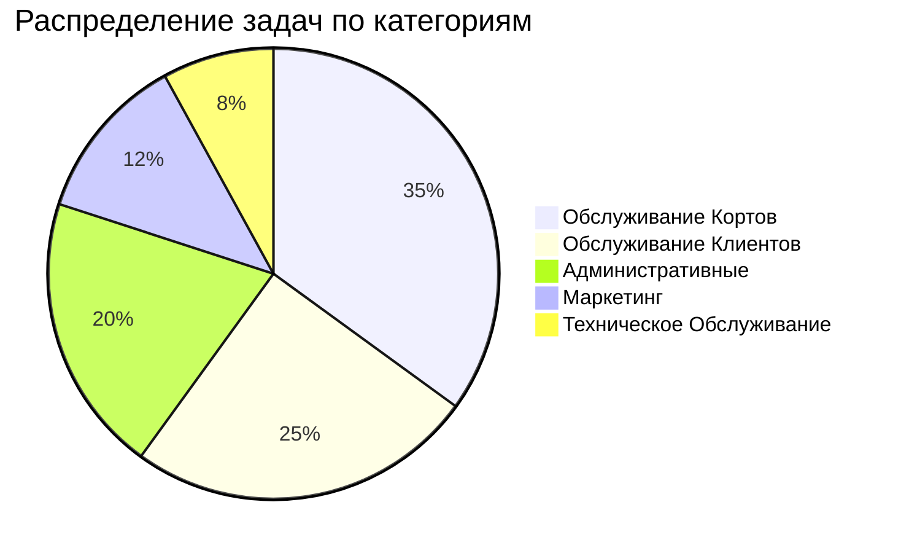
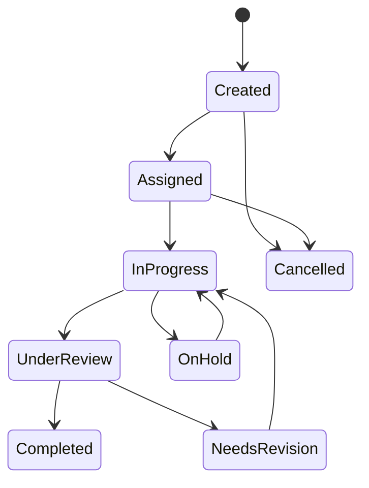
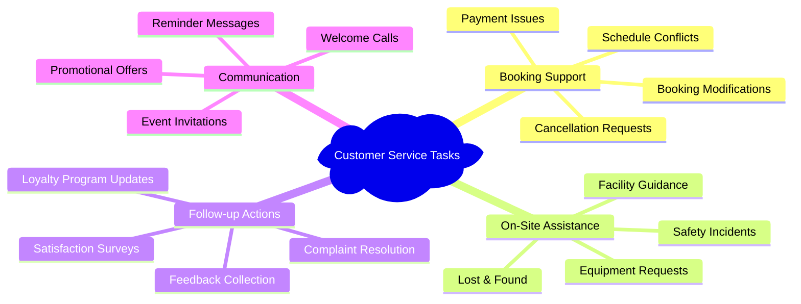
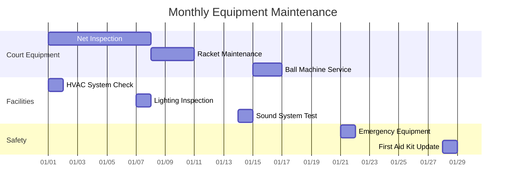
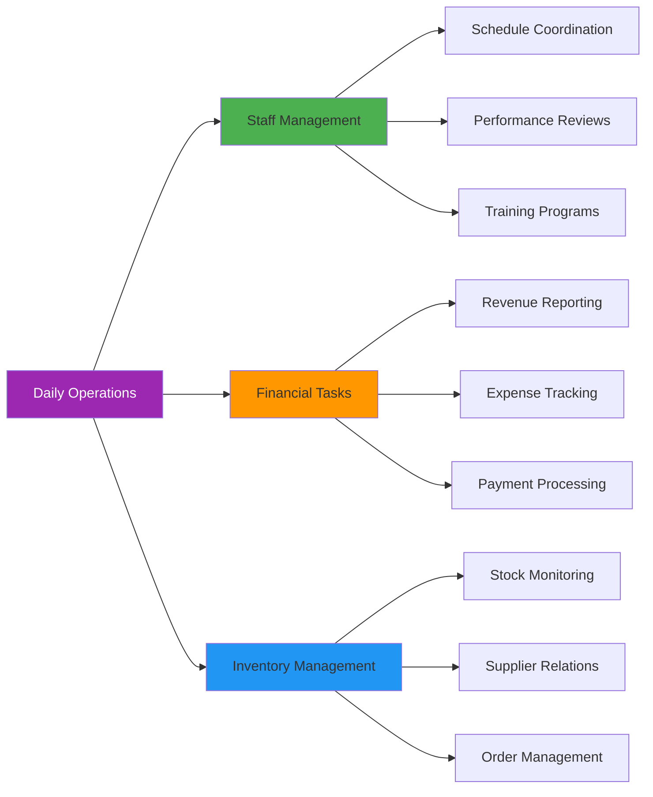
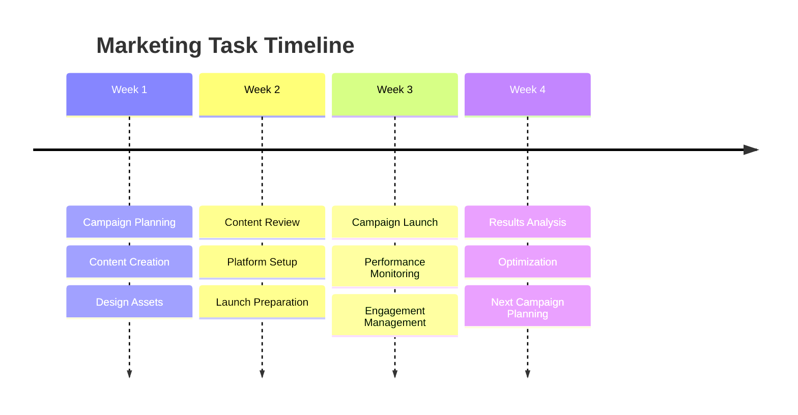
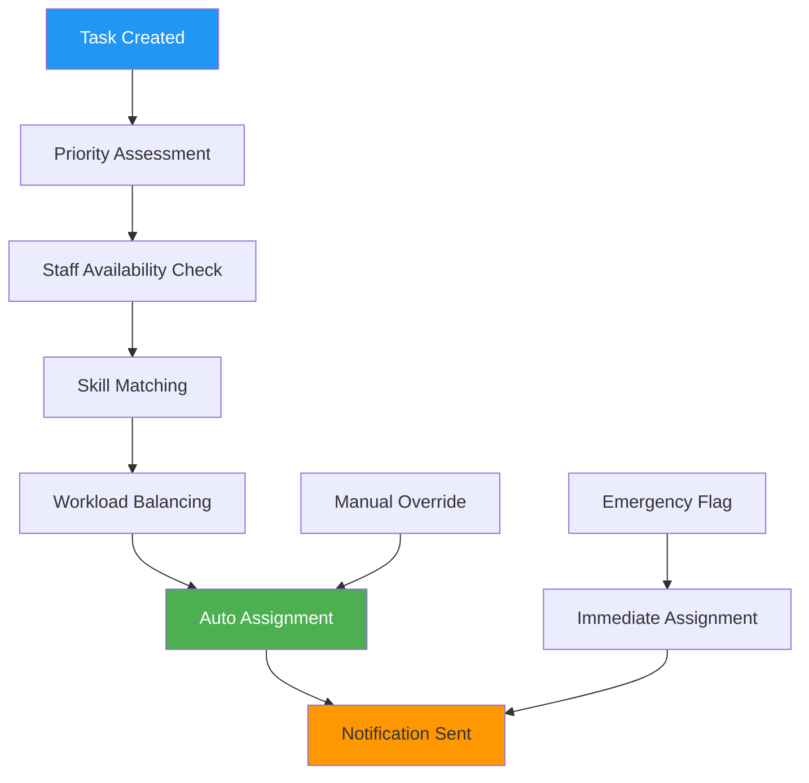
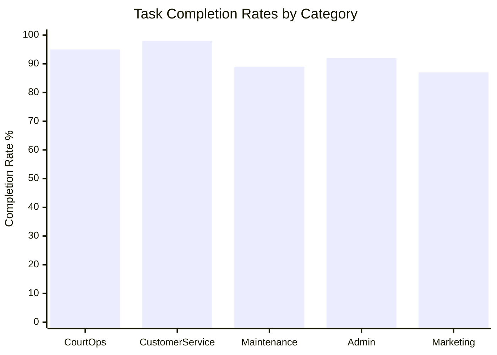
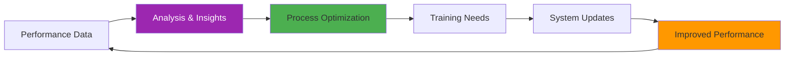

# 📋 Tasks Data - Phangan Padel Tennis Club

## 📊 Интерактивная Таблица Задач

```dataview
TABLE
  title as "📝 Задача",
  category as "📂 Категория",
  priority as "⚡ Приоритет",
  status as "📊 Статус",
  assigned_to as "👤 Исполнитель",
  due_date as "📅 Дедлайн"
FROM "Database/tasks"
WHERE status != "completed"
SORT priority desc, due_date asc
LIMIT 15
```

## 📈 Task Categories & Distribution

### Распределение Задач по Категориям



### Task Status Flow



## 🎯 Priority System

### Priority Levels

| Priority Level  | Response Time | Description               | Examples                                |
| --------------- | ------------- | ------------------------- | --------------------------------------- |
| **🔴 Critical** | <15 minutes   | Emergency issues          | Equipment failure, safety hazards       |
| **🟡 High**     | <2 hours      | Important operations      | Customer complaints, booking issues     |
| **🟢 Medium**   | <1 day        | Regular maintenance       | Routine cleaning, inventory checks      |
| **🔵 Low**      | <1 week       | Nice-to-have improvements | Decoration updates, non-urgent upgrades |

### Urgency Matrix

```mermaid
quadrantChart
    title Task Priority Matrix
    x-axis Low --> High
    y-axis Low --> High
    quadrant-1 Do First (Critical)
    quadrant-2 Schedule (Important)
    quadrant-3 Delegate (Less Important)
    quadrant-4 Don't Do (Neither)

    Equipment Repair: [0.9, 0.95]
    Customer Complaint: [0.8, 0.7]
    Court Maintenance: [0.6, 0.8]
    Inventory Update: [0.4, 0.3]
    Marketing Campaign: [0.7, 0.4]
    Staff Training: [0.5, 0.6]
```

## 🏓 Court Operations Tasks

### Daily Court Maintenance

```yaml
daily_court_tasks:
  morning_setup:
    - check_court_surface_condition
    - verify_net_tension
    - clean_court_lines
    - test_lighting_systems
    - set_up_equipment_stations

  between_sessions:
    - quick_surface_clean
    - check_equipment_condition
    - refill_water_stations
    - sanitize_high_touch_surfaces

  evening_shutdown:
    - thorough_court_cleaning
    - equipment_inspection_and_storage
    - lighting_system_shutdown
    - security_check
    - next_day_preparation
```

### Weekly Maintenance Schedule

| Day           | Task                        | Duration  | Staff Required |
| ------------- | --------------------------- | --------- | -------------- |
| **Monday**    | Deep court cleaning         | 2 hours   | 2 staff        |
| **Tuesday**   | Net & equipment inspection  | 1 hour    | 1 staff        |
| **Wednesday** | Line marking touch-up       | 1.5 hours | 1 staff        |
| **Thursday**  | Drainage system check       | 1 hour    | 1 staff        |
| **Friday**    | Lighting maintenance        | 1 hour    | 1 staff        |
| **Saturday**  | Surface treatment           | 3 hours   | 2 staff        |
| **Sunday**    | General facility inspection | 2 hours   | 1 staff        |

## 👥 Customer Service Tasks

### Service Request Categories



### Customer Service Metrics

| Metric                       | Target     | Current     | Trend  |
| ---------------------------- | ---------- | ----------- | ------ |
| **Response Time**            | <5 minutes | 3.2 minutes | ↗️ +8% |
| **Resolution Rate**          | 95%+       | 97.3%       | ↗️ +2% |
| **Customer Satisfaction**    | 4.5⭐+     | 4.8⭐       | ↗️ +5% |
| **First Contact Resolution** | 80%+       | 85.2%       | ↗️ +3% |

## 🔧 Technical Maintenance Tasks

### Equipment Maintenance Schedule



### Preventive Maintenance Checklist

#### Weekly Inspections

- [ ] Court surface integrity
- [ ] Net condition and tension
- [ ] Lighting functionality
- [ ] Water system operation
- [ ] Emergency equipment accessibility

#### Monthly Deep Maintenance

- [ ] HVAC system servicing
- [ ] Electrical system inspection
- [ ] Plumbing system check
- [ ] Fire safety equipment testing
- [ ] Security system evaluation

#### Quarterly Upgrades

- [ ] Surface treatment application
- [ ] Equipment replacement assessment
- [ ] Technology system updates
- [ ] Facility improvement planning

## 📊 Administrative Tasks

### Business Operations



### Financial Task Automation

| Task                       | Frequency | Automation Level | Time Saved    |
| -------------------------- | --------- | ---------------- | ------------- |
| **Daily Revenue Report**   | Daily     | 95% automated    | 45 min/day    |
| **Payment Reconciliation** | Daily     | 80% automated    | 30 min/day    |
| **Expense Categorization** | Weekly    | 70% automated    | 2 hours/week  |
| **Monthly P&L Generation** | Monthly   | 90% automated    | 4 hours/month |

## 📈 Marketing & Events Tasks

### Marketing Campaign Management



### Event Management Tasks

#### Tournament Organization

```yaml
tournament_tasks:
  pre_event:
    - participant_registration
    - bracket_creation
    - court_scheduling
    - equipment_preparation
    - staff_briefing

  during_event:
    - check_in_management
    - match_coordination
    - score_tracking
    - live_updates
    - refreshment_service

  post_event:
    - results_publication
    - award_ceremony
    - participant_feedback
    - financial_reconciliation
    - next_event_planning
```

## 🤖 Task Automation & AI

### Automated Task Assignment



### AI-Powered Task Optimization

- **Predictive Scheduling**: AI predicts optimal task timing
- **Resource Allocation**: Intelligent staff and equipment assignment
- **Workload Balancing**: Automatic distribution of tasks
- **Performance Analytics**: Task completion pattern analysis

## 📱 Mobile Task Management

### Staff Mobile App Features

```typescript
interface TaskMobileApp {
  taskList: {
    myTasks: Task[];
    teamTasks: Task[];
    urgentTasks: Task[];
  };

  actions: {
    updateStatus: (taskId: string, status: TaskStatus) => void;
    addComments: (taskId: string, comment: string) => void;
    uploadPhoto: (taskId: string, photo: File) => void;
    requestHelp: (taskId: string) => void;
  };

  notifications: {
    newAssignment: boolean;
    dueSoon: boolean;
    overdue: boolean;
    teamUpdates: boolean;
  };
}
```

### Real-Time Updates

- **Live Status Tracking**: Real-time task status updates
- **Team Collaboration**: Instant team member notifications
- **Photo Documentation**: Visual task completion proof
- **GPS Integration**: Location-based task validation

## 📊 Performance Analytics

### Task Completion Metrics



### Staff Performance Dashboard

| Staff Member   | Tasks Completed | Avg Completion Time | Quality Score | Efficiency Rating |
| -------------- | --------------- | ------------------- | ------------- | ----------------- |
| **Somchai T.** | 147             | 2.3 hours           | 4.8⭐         | A+                |
| **Niran K.**   | 132             | 2.7 hours           | 4.6⭐         | A                 |
| **Ploy S.**    | 156             | 2.1 hours           | 4.9⭐         | A+                |
| **Anan P.**    | 125             | 3.1 hours           | 4.4⭐         | B+                |

### Continuous Improvement



## 🎯 Quality Assurance

### Task Quality Metrics

- **Completion Accuracy**: 97.5%
- **Rework Rate**: 2.3%
- **Customer Satisfaction**: 4.8/5.0
- **On-Time Completion**: 94.2%

### Quality Control Process

1. **Task Standardization**: Clear procedures for each task type
2. **Regular Audits**: Random quality checks and inspections
3. **Feedback Loops**: Continuous improvement based on results
4. **Training Updates**: Regular skill development programs

---

_Task management system processing 200+ daily operations with 95%+ efficiency_  
_📋 Phangan Operations - Excellence in Every Detail_
