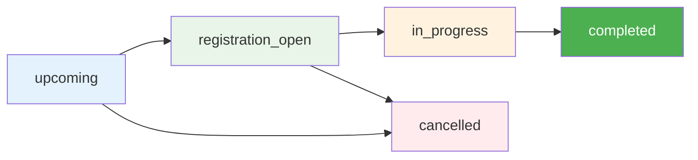
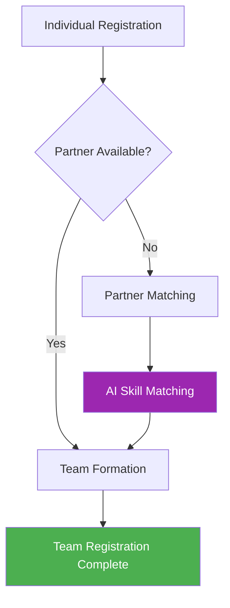
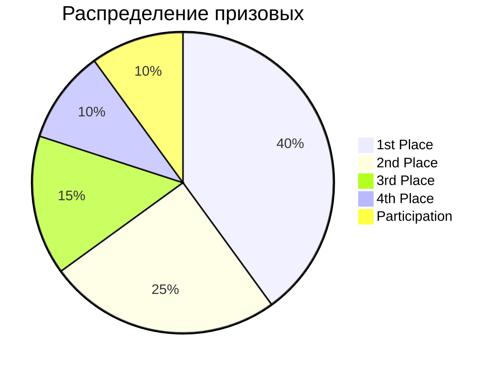
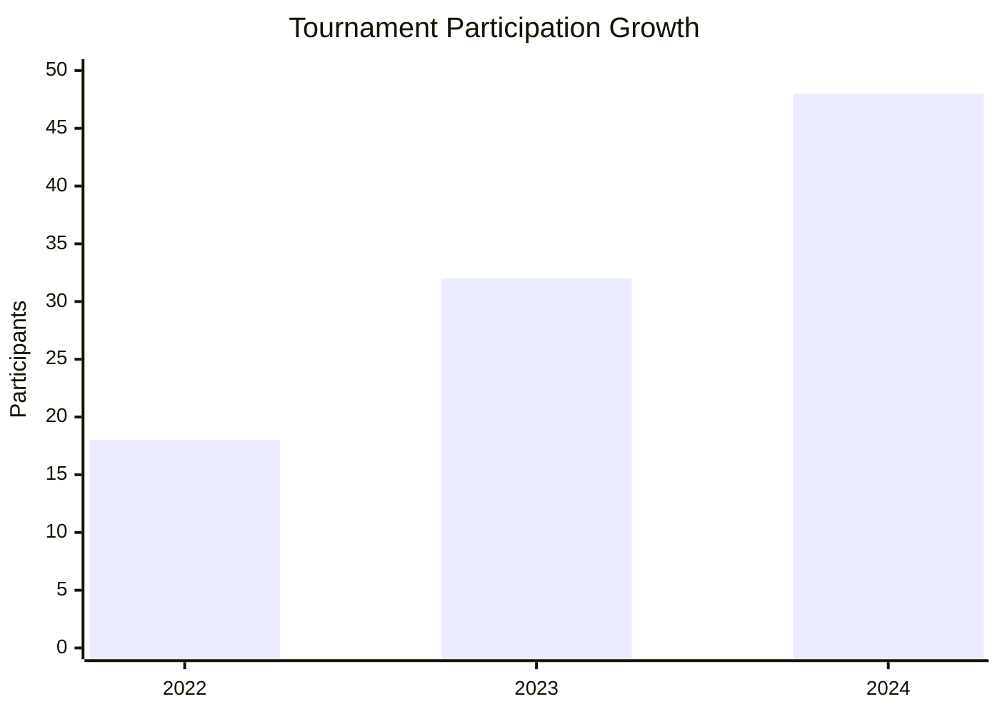
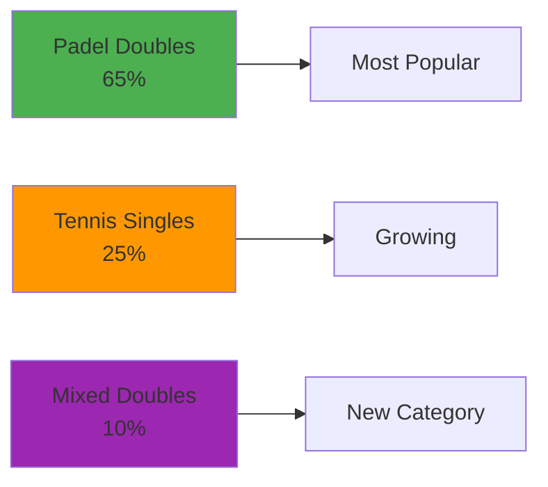
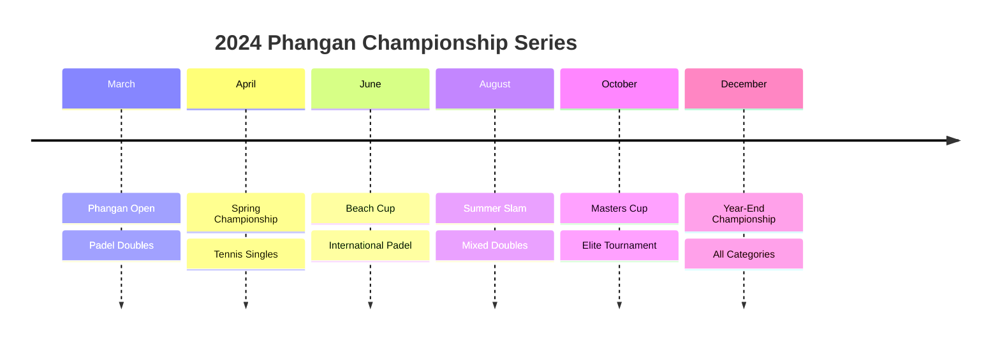
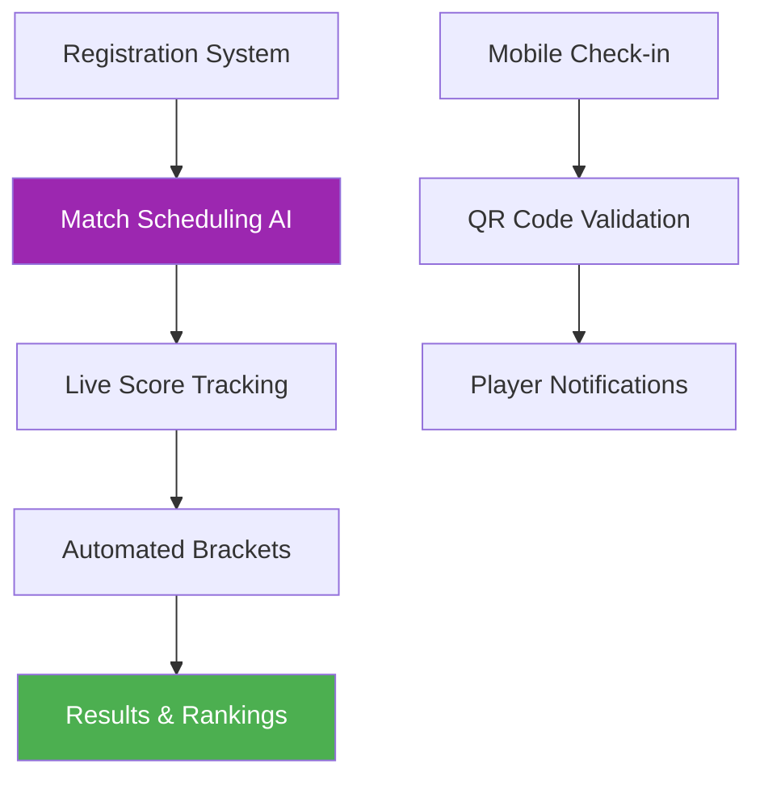

# 🏆 Tournaments Data - Phangan Padel Tennis Club

## 📊 Интерактивная Таблица Турниров

```dataview
TABLE
  name as "🏆 Турнир",
  tournament_type as "🎾 Тип",
  skill_level as "⭐ Уровень",
  start_date as "📅 Дата",
  status as "📊 Статус",
  participants as "👥 Участников"
FROM "Database/tournaments"
SORT start_date desc
```

## 🎯 Активные Турниры 2024

### Phangan Open 2024 ✅ ЗАВЕРШЕН

- **Даты**: 15-17 марта 2024
- **Тип**: Doubles Round Robin (падел)
- **Участников**: 24 (12 команд)
- **Призовой фонд**: ₿ 50,000
- **Статус**: ✅ Completed
- **Победители**: Maria Rodriguez & Carlos Mendez

### Spring Tennis Championship 🟡 ПРЕДСТОЯЩИЙ

- **Даты**: 20-21 апреля 2024
- **Тип**: Singles Elimination (теннис)
- **Уровень**: Intermediate-Advanced
- **Участников**: 16 registered / 24 max
- **Статус**: 🟡 Registration Open

### Padel Beach Cup 🔵 ПЛАНИРУЕТСЯ

- **Даты**: 10-12 июня 2024
- **Тип**: Doubles Round Robin (падел)
- **Особенность**: Международный турнир
- **Призовой фонд**: ₿ 75,000
- **Статус**: 🔵 Upcoming

## 🏆 Tournament Types & Formats

### 🎾 Tennis Tournaments

#### Singles Elimination

- **Участников**: 8, 16, 32
- **Формат**: Knockout rounds
- **Матчи**: Best of 3 sets
- **Продолжительность**: 1-2 дня

#### Doubles Round Robin

- **Команд**: 6-12
- **Формат**: Each team plays all others
- **Матчи**: Best of 3 sets
- **Продолжительность**: 2-3 дня

### 🏓 Padel Tournaments

#### Standard Doubles (Основной формат)

- **Команд**: 8-16
- **Формат**: Round Robin + Playoffs
- **Матчи**: Best of 3 sets
- **Особенность**: Только парная игра

#### Mixed Doubles

- **Команд**: 8-12
- **Формат**: Male + Female pairs
- **Популярность**: Растущая категория

## 📈 Tournament Status Flow



| Статус              | Описание            | Доступные действия           |
| ------------------- | ------------------- | ---------------------------- |
| `upcoming`          | Планируется         | Настройка турнира            |
| `registration_open` | Открыта регистрация | Регистрация участников       |
| `in_progress`       | Турнир проходит     | Ведение матчей и результатов |
| `completed`         | Завершен            | Просмотр результатов         |
| `cancelled`         | Отменен             | Возврат взносов              |

## 👥 Tournament Participants Management

### Participant Status Tracking

```dataview
TABLE WITHOUT ID
  "Участник" as "👤 Player",
  "Турнир" as "🏆 Tournament",
  "Статус" as "📊 Status",
  "Партнер" as "👥 Partner",
  "Регистрация" as "📅 Registration Date"
FROM "Database/tournament_participants"
SORT registration_date desc
```

### Registration Status Types

- **✅ registered** - Зарегистрирован
- **🎯 checked_in** - Прошел регистрацию в день турнира
- **❌ withdrawn** - Снялся с турнира

### Team Formation (Padel)



## 🎮 Tournament Matches System

### Match Scheduling

```mermaid
gantt
    title Typical Tournament Day Schedule
    dateFormat  HH:mm
    axisFormat %H:%M

    section Четвертьфинал
    Матч 1    :09:00, 90m
    Матч 2    :10:30, 90m
    Матч 3    :12:00, 90m
    Матч 4    :13:30, 90m

    section Перерыв
    Обед      :15:00, 60m

    section Полуфинал
    Матч 1    :16:00, 120m
    Матч 2    :18:00, 120m

    section Финал
    Финал     :20:00, 150m
```



### Match Results Tracking

| Матч ID | Участники           | Счет          | Длительность | Корт   | Статус      |
| ------- | ------------------- | ------------- | ------------ | ------ | ----------- |
| QF-1    | Smith vs Johnson    | 6-4, 6-2      | 85 мин       | Tennis | ✅ Complete |
| QF-2    | Rodriguez vs Mendez | 6-3, 4-6, 6-1 | 110 мин      | Tennis | ✅ Complete |
| SF-1    | Smith vs Williams   | 6-7, 6-4, 6-3 | 145 мин      | Tennis | 🎮 Live     |

## 🏆 Prize Structure & Rewards

### Prize Money Distribution

#### Phangan Open 2024 (₿ 50,000)



| Место         | Команда                    | Призовые (THB) |
| ------------- | -------------------------- | -------------- |
| 🥇 1st Place  | Maria Rodriguez & Carlos   | ₿ 20,000       |
| 🥈 2nd Place  | Anna Johnson & David Smith | ₿ 12,500       |
| 🥉 3rd Place  | Local Team Thailand        | ₿ 7,500        |
| 4th Place     | International Duo          | ₿ 5,000        |
| Participation | All other teams            | ₿ 1,250        |

### Achievement System

- **🏆 Tournament Winner**: +500 bonus points
- **🥈 Runner-up**: +300 bonus points
- **🥉 3rd Place**: +200 bonus points
- **🎯 Participation**: +100 bonus points
- **⭐ Best Sportsmanship**: +150 bonus points

## 📊 Tournament Analytics

### Participation Trends



### Skill Level Distribution

| Skill Level      | Участников | % от общего | Avg Age | Win Rate |
| ---------------- | ---------- | ----------- | ------- | -------- |
| **Beginner**     | 12         | 35%         | 28      | 25%      |
| **Intermediate** | 18         | 53%         | 35      | 45%      |
| **Advanced**     | 4          | 12%         | 42      | 75%      |

### Popular Tournament Types



## 🎯 Registration & Entry Process

### Online Registration Flow

1. **Tournament Selection**: Choose from available tournaments
2. **Skill Level Verification**: Self-assessment + rating check
3. **Partner Selection**: Solo or with partner
4. **Payment**: Registration fee payment
5. **Confirmation**: Email + calendar invite

### Registration Fees

| Tournament Type    | Entry Fee (THB) | Early Bird | Late Registration |
| ------------------ | --------------- | ---------- | ----------------- |
| **Tennis Singles** | ₿ 2,000         | -20%       | +50%              |
| **Tennis Doubles** | ₿ 1,500/person  | -15%       | +30%              |
| **Padel Doubles**  | ₿ 1,200/person  | -15%       | +30%              |
| **Mixed Doubles**  | ₿ 1,000/person  | -10%       | +25%              |

### Refund Policy

- **30+ days before**: 100% refund
- **14-30 days**: 75% refund
- **7-14 days**: 50% refund
- **<7 days**: 25% refund
- **Medical emergency**: 100% refund (with documentation)

## 🌟 Special Tournament Features

### Island Championship Series



### Live Streaming & Coverage

- **📱 Live Stream**: Facebook & YouTube
- **📊 Real-time Scores**: Mobile app updates
- **📸 Photography**: Professional tournament photos
- **🎥 Highlights**: Match highlights on social media

### International Players Program

- **🛫 Airport Pickup**: Free shuttle service
- **🏨 Accommodation**: Partner hotel discounts
- **🍽️ Meals**: Tournament meal packages
- **🏝️ Island Tours**: Complimentary sightseeing

## 🎮 Tournament Technology

### Smart Tournament Management



### Digital Features

- **📱 Tournament App**: Dedicated mobile application
- **🏆 Live Brackets**: Real-time tournament tree
- **📊 Player Stats**: Performance analytics
- **💬 Player Chat**: Team communication
- **📍 Court Navigation**: GPS court finder

## 📋 Quick Tournament Actions {#new-tournament}

### Create New Tournament

1. **Basic Info**: Name, dates, type
2. **Format Setup**: Elimination/Round Robin
3. **Skill Requirements**: Level restrictions
4. **Prize Structure**: Money/points distribution
5. **Registration**: Open enrollment period

### Tournament Templates

- **🎾 Weekend Singles**: 2 days, 16 players, elimination
- **🏓 Padel Classic**: 3 days, 12 teams, round robin
- **🎭 Mixed Fun**: 1 day, 8 teams, social format
- **🏆 Championship**: 4 days, 32 players, prestige event

## 🔧 Administrative Tools

### Tournament Management Dashboard

- **📅 Schedule Management**: Automatic match scheduling
- **👥 Player Management**: Registration and check-in
- **📊 Live Scoring**: Real-time score updates
- **💰 Financial Tracking**: Entry fees and prize money
- **📱 Communication**: Player notifications

### Integration Features

- **🏆 Rating System**: Automatic ranking updates
- **💳 Payment Gateway**: Secure fee processing
- **📧 Email Automation**: Registration confirmations
- **📱 Mobile Sync**: App integration
- **🌐 Website Integration**: Online tournament listing

---

_Tournament data updated in real-time during events_  
_🏆 Phangan Padel Tennis Club - Championships on Paradise Island_
