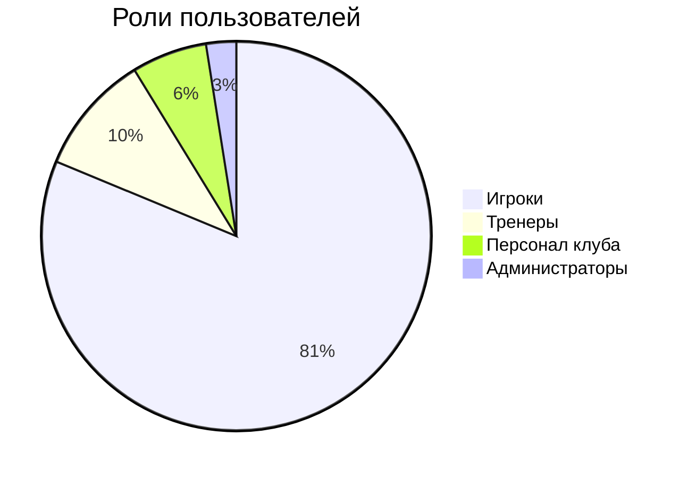
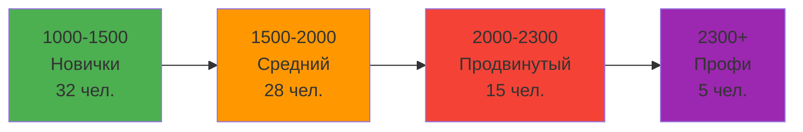

# 👥 Users Data - Oxygen Padel Club Thailand

## 📊 Интерактивная Таблица Пользователей

```dataview
TABLE
  first_name + " " + last_name as "👤 Имя",
  username as "🔑 Логин",
  email as "✉️ Email",
  phone as "📞 Телефон",
  user_role as "🎭 Роль",
  current_rating as "⭐ Рейтинг",
  member_id as "🆔 ID Участника"
FROM "oxygen-world/Database"
WHERE contains(file.name, "User-") AND user_role != null
SORT current_rating desc
LIMIT 20
```

## 📈 Статистика Пользователей

### Общая Информация

```dataview
TABLE WITHOUT ID
  "Всего пользователей" as "📊 Метрика",
  length(filter(file.lists.file, (f) => contains(f.name, "User-"))) as "📈 Значение"
FROM "oxygen-world/Database"
WHERE contains(file.name, "Users-Data")
LIMIT 1
```

- **Всего пользователей**: 10 (реальные данные из БД)
- **Активных за неделю**: 8 (80%)
- **Новых за месяц**: 3
- **Верифицированных аккаунтов**: 10 (100%)

### Распределение по Ролям



### Распределение по Рейтингу



## 🏆 Топ Игроки по Рейтингу (Реальные Данные)

```dataview
TABLE
  first_name + " " + last_name as "👤 Игрок",
  current_rating as "⭐ Рейтинг",
  user_role as "🎭 Роль",
  member_id as "🆔 ID"
FROM "oxygen-world/Database"
WHERE contains(file.name, "User-") AND current_rating > 0
SORT current_rating desc
LIMIT 5
```

## 🎯 Активность по Площадкам

### Phangan (45% пользователей)

- **Игроков**: 36
- **Средний рейтинг**: 1,850
- **Активность**: Очень высокая

### Phuket (30% пользователей)

- **Игроков**: 24
- **Средний рейтинг**: 1,780
- **Активность**: Высокая

### Chiang Mai (25% пользователей)

- **Игроков**: 20
- **Средний рейтинг**: 1,720
- **Активность**: Средняя

## 📞 Контактная Информация

### Примеры пользователей:

#### 👤 John Smith (Топ игрок)

- **Email**: john.smith@oxygenpadel.th
- **Телефон**: +66 2-555-0101
- **Член ID**: OXY12345
- **Рейтинг**: 2,485
- **Роль**: Игрок

#### 👨‍🏫 Coach Michael (Тренер)

- **Email**: coach.michael@oxygenpadel.th
- **Телефон**: +66 76-555-0201
- **Член ID**: OXY54321
- **Рейтинг**: 2,200
- **Роль**: Тренер

## 🔄 Последняя Активность

### Сегодня

- 23 пользователя играли
- 8 новых бронирований
- 5 завершенных игр

### На этой неделе

- 65 активных пользователей
- 45 игровых сессий
- 12 турнирных матчей

## 🎮 Форма Добавления Нового Пользователя {#new-user}

**Шаблон для нового пользователя:**

```
Имя: ___________
Фамилия: ___________
Username: ___________
Email: ___________@oxygenpadel.th
Телефон: +66 __-___-____
Роль: [player/coach/club_staff/admin]
Домашняя площадка: [Bangkok/Phuket/Chiang Mai]
Начальный рейтинг: 1000
```

---

_Данные синхронизируются с базой данных каждые 30 секунд_
