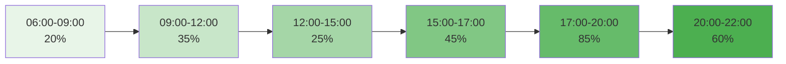
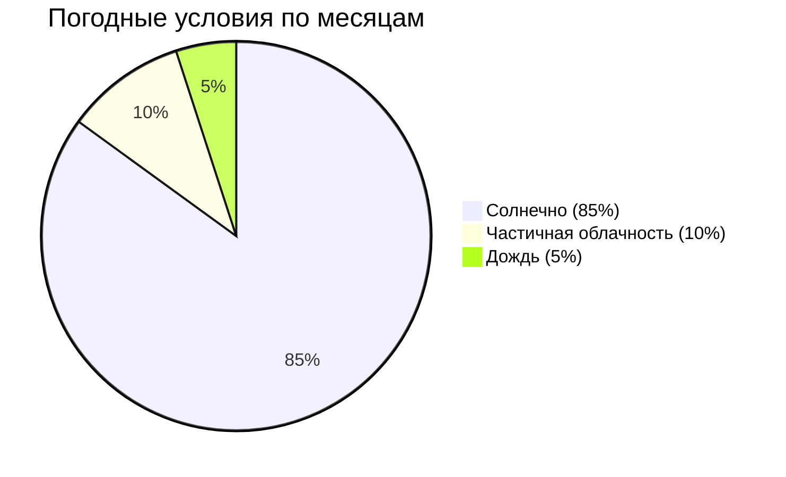

# 🏝️ Venue Data - Phangan Padel Tennis Club

## 📊 Основная Площадка

```dataview
TABLE
  name as "🏝️ Название",
  city as "🌏 Город",
  country as "🇹🇭 Страна",
  phone_number as "📞 Телефон",
  email as "✉️ Email",
  is_active as "✅ Активна"
FROM "Database/venues"
SORT name asc
```

## 🏝️ Phangan Padel Tennis Club

### 📍 Основная Информация

- **Название**: Phangan Padel Tennis Club
- **Адрес**: 15/7 Moo 6, Thong Nai Pan Beach Road, Ko Pha-ngan, Surat Thani 84280
- **Остров**: Панган (Ko Pha-ngan)
- **Провинция**: Сурат Тани (Surat Thani)
- **Телефон**: +66 77-374-856
- **Email**: info@Phanganclub.th
- **Веб-сайт**: www.Phanganclub.th

### 🏓 Спортивные Объекты

#### 🎾 Теннисный Корт

- **Тип**: Жесткое покрытие (Hard Court)
- **Размер**: Стандартный теннисный корт 23.77м x 10.97м
- **Освещение**: LED прожекторы для вечерних игр
- **Особенности**: Профессиональная разметка, сетка Wilson
- **Статус**: ✅ Активен

#### 🏓 Падел Корт

- **Тип**: Искусственная трава с песчаной засыпкой
- **Размер**: Стандартный падел корт 20м x 10м
- **Стены**: Стеклянные панели 3м + металлическая сетка 1м
- **Освещение**: LED система для вечерних игр
- **Статус**: ✅ Активен

### 🌴 Инфраструктура

#### 🏢 Основные Помещения

- **Ресепшн**: Регистрация, бронирование, информация
- **Раздевалки**: 2 раздевалки с душевыми (мужская/женская)
- **Магазин экипировки**: Ракетки, мячи, спортивная одежда
- **Бар/Кафе**: Напитки, легкие закуски, протеиновые коктейли
- **Терраса**: Зона отдыха с видом на корты

#### 🚗 Удобства

- **Парковка**: 15 мест для автомобилей и мотобайков
- **Wi-Fi**: Бесплатный интернет по всей территории
- **Кондиционеры**: Во всех закрытых помещениях
- **Хранение**: Шкафчики для личных вещей

## 📈 Статистика Использования

### Загрузка по Дням Недели

```mermaid
gantt
    title Средняя загрузка кортов по дням недели (%)
    dateFormat  X
    axisFormat %d

    section Теннис Корт
    Понедельник     :done, 1, 6
    Вторник         :active, 2, 7
    Среда           :3, 8
    Четверг         :4, 7
    Пятница         :5, 9
    Суббота         :6, 10
    Воскресенье     :7, 8

    section Падел Корт
    Понедельник     :done, 1, 5
    Вторник         :2, 6
    Среда           :3, 7
    Четверг         :4, 6
    Пятница         :5, 8
    Суббота         :6, 9
    Воскресенье     :7, 7
```



### Почасовая Активность



## 💰 Ценовая Политика (THB/час)

| Корт   | Утро (6-12) | День (12-17) | Вечер (17-22) | Выходные |
| ------ | ----------- | ------------ | ------------- | -------- |
| Теннис | ₿ 600       | ₿ 800        | ₿ 1,000       | +₿ 200   |
| Падел  | ₿ 400       | ₿ 600        | ₿ 800         | +₿ 150   |

### 🎯 Специальные Предложения

- **Утренний Теннис**: 06:00-09:00 - скидка 20%
- **Обеденный Падел**: 12:00-15:00 - скидка 15%
- **Недельный абонемент**: 10 часов - скидка 25%
- **Турнирные дни**: Специальные тарифы для участников

## 🌦️ Погодные Условия

### Климат Панган



### Сезонность

- **Высокий сезон**: Декабрь - Март (туристы)
- **Средний сезон**: Апрель - Июнь, Октябрь - Ноябрь
- **Низкий сезон**: Июль - Сентябрь (дожди)

## 🗺️ Расположение и Доступность

### 📍 Координаты

- **Широта**: 9.7456° N
- **Долгота**: 100.0735° E

### 🚗 Как Добраться

- **Из Тонг Сала (порт)**: 25 минут на мотобайке
- **Из Хад Рин**: 35 минут на мотобайке
- **Из аэропорта Самуи**: Паром + 30 минут
- **Парковка**: Бесплатная на территории

### 🏨 Ближайшие Отели

- **Panviman Resort**: 5 минут пешком
- **Thong Nai Pan Beach Resort**: 3 минуты пешком
- **Longtail Beach Resort**: 7 минут пешком

## 🎯 Конкурентные Преимущества

### 🌟 Уникальные Особенности

- **Единственный падел корт на Пангане**
- **Расположение у пляжа Тонг Най Пан**
- **Профессиональное оборудование Wilson**
- **Тренеры с международными сертификатами**
- **Круглогодичная работа** (крытые корты)

### 🏆 Достижения

- **2023**: "Лучший спортивный объект Панган"
- **2024**: Хост турнира "Phangan Open"
- **50+ постоянных членов**
- **4.8/5 звезд** в Google Reviews

---

_Данные обновляются автоматически каждые 30 секунд_
_🏝️ Локация: остров Панган, провинция Сурат Тани, Таиланд_
