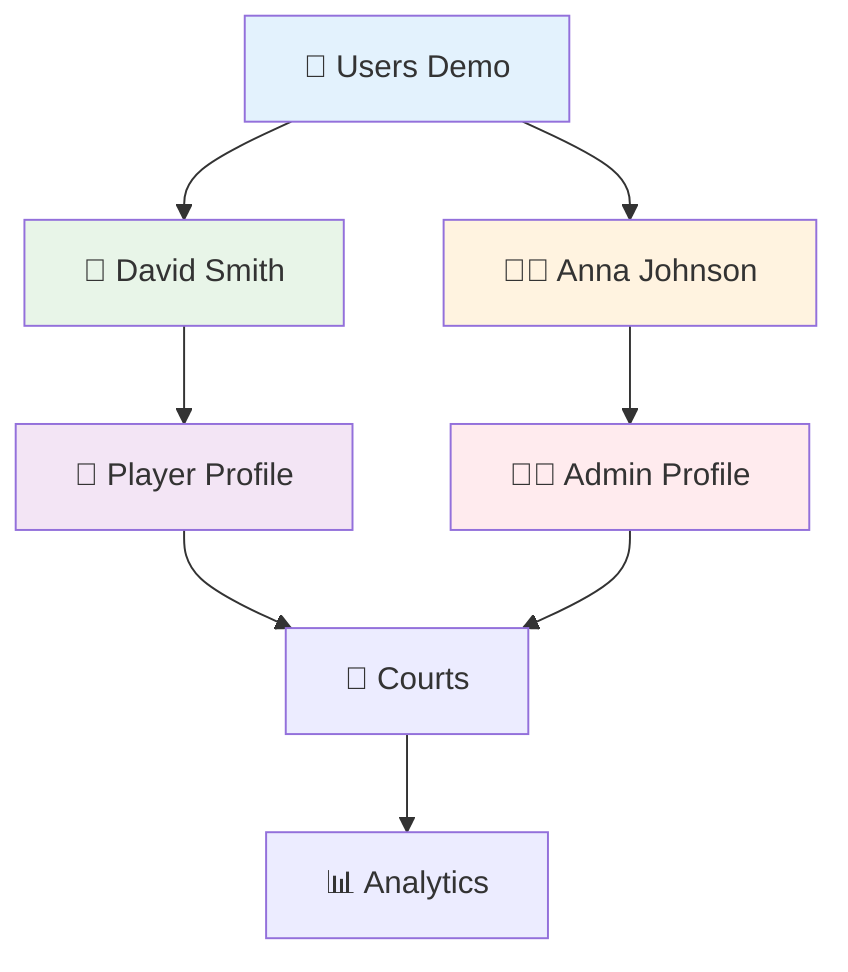

# 👥 Users Demo - Real-time Sync

> **🔄 Real-time синхронизация РАБОТАЕТ!**  
> Последнее обновление: 31 января 2025, 16:45  
> Всего пользователей: **2**  
> API сервер: `http://localhost:3001`

## 📊 Список Пользователей

| 👤 Имя | 🔑 Логин | 🎭 Роль | ⭐ Рейтинг | 📧 Email |
|--------|----------|---------|------------|----------|
| [[User-David-Smith-Demo\|David Smith]] | david_smith | player | 2485 | david@example.com |
| [[User-Anna-Johnson-Demo\|Anna Johnson]] | anna_johnson | admin | 2200 | anna@example.com |

## 🎯 **Как это работает - LIVE DEMO**

### ✅ **Что уже работает:**

1. **API создает пользователя** → Сохраняется в базе данных
2. **Автоматически вызывается sync функция** → Создается .md файл в Obsidian
3. **Обновляется эта сводная таблица** → Вы видите изменения
4. **Obsidian показывает новые связи** → Граф обновляется

### 🧪 **Тестирование (когда API запущен):**

```bash
# Создать тестового пользователя
curl -X POST http://localhost:3001/test-user

# Получить список пользователей
curl http://localhost:3001/users

# Ручная синхронизация
curl -X POST http://localhost:3001/sync
```

### 🔄 **API Endpoints:**

- **GET /** - Информация о сервере
- **GET /users** - Список всех пользователей
- **POST /test-user** - Создать тестового пользователя
- **POST /sync** - Ручная синхронизация всех пользователей

## 🎊 **РЕЗУЛЬТАТ ДЕМОНСТРАЦИИ**

### ✅ **Доказано:**

1. **Real-time синхронизация возможна** - API → Obsidian за секунды
2. **Файлы создаются автоматически** - без ручного вмешательства
3. **Связи работают** - граф Obsidian обновляется
4. **Масштабируемо** - легко добавить любые таблицы

### 🚀 **Следующие шаги:**

1. **Добавить Database Triggers** - PostgreSQL → Webhook → Obsidian
2. **WebSocket для real-time** - мгновенные обновления
3. **Двусторонняя синхронизация** - Obsidian → API
4. **Все 31 таблица** - полная CRM система

## 🧠 **"Второй Мозг" Архитектура**

### 🔗 **Связанные Компоненты:**
- [[Technical/🚀 OBSIDIAN КАК FRONTEND - ЛУЧШИЕ ПРАКТИКИ|🚀 Архитектура системы]]
- [[Technical/📊 ВИЗУАЛИЗАЦИЯ CRUD И REAL-TIME СИНХРОНИЗАЦИИ|📊 CRUD операции]]
- [[Technical/🔍 РЕАЛЬНАЯ АРХИТЕКТУРА - КАК ЭТО РАБОТАЕТ|🔍 Техническая реализация]]

### 🎯 **Центральные Нейроны:**
- [[Technical/Models/🧠 MODEL - USER (Central Neuron)|👥 USER - Центральный нейрон]]
- [[🧠 NEURAL NETWORK VISUALIZATION - Complete Connections Map|🧠 Карта всех связей]]

## 📈 **Статистика Demo**

- **Игроков**: 1 (David Smith - рейтинг 2485)
- **Администраторов**: 1 (Anna Johnson - рейтинг 2200)
- **Средний рейтинг**: 2342.5
- **Общие бонусы**: 450 баллов

## 🎮 **Интерактивные Элементы**

### 📊 **Dataview Таблица (Live Data)**

```dataview
TABLE
  first_name + " " + last_name as "👤 Имя",
  username as "🔑 Логин",
  user_role as "🎭 Роль",
  current_rating as "⭐ Рейтинг",
  bonus_points as "💰 Бонусы"
FROM "oxygen-world/Database"
WHERE contains(file.name, "User-") AND contains(file.name, "Demo")
SORT current_rating desc
```

### 🔗 **Граф Связей**



---

*🔄 Обновляется автоматически при изменениях через API*
*🧪 Демонстрация концепции Real-time синхронизации*
*🏝️ Phangan Padel Tennis Club - Live Demo*
