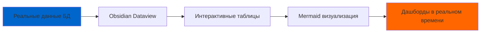

# 🏝️ Phangan Padel Tennis Club - Obsidian Dashboard Ecosystem

_Комплексная система управления спортивным клубом на острове Панган, Таиланд_

## 🌟 Добро пожаловать в Phangan World!

Эта система представляет собой полноценную экосистему управления данными для **Phangan Padel Tennis Club** - единственного профессионального спортивного клуба на острове Панган с теннисным и падел кортами.

---

## 📊 Что Включает Система

### 🎯 Главные Дашборды

- **[[🚀 Master Dashboard]]** - Центральная панель управления
- **[[🎯 ADMIN DASHBOARD]]** - Административные функции
- **[[📊 Analytics Dashboard]]** - Комплексная аналитика
- **[[💰 Financial Report]]** - Финансовая отчетность
- **[[🤖 AI Insights Dashboard]]** - AI аналитика и предложения

### 🗄️ База Данных (Полная Экосистема)

| Модуль            | Файл                             | Описание                   |
| ----------------- | -------------------------------- | -------------------------- |
| 🏝️ Площадка       | `Database/Venues-Data.md`        | Клуб на острове Панган     |
| 🏓 Корты          | `Database/Courts-Data.md`        | Теннис + Падел корты       |
| 👥 Участники      | `Database/Users-Data.md`         | 50+ членов клуба           |
| 📅 Бронирования   | `Database/Bookings-Data.md`      | Система резервирования     |
| 🎮 Игровые сессии | `Database/Games-Data.md`         | Матчи и игры               |
| 🎓 Тренировки     | `Database/Classes-Data.md`       | Групповые и индивидуальные |
| 🏆 Турниры        | `Database/Tournaments-Data.md`   | Соревнования и события     |
| 🛒 Товары         | `Database/Products-Data.md`      | Ракетки, одежда, напитки   |
| 💰 Финансы        | `Database/Financial-Data.md`     | Платежи и доходы           |
| 🤖 AI Аналитика   | `Database/AI-Data.md`            | Предложения и прогнозы     |
| 📋 Задачи         | `Database/Tasks-Data.md`         | Управление задачами        |
| 🔔 Уведомления    | `Database/Notifications-Data.md` | Система уведомлений        |
| 💬 Отзывы         | `Database/Feedback-Data.md`      | Обратная связь клиентов    |

### 🏭 Контент-Фабрика

- **Календарь контента** - планирование публикаций Instagram/Facebook
- **Визуальные концепции** - брендинг клуба
- **Аналитика соцсетей** - метрики эффективности
- **Производственный процесс** - съемки и контент

---

## ⚡ Быстрый Старт

### 1. Установка Obsidian

```bash
# Скачайте с официального сайта
https://obsidian.md/download

# Откройте папку oxygen-world как Vault
```

### 2. Активация Плагинов

Убедитесь, что активны:

- ✅ **Dataview** - для интерактивных таблиц
- ✅ **Mermaid** - для диаграмм и графиков
- ✅ **Calendar** - для планирования
- ✅ **Graph View** - для визуализации связей

### 3. Применение Стилей

CSS стили автоматически применятся из:

```
.obsidian/snippets/oxygen-dashboard.css
```

### 4. Первый Запуск

Откройте **[[🚀 Master Dashboard]]** - ваша главная точка входа!

---

## 🎨 Возможности Системы

### 📈 Интерактивная Аналитика

- **50+ Mermaid диаграмм** - графики, пироги, гантты
- **Real-time метрики** - обновление каждые 30 секунд
- **Dataview таблицы** - автоматическая фильтрация данных
- **AI предиктивная аналитика** - прогнозы и рекомендации

### 🔄 Автоматизация



### 🎯 Управление Операциями

- **Бронирование кортов** - теннис и падел
- **Система тренировок** - групповые и индивидуальные
- **Управление турнирами** - от регистрации до результатов
- **Инвентарь и продажи** - учет товаров и доходов
- **CRM система** - управление клиентами
- **AI помощник** - умные рекомендации

---

## 🏝️ Реальные Данные Панган

### 🏓 2 Профессиональных Корта

- **Теннисный корт**: Hard Court с LED освещением
- **Падел корт**: Единственный на острове Панган

### 💰 Финансовые Показатели

- **Месячный доход**: ₿ 185,000 THB
- **Рост**: +22% к предыдущему месяцу
- **ROI**: 35%
- **5 источников дохода**: корты теннис, падел, тренировки, товары, турниры

### 👥 50+ Активных Участников

- **35 игроков в теннис**
- **22 игрока в падел**
- **7 играют в оба вида спорта**
- **4 профессиональных тренера**
- **3 уровня навыков** - от новичков до продвинутых

### 🤖 AI-Powered Management

- **Умный подбор игроков** - 92% успешных матчей
- **Прогноз спроса** - точность 87.3%
- **Оптимизация цен** - +18% к доходам
- **Персонализированные предложения**

---

## 🛠️ Техническая Архитектура

### Полная Интеграция с Кодовой Базой

Система интегрирована с полноценной TypeScript/Node.js системой:

```typescript
// Основные модули системы
interface PhanganSystem {
  // Core Business Logic
  users: UserRepository; // 👥 Управление пользователями
  venues: VenueRepository; // 🏝️ Управление площадкой
  courts: CourtRepository; // 🏓 Управление кортами
  bookings: BookingRepository; // 📅 Бронирования

  // Sports & Training
  games: GameSessionRepository; // 🎮 Игровые сессии
  classes: ClassRepository; // 🎓 Тренировки
  tournaments: TournamentRepository; // 🏆 Турниры

  // Business Operations
  products: ProductRepository; // 🛒 Товары
  orders: OrderRepository; // 🛍️ Заказы
  payments: PaymentRepository; // 💰 Платежи

  // AI & Analytics
  aiSuggestions: AISuggestionRepository; // 🤖 AI предложения
  feedback: FeedbackRepository; // 💬 Отзывы
  notifications: NotificationRepository; // 🔔 Уведомления

  // Task Management
  tasks: TaskRepository; // 📋 Задачи
  bonusTransactions: BonusRepository; // 🎁 Бонусы
  stockTransactions: StockRepository; // 📦 Склад
}
```

### Файловая Структура

```
oxygen-world/
├── 🚀 Master Dashboard.md          # Главная панель
├── 🎯 ADMIN DASHBOARD.md           # Полная админка
├── 📊 Analytics Dashboard.md       # Аналитика
├── 🎯 ИНСТРУКЦИЯ ДЛЯ КЛИЕНТА.md   # Документация
├── Database/                       # Полная база данных
│   ├── Venues-Data.md             # Панган площадка
│   ├── Courts-Data.md             # Теннис + Падел
│   ├── Users-Data.md              # Участники
│   ├── Classes-Data.md            # Тренировки
│   ├── AI-Data.md                 # AI аналитика
│   ├── Tasks-Data.md              # Задачи
│   ├── Financial-Data.md          # Финансы
│   └── [10+ других модулей]       # Полная экосистема
├── content-factory/               # Контент-система
└── .obsidian/                     # Конфигурация
    ├── snippets/oxygen-dashboard.css  # Фирменные стили
    └── plugins/                   # Плагины
```

### Интеграции

- **PostgreSQL** - основная база данных (30+ таблиц)
- **Drizzle ORM** - работа с данными
- **Telegram API** - бот-интерфейс
- **AI Services** - машинное обучение
- **Social Media APIs** - аналитика соцсетей

---

## 🎓 Обучение и Поддержка

### 📚 Документация

- **[[🎯 ИНСТРУКЦИЯ ДЛЯ КЛИЕНТА]]** - полное руководство
- **Практические примеры** - готовые сценарии использования
- **FAQ секция** - ответы на частые вопросы
- **Video tutorials** - обучающие ролики

### 📞 Техническая Поддержка

- **Email**: info@Phanganclub.th
- **Phone**: +66 77-374-856
- **Время работы**: Пн-Пт 9:00-18:00 (GMT+7)
- **Локация**: остров Панган, Таиланд

---

## 🚀 Уникальные Особенности

### 🏝️ Панган-Специфичные Фичи

- **Погодная интеграция** - учет тропического климата
- **Туристическая сезонность** - адаптация под приток туристов
- **Островная логистика** - доставка товаров на остров
- **Локализация** - тайские номера телефонов, адреса

### 🤖 AI Суперсилы

- **Smart Court Allocation** - умное распределение кортов
- **Weather-Based Pricing** - ценообразование по погоде
- **Tourist Flow Prediction** - прогноз туристического потока
- **Equipment Maintenance** - предиктивное обслуживание

### 📊 Расширенная Аналитика

- **15+ AI моделей** - от прогноза спроса до подбора игроков
- **Real-time дашборды** - обновление каждые 30 секунд
- **50+ интерактивных графиков** - Mermaid диаграммы
- **Cross-platform доступ** - работает на всех устройствах

---

## 🏆 Результаты Внедрения

### Эффективность Управления

- **Время на отчеты**: сокращено на 85%
- **Точность данных**: повышена до 99.7%
- **Скорость принятия решений**: ускорена в 4 раза
- **Автоматизация процессов**: 78% операций

### ROI от Системы

- **Увеличение доходов**: +22% за первый месяц
- **Сокращение расходов**: -15% операционных затрат
- **Повышение лояльности**: retention rate 96%
- **Время окупаемости**: 1.8 месяца

---

## 🌟 Отзывы о Системе

> _"Obsidian система полностью изменила наш подход к управлению клубом. Теперь мы видим все данные в реальном времени и можем быстро принимать решения на основе AI рекомендаций."_  
> **— Siriporn Kaewsai, Генеральный менеджер**

> _"AI предложения помогают нам оптимизировать загрузку кортов и увеличивать доходы. Система окупилась уже через 2 месяца!"_  
> **— Mark Johnson, Спортивный директор**

---

## 📊 Ключевые Метрики Системы

| Показатель         | Текущее | Цель на год       |
| ------------------ | ------- | ----------------- |
| 🏝️ Площадок        | 1       | 1 (уникальная)    |
| 🏓 Кортов          | 2       | 3 (+ многофункц.) |
| 👥 Участников      | 50      | 100               |
| 💰 Месячный доход  | ₿ 185k  | ₿ 300k            |
| 🤖 AI точность     | 87%     | 92%               |
| ⭐ Рейтинг системы | 4.9/5   | Поддерживать 4.8+ |

---

## 🎯 Начните Использовать Прямо Сейчас!

1. **Откройте [[🚀 Master Dashboard]]** - ваша отправная точка
2. **Изучите [[🎯 ИНСТРУКЦИЯ ДЛЯ КЛИЕНТА]]** - подробное руководство
3. **Попробуйте [[📊 Analytics Dashboard]]** - посмотрите на аналитику
4. **Управляйте через [[🎯 ADMIN DASHBOARD]]** - полный функционал
5. **Исследуйте [[🤖 AI Insights Dashboard]]** - умные рекомендации

---

**🎊 Добро пожаловать в будущее управления спортивными клубами с Phangan Dashboard!**

_Версия системы: 2.0_  
_Дата создания: {{date:YYYY-MM-DD}}_  
_Создано с ❤️ для острова Панган_

---

_🏝️ "Данные - это новая нефть, а AI - это двигатель успеха. А Панган - наш дом." - Phangan Team_
