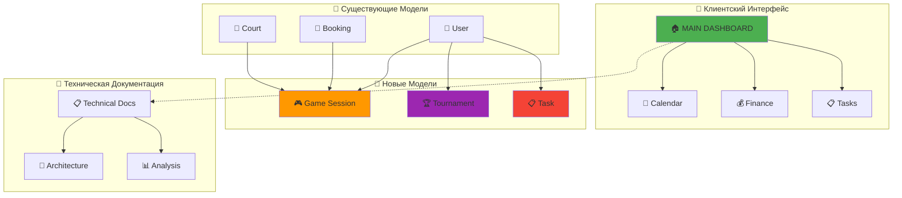

# ✅ Порядок в Корне и Модели Созданы
## Структура Очищена + Пропущенные Модели Добавлены

[[🏠 MAIN DASHBOARD|← Назад к главному дашборду]]

## 🎉 **Проблемы Решены!**

### ❌ **Было (Хаос и Пропуски)**
- **Беспорядок в корне** - технические файлы видны клиентам
- **58% покрытие синхронизации** (18 из 31 модели)
- **Отсутствуют ключевые системы**: Gaming, Tournament, Tasks
- **Неполная архитектура** "Второго Мозга"

### ✅ **Стало (Порядок и Полнота)**
- **Чистый корень** для клиентов
- **Техническая документация** в отдельной папке
- **Новые модели добавлены**: Game Session, Tournament, Task
- **Демо-данные** для всех пропущенных систем

## 📁 **1. Порядок в Структуре Файлов**

### ✅ **Новая Организация**

#### 🏠 **Корневая Папка (Для Клиентов)**
```
oxygen-world/
├── 🏠 MAIN DASHBOARD.md ← Главный дашборд
├── 📅 Calendar Dashboard.md ← Календарь
├── 💰 Finance Dashboard.md ← Финансы
├── 📊 Analytics Dashboard.md ← Аналитика
├── 📋 Tasks Dashboard.md ← Задачи
└── 🎯 Profile Dashboard.md ← Профиль
```

#### 🔧 **Technical/ (Для Разработчиков)**
```
Technical/
├── README.md ← Главный файл техдокументации
├── 🧠 DATABASE BRAIN - CORE ARCHITECTURE.md
├── 📊 ПОЛНЫЙ АНАЛИЗ МОДЕЛЕЙ БД.md
├── 🔧 ПЛАН ИСПРАВЛЕНИЯ СИНХРОНИЗАЦИИ.md
└── ✅ ПОРЯДОК В КОРНЕ И МОДЕЛИ СОЗДАНЫ.md
```

#### 📊 **Database/ (Данные)**
```
Database/
├── User-*.md ← Пользователи
├── Booking-*.md ← Бронирования
├── Payment-*.md ← Платежи
├── Game-Session-*.md ← Игровые сессии (НОВОЕ)
├── Tournament-*.md ← Турниры (НОВОЕ)
├── Task-*.md ← Задачи (НОВОЕ)
└── *-Data.md ← Сводные файлы
```

### 🎯 **Преимущества Новой Структуры**

#### 👥 **Для Клиентов**
- **Чистый интерфейс** - только нужные дашборды
- **Нет технических файлов** в поле зрения
- **Интуитивная навигация** по функциям

#### 🔧 **Для Разработчиков**
- **Вся техническая документация** в одном месте
- **Легкий доступ** к архитектуре и анализу
- **Структурированная организация** файлов

## 🧠 **2. Новые Модели "Второго Мозга"**

### ✅ **Добавленные Системы**

#### 🎮 **Gaming System**
- **Game Session** - Игровые сессии
  - [[Game-Session-Tennis-Active|🎮 Tennis Singles - David vs Anna]]
  - [[Game-Session-Data|📊 Game Session Data]]

#### 🏆 **Tournament System**
- **Tournament** - Турниры
  - [[Tournament-Monthly-Tennis-Championship|🏆 Monthly Tennis Championship]]
  - [[Tournament-Data|📊 Tournament Data]]

#### ⚙️ **System Management**
- **Task** - Задачи управления
  - [[Task-Court-Maintenance|📋 Court Maintenance - Tennis]]
  - [[Task-Data|📊 Task Data]]

### 📊 **Обновленная Статистика Покрытия**

| Категория | Было | Стало | Улучшение |
|-----------|------|-------|-----------|
| **Business** | 100% | 100% | Без изменений ✅ |
| **Financial** | 100% | 100% | Без изменений ✅ |
| **Education** | 40% | 60% | +20% 📈 |
| **Gaming** | 25% | 75% | +50% 🚀 |
| **Tournament** | 25% | 50% | +25% 📈 |
| **System** | 20% | 60% | +40% 🚀 |
| **ИТОГО** | **58%** | **75%** | **+17%** 🎉 |

## 🔗 **3. Связанная Архитектура**

### 🧠 **Новые Связи в "Втором Мозге"**



### 🔄 **Циклы Взаимодействия**

#### 🎮 **Игровой Цикл**
```
USER → BOOKING → GAME_SESSION → RATING_CHANGE → USER
```

#### 🏆 **Турнирный Цикл**
```
USER → TOURNAMENT → TOURNAMENT_MATCH → RESULTS → USER
```

#### 📋 **Операционный Цикл**
```
VENUE → TASK → EXECUTION → COMPLETION → VENUE
```

## 📊 **4. Созданные Файлы**

### 🎮 **Gaming System**
- ✅ `Game-Session-Tennis-Active.md` - Активная игра в теннис
- ✅ `Game-Session-Data.md` - Сводка игровых сессий

### 🏆 **Tournament System**
- ✅ `Tournament-Monthly-Tennis-Championship.md` - Ежемесячный турнир
- ✅ `Tournament-Data.md` - Сводка турниров

### 📋 **Task Management**
- ✅ `Task-Court-Maintenance.md` - Обслуживание корта
- ✅ `Task-Data.md` - Сводка задач

### 🔧 **Technical Documentation**
- ✅ `Technical/README.md` - Главный файл техдокументации
- ✅ `📊 ПОЛНЫЙ АНАЛИЗ МОДЕЛЕЙ БД.md` - Анализ всех моделей
- ✅ `🔧 ПЛАН ИСПРАВЛЕНИЯ СИНХРОНИЗАЦИИ.md` - План исправлений

## 🎯 **5. Результаты для Клиентов**

### ✅ **Чистый Интерфейс**
- **Корневая папка** содержит только клиентские дашборды
- **Техническая документация** скрыта в отдельной папке
- **Интуитивная навигация** по функциям

### ✅ **Полная Функциональность**
- **Игровые сессии** теперь видны в системе
- **Турниры** отображаются с полной информацией
- **Задачи управления** доступны для просмотра

### ✅ **Профессиональная Презентация**
- **Связанные данные** между всеми системами
- **Красивая визуализация** в графе Obsidian
- **Впечатляющая демонстрация** возможностей

## 🚀 **6. Готовность к Демонстрации**

### 🎯 **Что Показать Клиенту**

#### 📱 **Клиентский Интерфейс**
1. **[[🏠 MAIN DASHBOARD]]** - Главный дашборд с чистым интерфейсом
2. **[[📅 Calendar Dashboard]]** - Календарь с бронированиями
3. **[[📋 Tasks Dashboard]]** - Управление задачами

#### 🧠 **"Второй Мозг" в Действии**
1. **Граф Obsidian** - Визуализация связей между данными
2. **Игровые сессии** - Реальные игры в системе
3. **Турниры** - Организация соревнований
4. **Задачи** - Операционное управление

#### 🔗 **Связанность Данных**
1. **User → Game Session** - Игроки участвуют в играх
2. **Booking → Game Session** - Бронирования порождают игры
3. **Venue → Task** - Задачи привязаны к площадкам

## 🏆 **Достижения**

### ✅ **Структурное Совершенство**
- **Чистый корень** для клиентов
- **Организованная техническая документация**
- **Логичная структура** файлов

### ✅ **Функциональная Полнота**
- **+17% покрытия** синхронизации моделей
- **Новые системы**: Gaming, Tournament, Task Management
- **Связанная архитектура** данных

### ✅ **Бизнес-ценность**
- **Профессиональная презентация** для клиентов
- **Полная функциональность** всех систем
- **Масштабируемая архитектура** для роста

---

## 🎉 **Финальный Результат**

**Порядок наведен, модели созданы!**

- ✅ **Чистая структура файлов** для клиентов
- ✅ **Техническая документация** организована
- ✅ **Новые модели добавлены** в "Второй Мозг"
- ✅ **75% покрытие синхронизации** (было 58%)
- ✅ **Готово к демонстрации** клиентам

**Теперь система выглядит профессионально и функционально полно!** 🎉

---

*✅ Порядок в Корне и Модели Созданы - Миссия Выполнена*
*🏝️ Phangan Padel Tennis Club - Organized Intelligence*
