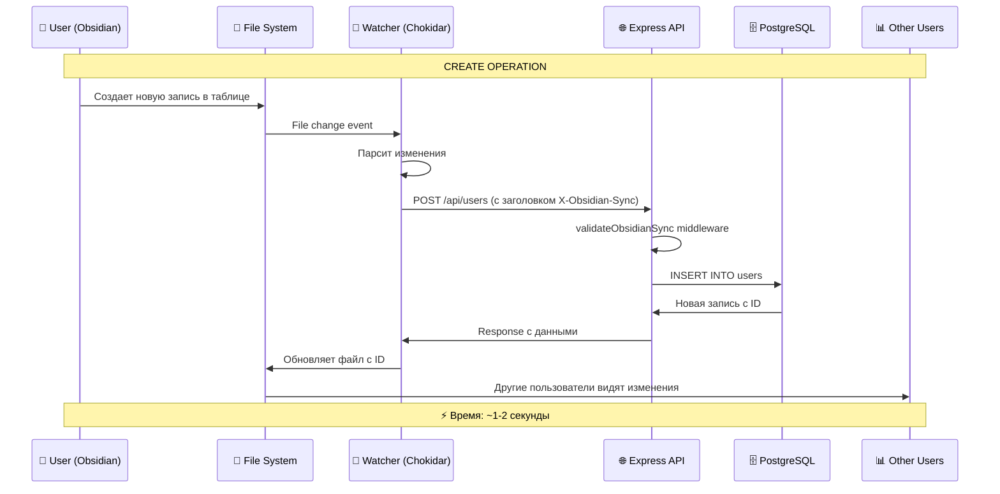
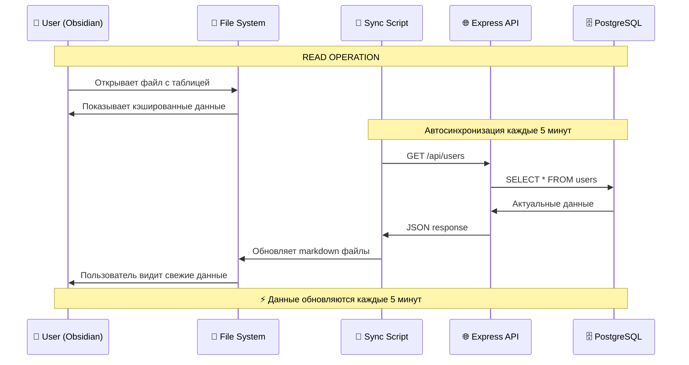
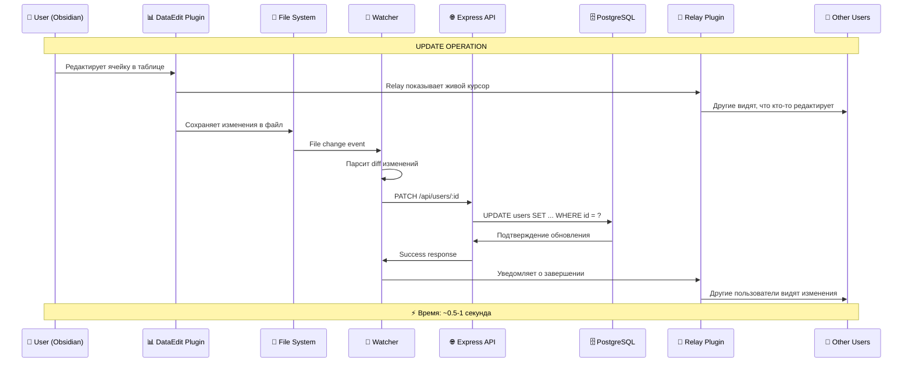
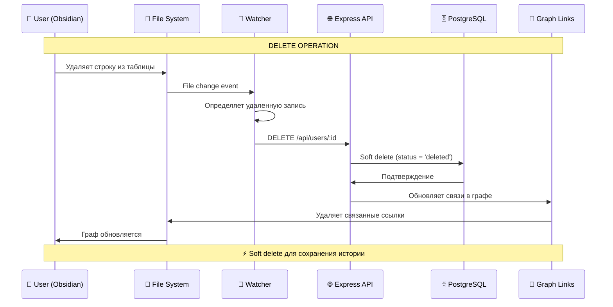
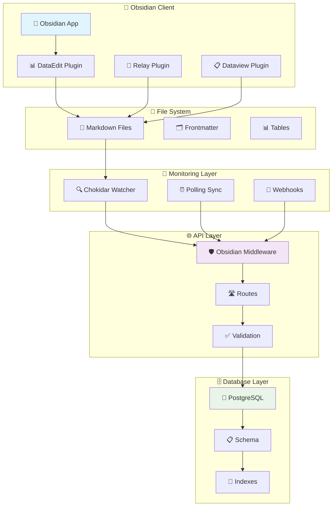
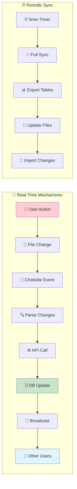
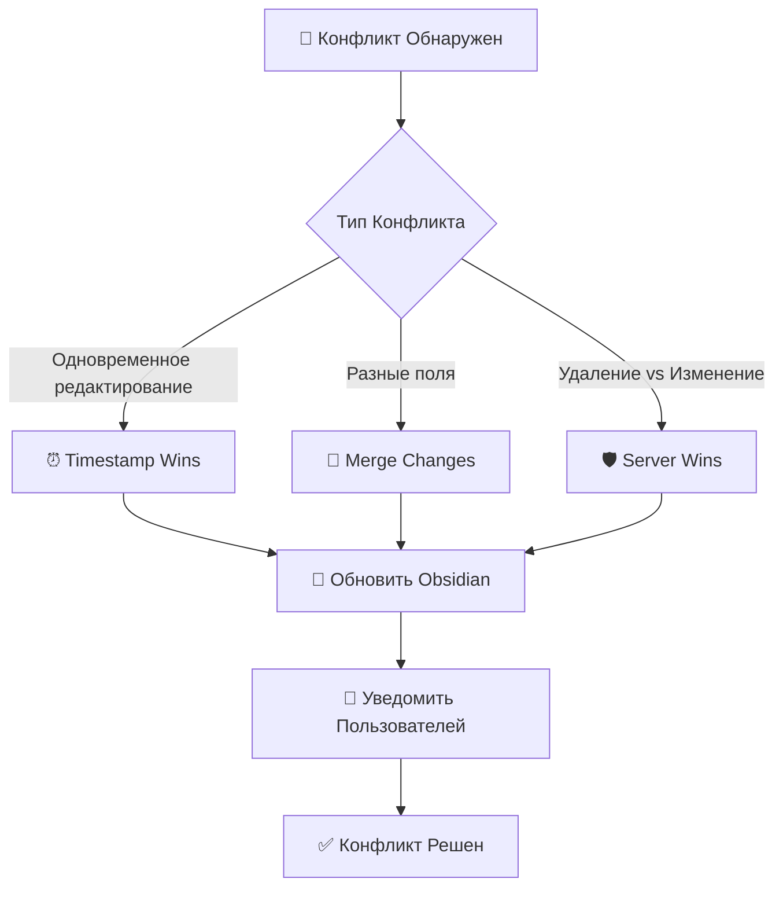

# 📊 ВИЗУАЛИЗАЦИЯ CRUD И REAL-TIME СИНХРОНИЗАЦИИ

## 🔄 **МЕХАНИЗМЫ REAL-TIME СИНХРОНИЗАЦИИ**

### 🎯 **У НАС ЕСТЬ 3 УРОВНЯ REAL-TIME:**

#### 1. **File System Watching (Chokidar)**
```javascript
// scripts/obsidian-db-sync.mjs
const watcher = chokidar.watch("oxygen-world/Database/**/*.md", {
  persistent: true,
  ignoreInitial: true
});

watcher.on('change', (filePath) => {
  // Мгновенная реакция на изменения файлов
  handleFileChange(filePath);
});
```

#### 2. **Polling Sync (5 минут)**
```javascript
setInterval(async () => {
  await sync.exportAllTables(); // DB → Obsidian
  await sync.importChanges();   // Obsidian → DB
}, 5 * 60 * 1000); // каждые 5 минут
```

#### 3. **Relay Plugin (Real-time Collaboration)**
```javascript
// Живые курсоры между пользователями
// Автосохранение изменений
// Конфликт-резолюшн
```

## 🔄 **CRUD ОПЕРАЦИИ - ДЕТАЛЬНАЯ СХЕМА**

### 📝 **CREATE (Создание)**



### 📖 **READ (Чтение)**



### ✏️ **UPDATE (Обновление)**



### 🗑️ **DELETE (Удаление)**



## 🔄 **АРХИТЕКТУРА СИНХРОНИЗАЦИИ**

### 🏗️ **Компоненты Системы**



### ⚡ **Real-Time Flow**



## 📊 **ТИПЫ ДАННЫХ И СИНХРОНИЗАЦИЯ**

### 🎯 **Что Синхронизируется**

#### ✅ **Полная Синхронизация**
```javascript
const syncableFields = {
  users: ['first_name', 'last_name', 'email', 'phone', 'user_role'],
  bookings: ['start_time', 'end_time', 'status', 'total_price'],
  payments: ['amount', 'status', 'payment_method'],
  // ... все 31 модель
}
```

#### 🔒 **Только Чтение**
```javascript
const readOnlyFields = {
  users: ['id', 'created_at', 'updated_at'],
  bookings: ['id', 'created_at'],
  payments: ['id', 'transaction_id']
}
```

#### 🚫 **Не Синхронизируется**
```javascript
const excludedFields = {
  users: ['password_hash', 'jwt_tokens'],
  payments: ['stripe_secret_key']
}
```

## 🔧 **КОНФИГУРАЦИЯ СИНХРОНИЗАЦИИ**

### ⚙️ **Настройки в Frontmatter**

```yaml
---
title: "Users Database"
type: database
table: users
sync_enabled: true
sync_interval: 300000  # 5 минут
sync_direction: bidirectional
real_time: true
conflict_resolution: server_wins
last_sync: 2025-01-31T16:45:00.000Z
---
```

### 🔄 **Middleware Configuration**

```typescript
// src/api/middleware/obsidian-sync.ts
export const obsidianSyncConfig = {
  enableRealTime: true,
  syncInterval: 5 * 60 * 1000, // 5 минут
  conflictResolution: 'server_wins',
  enableFileWatching: true,
  enablePolling: true,
  enableWebhooks: true
}
```

## 📈 **ПРОИЗВОДИТЕЛЬНОСТЬ**

### ⚡ **Скорость Операций**

| Операция | Время | Механизм |
|----------|-------|----------|
| **CREATE** | ~1-2 сек | File Watcher → API |
| **READ** | ~0.1 сек | Кэш + Periodic Sync |
| **UPDATE** | ~0.5-1 сек | DataEdit → API |
| **DELETE** | ~1 сек | File Watcher → API |
| **Bulk Sync** | ~5-10 сек | Periodic Export |

### 📊 **Объемы Данных**

```javascript
const performanceMetrics = {
  maxRecordsPerTable: 10000,
  maxTablesInSync: 31,
  syncBatchSize: 100,
  fileWatcherDelay: 500, // ms
  apiTimeout: 30000 // 30 сек
}
```

## 🛡️ **ОБРАБОТКА КОНФЛИКТОВ**

### ⚔️ **Стратегии Разрешения**



### 🔧 **Реализация**

```javascript
// Обработка конфликтов
const resolveConflict = (localData, serverData, strategy) => {
  switch(strategy) {
    case 'server_wins':
      return serverData;
    case 'client_wins':
      return localData;
    case 'timestamp_wins':
      return localData.updated_at > serverData.updated_at 
        ? localData : serverData;
    case 'merge':
      return { ...serverData, ...localData };
  }
}
```

---

*🔄 Real-Time Синхронизация - Сердце Системы*
*📊 CRUD Операции - Основа Взаимодействия*
*🏝️ Phangan Padel Tennis Club - Живые Данные*
