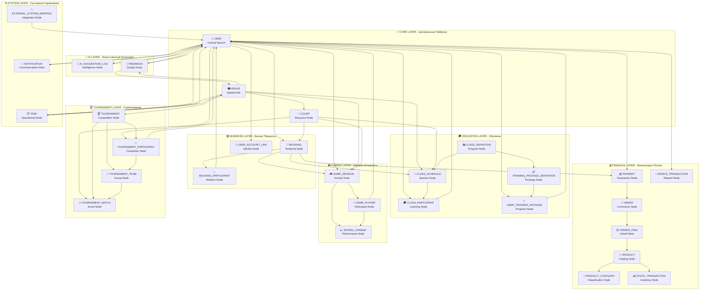

# 🔄 План Реструктуризации Графа
## Создание Правильной Архитектуры Всех 31 Модели

[[🏠 MAIN DASHBOARD|← Назад к главному дашборду]]

## ❌ **Проблемы Текущего Графа**

### 🔍 **Анализ Хаоса**
- **Разрозненные узлы** - много файлов без связей
- **Дублирование данных** - несколько файлов для одной модели
- **Отсутствие центральной структуры** - нет четкой иерархии
- **Неправильные связи** - модели не связаны с данными
- **Отсутствуют 13 моделей** из 31

## 🎯 **Правильная Архитектура**

### 🧠 **Центральная Нейронная Сеть**

## 📋 **Все 31 Модели с Правильными Связями**

### 🔵 **Core Layer (3 модели)**
1. **👥 USER** - Центральный нейрон, связан со всеми
2. **🏟️ VENUE** - Пространственный хаб
3. **🎾 COURT** - Ресурсный узел

### 🟢 **Business Layer (3 модели)**
4. **📅 BOOKING** - Временной узел
5. **👤 BOOKING_PARTICIPANT** - Узел отношений
6. **🔗 USER_ACCOUNT_LINK** - Узел идентичности

### 💰 **Financial Layer (7 моделей)**
7. **💰 PAYMENT** - Транзакционный узел
8. **🛒 ORDER** - Коммерческий узел
9. **📦 ORDER_ITEM** - Детальный узел
10. **🎯 PRODUCT** - Каталожный узел
11. **📂 PRODUCT_CATEGORY** - Классификационный узел
12. **📊 STOCK_TRANSACTION** - Складской узел
13. **🎁 BONUS_TRANSACTION** - Бонусный узел

### 🎓 **Education Layer (5 моделей)**
14. **📚 CLASS_DEFINITION** - Программный узел
15. **📅 CLASS_SCHEDULE** - Сессионный узел
16. **🎓 CLASS_PARTICIPANT** - Обучающий узел
17. **📋 TRAINING_PACKAGE_DEFINITION** - Пакетный узел
18. **🎯 USER_TRAINING_PACKAGE** - Прогрессивный узел

### 🎮 **Gaming Layer (3 модели)**
19. **🎮 GAME_SESSION** - Активный узел
20. **🏓 GAME_PLAYER** - Участвующий узел
21. **📈 RATING_CHANGE** - Производительный узел

### 🏆 **Tournament Layer (4 модели)**
22. **🏆 TOURNAMENT** - Соревновательный узел
23. **🥇 TOURNAMENT_PARTICIPANT** - Конкурентный узел
24. **👥 TOURNAMENT_TEAM** - Групповой узел
25. **⚔️ TOURNAMENT_MATCH** - Событийный узел

### 🤖 **AI Layer (2 модели)**
26. **🤖 AI_SUGGESTION_LOG** - Интеллектуальный узел
27. **💭 FEEDBACK** - Качественный узел

### ⚙️ **System Layer (3 модели)**
28. **📋 TASK** - Операционный узел
29. **🔔 NOTIFICATION** - Коммуникационный узел
30. **🔄 EXTERNAL_SYSTEM_MAPPING** - Интеграционный узел

## 🔄 **План Реструктуризации**

### 🗑️ **Этап 1: Очистка Хаоса**
- [ ] Удалить дублирующие файлы
- [ ] Удалить разрозненные узлы без связей
- [ ] Очистить неправильные модели

### 🧠 **Этап 2: Создание Центральных Моделей**
- [ ] Создать 31 файл модели в `Technical/Models/`
- [ ] Каждая модель = один файл с четкими связями
- [ ] Использовать правильные имена и эмодзи

### 🔗 **Этап 3: Создание Связанных Данных**
- [ ] Для каждой модели создать 2-3 файла данных
- [ ] Все данные должны ссылаться на модели
- [ ] Использовать правильные связи через `[[]]`

### 📊 **Этап 4: Создание Сводных Файлов**
- [ ] Один сводный файл на каждый слой
- [ ] Dataview запросы для автоматической агрегации
- [ ] Красивая визуализация статистики

## 🎯 **Ожидаемый Результат**

### ✅ **Чистый Граф**
- **31 модель** в центре графа
- **Каждая модель связана** с соответствующими данными
- **Четкая иерархия** по слоям
- **Центральные нейроны** (USER, VENUE, COURT) в центре

### ✅ **Правильные Связи**
- **USER** связан с 15+ моделями
- **VENUE** связан с 8+ моделями  
- **COURT** связан с 6+ моделями
- **Все модели** имеют логичные связи

### ✅ **Красивая Визуализация**
- **Цветовое кодирование** по слоям
- **Логичное расположение** узлов
- **Понятная навигация** между связями

---

## 🚀 **Начинаем Реструктуризацию**

**Следующий шаг**: Создать все 31 модель с правильными связями

---

*🔄 План Реструктуризации Графа - Путь к Порядку*
*🏝️ Phangan Padel Tennis Club - Structured Intelligence*
