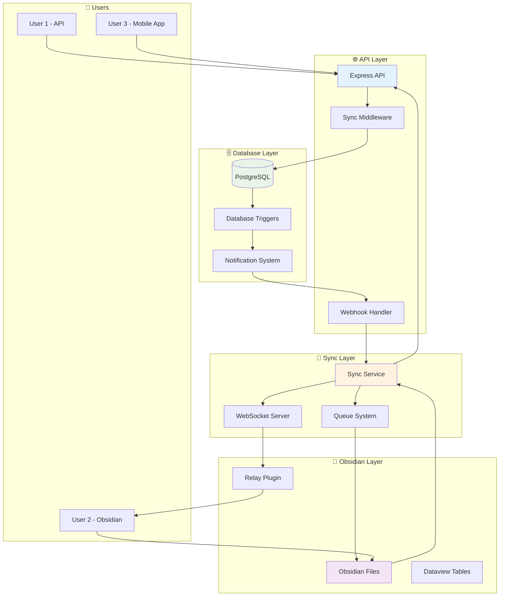
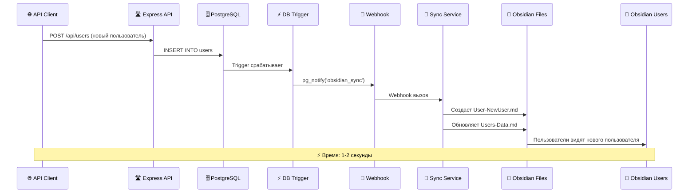
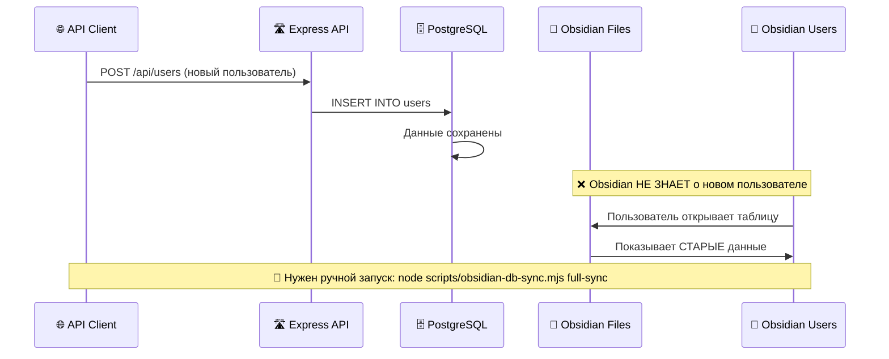
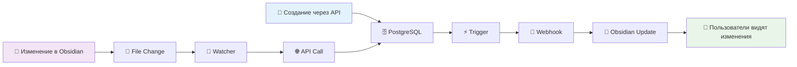

# 🔍 РЕАЛЬНАЯ АРХИТЕКТУРА - КАК ЭТО РАБОТАЕТ

## 🎯 **ВЫ ПРАВЫ! ЕСТЬ ПРОБЛЕМА**

### ❌ **Текущая Ситуация**

```mermaid
graph TB
    subgraph "🗄️ PostgreSQL (Источник Истины)"
        PG[(PostgreSQL Database)]
        U1[User 1: David Smith]
        U2[User 2: Anna Johnson]
        U3[User 3: Sarah Brown]
    end
    
    subgraph "📁 Obsidian Files (Копии)"
        OF1[User-David-Smith.md]
        OF2[User-Anna-Johnson.md]
        OF3[User-Sarah-Brown.md]
        OT[Users-Data.md - Таблица]
    end
    
    subgraph "🌐 API Endpoints"
        API[POST /api/users]
        API2[GET /api/users]
        API3[PUT /api/users/:id]
    end
    
    subgraph "🔄 Sync Script"
        SS[obsidian-db-sync.mjs]
        EX[exportAllTables()]
        WT[startWatching()]
    end
    
    %% Односторонняя синхронизация
    PG --> SS
    SS --> OF1
    SS --> OF2
    SS --> OF3
    SS --> OT
    
    %% API работает только с БД
    API --> PG
    API2 --> PG
    API3 --> PG
    
    %% Проблема: новые пользователи через API не попадают в Obsidian автоматически
    API -.->|❌ НЕТ АВТОСИНХРОНИЗАЦИИ| OF1
    
    style PG fill:#e8f5e8
    style API fill:#ffebee
    style SS fill:#fff3e0
```

### 🚨 **ПРОБЛЕМЫ**

#### 1. **Односторонняя Синхронизация**
```javascript
// Работает: PostgreSQL → Obsidian
node scripts/obsidian-db-sync.mjs full-sync

// НЕ РАБОТАЕТ: API → Obsidian (автоматически)
// Если создать пользователя через API, он НЕ появится в Obsidian
```

#### 2. **Ручной Запуск Синхронизации**
```bash
# Нужно вручную запускать каждый раз
node scripts/obsidian-db-sync.mjs full-sync
```

#### 3. **Нет Real-Time от API к Obsidian**
```javascript
// Когда кто-то создает пользователя через API:
POST /api/users → PostgreSQL ✅
PostgreSQL → Obsidian ❌ (нет автоматической синхронизации)
```

## 🔧 **КАК ЭТО ДОЛЖНО РАБОТАТЬ**

### ✅ **Правильная Архитектура**



## 🛠️ **РЕШЕНИЕ ПРОБЛЕМЫ**

### 🎯 **Что Нужно Добавить**

#### 1. **Database Triggers + Webhooks**
```sql
-- Создаем триггер в PostgreSQL
CREATE OR REPLACE FUNCTION notify_obsidian_sync()
RETURNS TRIGGER AS $$
BEGIN
    -- Отправляем уведомление о изменении
    PERFORM pg_notify('obsidian_sync', json_build_object(
        'table', TG_TABLE_NAME,
        'action', TG_OP,
        'data', row_to_json(NEW)
    )::text);
    RETURN NEW;
END;
$$ LANGUAGE plpgsql;

-- Применяем к таблице users
CREATE TRIGGER user_sync_trigger
    AFTER INSERT OR UPDATE OR DELETE ON "user"
    FOR EACH ROW EXECUTE FUNCTION notify_obsidian_sync();
```

#### 2. **Webhook Endpoint в API**
```javascript
// src/api/routes/obsidian-webhooks.ts
app.post('/api/webhooks/obsidian-sync', async (req, res) => {
  const { table, action, data } = req.body;
  
  // Запускаем синхронизацию конкретной таблицы
  await syncTableToObsidian(table, action, data);
  
  res.json({ success: true });
});
```

#### 3. **Auto-Sync Service**
```javascript
// services/obsidian-auto-sync.js
class ObsidianAutoSync {
  constructor() {
    this.setupDatabaseListener();
  }
  
  setupDatabaseListener() {
    // Слушаем уведомления от PostgreSQL
    this.client.on('notification', async (msg) => {
      const { table, action, data } = JSON.parse(msg.payload);
      await this.syncToObsidian(table, action, data);
    });
  }
  
  async syncToObsidian(table, action, data) {
    // Обновляем соответствующие файлы в Obsidian
    if (table === 'user') {
      await this.updateUserFile(data);
      await this.updateUsersTable();
    }
  }
}
```

## 🔄 **ПОЛНЫЙ FLOW CRUD ОПЕРАЦИЙ**

### ✅ **CREATE (Правильный Flow)**



### ❌ **Текущий Broken Flow**



## 🎯 **ПЛАН ИСПРАВЛЕНИЯ**

### 🚀 **Этап 1: Database Triggers (1 день)**
```sql
-- Добавляем триггеры для всех таблиц
CREATE TRIGGER user_sync_trigger AFTER INSERT OR UPDATE OR DELETE ON "user";
CREATE TRIGGER booking_sync_trigger AFTER INSERT OR UPDATE OR DELETE ON "booking";
CREATE TRIGGER payment_sync_trigger AFTER INSERT OR UPDATE OR DELETE ON "payment";
-- ... для всех 31 таблицы
```

### 🚀 **Этап 2: Webhook Handler (1 день)**
```javascript
// src/api/routes/obsidian-sync.ts
router.post('/webhook', async (req, res) => {
  const { table, action, data } = req.body;
  
  // Запускаем синхронизацию
  await obsidianSyncService.syncTable(table, action, data);
  
  res.json({ success: true });
});
```

### 🚀 **Этап 3: Auto-Sync Service (2 дня)**
```javascript
// services/obsidian-auto-sync.service.ts
export class ObsidianAutoSyncService {
  async syncTable(table: string, action: string, data: any) {
    switch(table) {
      case 'user':
        await this.syncUser(action, data);
        break;
      case 'booking':
        await this.syncBooking(action, data);
        break;
      // ... для всех таблиц
    }
  }
}
```

### 🚀 **Этап 4: Real-Time WebSockets (2 дня)**
```javascript
// Real-time уведомления для Obsidian
io.on('connection', (socket) => {
  socket.on('subscribe_table', (tableName) => {
    socket.join(`table_${tableName}`);
  });
});

// При изменении данных
io.to(`table_users`).emit('table_updated', {
  table: 'users',
  action: 'create',
  data: newUser
});
```

## 🏆 **РЕЗУЛЬТАТ**

### ✅ **После Исправления**



### 🎯 **Преимущества**
1. **Истинный Real-Time** - изменения видны мгновенно
2. **Двусторонняя синхронизация** - работает в обе стороны
3. **Автоматическая синхронизация** - не нужно ничего запускать вручную
4. **Масштабируемость** - работает с любым количеством пользователей

---

*🔍 Честная Диагностика - Основа Решения*
*🛠️ Правильная Архитектура - Путь к Успеху*
*🏝️ Phangan Padel Tennis Club - Real-Time CRM*
