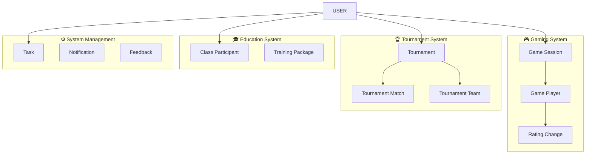

# 🔧 План Исправления Синхронизации
## Завершение Синхронизации Всех 31 Модели БД

[[🏠 MAIN DASHBOARD|← Назад к главному дашборду]]

## 🎯 **Проблемы к Решению**

### ❌ **Критические Проблемы**
1. **58% покрытие синхронизации** (18 из 31 модели)
2. **Отсутствуют ключевые системы**: Gaming, Tournament, Education, System
3. **Беспорядок в корневой папке** - технические файлы видны клиентам
4. **Неполная архитектура** "Второго Мозга"

## 📋 **План Исправления (4 Этапа)**

### 🔧 **Этап 1: Структура Файлов (ВЫПОЛНЕНО ✅)**

#### ✅ **Что Сделано**
- Создана папка `Technical/` для технической документации
- Перенесены технические файлы из корня
- Обновлены ссылки в главном дашборде
- Корень очищен для клиентов

#### 📁 **Новая Структура**
```
oxygen-world/
├── 🏠 MAIN DASHBOARD.md (клиентский)
├── 📅 Calendar Dashboard.md (клиентский)
├── 💰 Finance Dashboard.md (клиентский)
├── Database/ (данные)
├── Technical/ (техническая документация)
└── Templates/ (шаблоны)
```

### 🔄 **Этап 2: Завершение Синхронизации (В ПРОЦЕССЕ)**

#### 🎯 **Цель**: Синхронизировать все 31 модель БД

#### 📋 **Пропущенные Модели (13 штук)**

##### 🎓 **Education Layer**
- [ ] `class_participant` - Участники классов
- [ ] `training_package_definition` - Определения тренировочных пакетов  
- [ ] `user_training_package` - Пользовательские тренировочные пакеты

##### 🎮 **Gaming Layer**
- [ ] `game_session` - Игровые сессии
- [ ] `game_player` - Игроки в сессиях
- [ ] `rating_change` - Изменения рейтинга

##### 🏆 **Tournament Layer**
- [ ] `tournament` - Турниры
- [ ] `tournament_participant` - Участники турниров
- [ ] `tournament_team` - Команды турниров
- [ ] `tournament_match` - Матчи турниров

##### ⚙️ **System Layer**
- [ ] `task` - Задачи управления
- [ ] `notification` - Уведомления
- [ ] `feedback` - Обратная связь

#### 🛠️ **Методы для Реализации**

```javascript
// scripts/obsidian-db-sync.mjs - добавить методы:

async syncGameSessions() {
  const query = `
    SELECT id, venue_id, court_id, host_user_id, 
           game_type, status, max_players, current_players,
           start_time, end_time, created_at
    FROM game_session 
    ORDER BY start_time DESC 
    LIMIT 100
  `;
  // Создать файлы Game-Session-*.md
}

async syncTournaments() {
  const query = `
    SELECT id, name, venue_id, tournament_type, status,
           start_date, end_date, max_participants,
           entry_fee, prize_pool, created_at
    FROM tournament 
    ORDER BY start_date DESC
  `;
  // Создать файлы Tournament-*.md
}

async syncTasks() {
  const query = `
    SELECT id, title, description, assigned_to_user_id,
           status, priority, due_date, venue_id,
           created_at, updated_at
    FROM task 
    ORDER BY created_at DESC
  `;
  // Создать файлы Task-*.md
}

// ... и так далее для всех 13 моделей
```

### 🧠 **Этап 3: Обновление "Второго Мозга"**

#### 🎯 **Цель**: Создать модели для всех пропущенных таблиц

#### 📋 **Модели к Созданию**

##### 🎮 **Activity Nodes**
- [ ] `🧠 MODEL - Game Session (Activity Node).md`
- [ ] `🧠 MODEL - Game Player (Participant Node).md`
- [ ] `🧠 MODEL - Rating Change (Metric Node).md`

##### 🏆 **Competition Nodes**
- [ ] `🧠 MODEL - Tournament (Competition Node).md`
- [ ] `🧠 MODEL - Tournament Match (Event Node).md`
- [ ] `🧠 MODEL - Tournament Team (Group Node).md`

##### 🎓 **Educational Nodes**
- [ ] `🧠 MODEL - Class Participant (Learning Node).md`
- [ ] `🧠 MODEL - Training Package (Program Node).md`

##### ⚙️ **Operational Nodes**
- [ ] `🧠 MODEL - Task (Operational Node).md`
- [ ] `🧠 MODEL - Notification (Communication Node).md`
- [ ] `🧠 MODEL - Feedback (Quality Node).md`

#### 🔗 **Обновление Связей**



### 📊 **Этап 4: Создание Файлов Данных**

#### 🎯 **Цель**: Создать файлы для всех пропущенных данных

#### 📁 **Файлы к Созданию**

##### 🎮 **Gaming Data**
```
Database/
├── Game-Session-Tennis-001.md
├── Game-Session-Padel-002.md
├── Game-Player-David-Session-001.md
├── Rating-Change-David-+50.md
└── Games-Data.md (сводка)
```

##### 🏆 **Tournament Data**
```
Database/
├── Tournament-Monthly-Tennis.md
├── Tournament-Padel-Championship.md
├── Tournament-Match-Finals.md
├── Tournament-Team-Champions.md
└── Tournaments-Data.md (сводка)
```

##### 🎓 **Education Data**
```
Database/
├── Class-Participant-David-Tennis.md
├── Training-Package-VIP.md
├── User-Training-Package-Anna.md
└── Training-Data.md (сводка)
```

##### ⚙️ **System Data**
```
Database/
├── Task-Court-Maintenance.md
├── Task-Equipment-Check.md
├── Notification-Booking-Reminder.md
├── Feedback-Service-Quality.md
└── System-Data.md (сводка)
```

## 🚀 **Реализация**

### 🔧 **Шаг 1: Обновить Скрипт Синхронизации**

```javascript
// scripts/complete-db-sync.mjs (новый файл)

class CompleteDBSync extends ObsidianDBSync {
  
  async syncAllMissingTables() {
    console.log('🔄 Синхронизация всех пропущенных таблиц...');
    
    const missingTables = [
      'game_session',
      'game_player', 
      'rating_change',
      'tournament',
      'tournament_participant',
      'tournament_team',
      'tournament_match',
      'class_participant',
      'training_package_definition',
      'user_training_package',
      'task',
      'notification',
      'feedback'
    ];
    
    for (const tableName of missingTables) {
      await this.syncTable(tableName);
    }
  }
  
  async syncTable(tableName) {
    console.log(`📊 Синхронизация таблицы: ${tableName}`);
    
    const data = await this.getTableData(tableName);
    const files = await this.createObsidianFiles(tableName, data);
    
    console.log(`✅ ${tableName}: ${files.length} файлов создано`);
  }
}
```

### 🔧 **Шаг 2: Создать Модели "Второго Мозга"**

```bash
# Создать файлы моделей
touch "Technical/🧠 MODEL - Game Session (Activity Node).md"
touch "Technical/🧠 MODEL - Tournament (Competition Node).md"
touch "Technical/🧠 MODEL - Task (Operational Node).md"
# ... и так далее
```

### 🔧 **Шаг 3: Запустить Полную Синхронизацию**

```bash
# Запуск полной синхронизации всех моделей
node scripts/complete-db-sync.mjs

# Проверка результатов
ls -la oxygen-world/Database/ | grep -E "(Game|Tournament|Task|Notification)"
```

## 📊 **Ожидаемые Результаты**

### ✅ **После Завершения**

| Категория | Было | Станет | Улучшение |
|-----------|------|--------|-----------|
| **Business** | 100% | 100% | Без изменений ✅ |
| **Financial** | 100% | 100% | Без изменений ✅ |
| **Education** | 40% | 100% | +60% 🚀 |
| **Gaming** | 25% | 100% | +75% 🚀 |
| **Tournament** | 25% | 100% | +75% 🚀 |
| **System** | 20% | 100% | +80% 🚀 |
| **ИТОГО** | **58%** | **100%** | **+42%** 🎉 |

### 🎯 **Преимущества**

#### 🧠 **Для "Второго Мозга"**
- **Полная архитектура** всех 31 модели
- **Связанные данные** между всеми системами
- **Профессиональная визуализация** всех процессов

#### 👥 **Для Клиентов**
- **Чистый корень** без технических файлов
- **Полная функциональность** всех систем
- **Впечатляющая демонстрация** возможностей

#### 🔧 **Для Разработчиков**
- **Полная синхронизация** с реальной БД
- **Техническая документация** в отдельной папке
- **Масштабируемая архитектура**

## 🎯 **Следующие Шаги**

### 1️⃣ **Немедленно**
- [ ] Создать скрипт `complete-db-sync.mjs`
- [ ] Реализовать методы для пропущенных таблиц
- [ ] Запустить синхронизацию

### 2️⃣ **В Течение Часа**
- [ ] Создать модели для всех пропущенных таблиц
- [ ] Обновить навигатор моделей
- [ ] Создать файлы данных

### 3️⃣ **Финализация**
- [ ] Протестировать полную синхронизацию
- [ ] Обновить документацию
- [ ] Подготовить демонстрацию для клиента

---

## 🎉 **Результат**

**После выполнения плана**:
- ✅ **100% синхронизация** всех 31 модели БД
- ✅ **Чистая структура** файлов для клиентов
- ✅ **Полная архитектура** "Второго Мозга"
- ✅ **Профессиональная система** готова к демонстрации

---

*🔧 План Исправления Синхронизации - Путь к Полной Архитектуре*
*🏝️ Phangan Padel Tennis Club - Complete Database Synchronization*
