# 🧠 Database Brain - Core Architecture
## "Второй Мозг" Сервера - Центральная Архитектура БД

[[🏠 MAIN DASHBOARD|← Назад к главному дашборду]]

## 🎯 **Концепция "Второго Мозга"**

Наша база данных представляет собой **"Второй Мозг"** сервера - централизованную систему знаний, где каждая модель является нейроном, а связи между ними - синапсами. Это живая, дышащая архитектура данных.

## 🧠 **Центральная Нервная Система (Core Models)**

### 🎯 **Главные Модели-Нейроны**

```mermaid
erDiagram
    %% ===== ЦЕНТРАЛЬНЫЙ НЕЙРОН - USER =====
    USER {
        uuid id PK "🔑 Главный ключ"
        varchar username UK "👤 Уникальный логин"
        varchar password_hash "🔒 Хеш пароля"
        varchar first_name "📝 Имя"
        varchar last_name "📝 Фамилия"
        varchar email UK "📧 Email (уникальный)"
        varchar phone UK "📞 Телефон (уникальный)"
        varchar member_id UK "🎫 ID участника (уникальный)"
        user_role user_role "👔 Роль пользователя"
        real current_rating "⭐ Текущий рейтинг"
        integer bonus_points "🎁 Бонусные баллы"
        text profile_image_url "🖼️ URL аватара"
        gender_type gender "👫 Пол"
        date date_of_birth "🎂 Дата рождения"
        uuid home_venue_id FK "🏠 Домашний клуб"
        boolean is_account_verified "✅ Аккаунт подтвержден"
        timestamp last_login_at "🕐 Последний вход"
        timestamp last_activity_at "🕐 Последняя активность"
        timestamp created_at "📅 Создан"
        timestamp updated_at "📅 Обновлен"
    }
    
    %% ===== МЕСТО - VENUE =====
    VENUE {
        uuid id PK "🔑 Главный ключ"
        varchar name UK "🏢 Название клуба (уникальное)"
        text address "📍 Адрес"
        varchar city "🏙️ Город"
        varchar country "🌍 Страна"
        varchar phone_number "📞 Телефон клуба"
        varchar email "📧 Email клуба"
        boolean is_active "✅ Активен"
        varchar gcal_resource_id "📅 Google Calendar ID"
        timestamp created_at "📅 Создан"
        timestamp updated_at "📅 Обновлен"
    }
    
    %% ===== КОРТ - COURT =====
    COURT {
        uuid id PK "🔑 Главный ключ"
        uuid venue_id FK "🏢 Клуб"
        varchar name "🏓 Название корта"
        court_type court_type "🎾 Тип корта (tennis/padel)"
        court_status status "📊 Статус корта"
        numeric hourly_rate "💰 Стоимость за час"
        integer capacity "👥 Вместимость"
        text description "📝 Описание"
        text maintenance_schedule "🔧 График обслуживания"
        boolean is_active "✅ Активен"
        timestamp created_at "📅 Создан"
        timestamp updated_at "📅 Обновлен"
    }
    
    %% ===== БРОНИРОВАНИЕ - BOOKING =====
    BOOKING {
        uuid id PK "🔑 Главный ключ"
        uuid court_id FK "🏓 Корт"
        timestamp start_time "🕐 Время начала"
        timestamp end_time "🕐 Время окончания"
        integer duration_minutes "⏱️ Длительность (мин)"
        booking_status status "📊 Статус бронирования"
        numeric total_amount "💰 Общая сумма"
        varchar currency "💱 Валюта"
        uuid booked_by_user_id FK "👤 Забронировал пользователь"
        booking_purpose booking_purpose "🎯 Цель бронирования"
        uuid related_entity_id "🔗 Связанная сущность"
        text notes "📝 Заметки"
        timestamp created_at "📅 Создано"
        timestamp updated_at "📅 Обновлено"
    }
    
    %% ===== ПЛАТЕЖ - PAYMENT =====
    PAYMENT {
        uuid id PK "🔑 Главный ключ"
        uuid user_id FK "👤 Пользователь"
        numeric amount "💰 Сумма"
        varchar currency "💱 Валюта"
        payment_status status "📊 Статус платежа"
        payment_method payment_method "💳 Способ оплаты"
        varchar gateway_transaction_id "🏦 ID транзакции"
        text description "📝 Описание"
        uuid related_booking_participant_id FK "📅 Участник бронирования"
        uuid related_order_id FK "🛒 Заказ"
        uuid related_user_training_package_id FK "📦 Тренировочный пакет"
        timestamp created_at "📅 Создан"
        timestamp updated_at "📅 Обновлен"
    }

    %% ===== СВЯЗИ МЕЖДУ МОДЕЛЯМИ =====
    USER ||--o{ BOOKING : "booked_by_user_id"
    USER ||--o{ PAYMENT : "user_id"
    USER }o--|| VENUE : "home_venue_id"
    
    VENUE ||--o{ COURT : "venue_id"
    
    COURT ||--o{ BOOKING : "court_id"
    
    BOOKING ||--o{ PAYMENT : "related_booking_id"
```



## 🔗 **Синапсы "Второго Мозга" (Key Relationships)**

### 1️⃣ **Центральный Нейрон: USER**
```
USER является центральным узлом, связанным со ВСЕМИ остальными моделями:
- USER → BOOKING (создает бронирования)
- USER → PAYMENT (совершает платежи)
- USER → GAME_SESSION (создает и хостит игры)
- USER → RATING_CHANGE (изменения рейтинга)
```

### 2️⃣ **Пространственная Иерархия: VENUE → COURT**
```
VENUE (клуб) содержит множество COURT (кортов)
Каждый корт принадлежит одному клубу
```

### 3️⃣ **Цепочка Бронирования: BOOKING → GAME_SESSION**
```
BOOKING (бронирование) может породить GAME_SESSION (игру)
Каждая игра связана с одним бронированием
```

### 4️⃣ **Финансовая Цепочка: USER → BOOKING_PARTICIPANT → PAYMENT**
```
USER участвует в BOOKING через BOOKING_PARTICIPANT
BOOKING_PARTICIPANT генерирует PAYMENT
```

## 🧠 **Нейронная Сеть Данных**

### 🎯 **Центральные Узлы (Hub Models)**
1. **USER** - Главный нейрон (связан со всеми моделями)
2. **VENUE** - Пространственный узел
3. **BOOKING** - Временной узел
4. **GAME_SESSION** - Игровой узел

### 🔄 **Циклы Обратной Связи**
1. **Игровой цикл**: USER → GAME_SESSION → RATING_CHANGE → USER
2. **Финансовый цикл**: USER → BOOKING → PAYMENT → USER
3. **Пространственный цикл**: USER → VENUE → COURT → BOOKING → USER

### 📊 **Метрики "Мозга"**
- **Связность**: 100% (все модели связаны)
- **Центральность**: USER (максимальное количество связей)
- **Глубина**: 3 уровня (USER → BOOKING → GAME_SESSION)
- **Целостность**: Referential Integrity через Foreign Keys

---

## 🎯 **Визуализация в Obsidian Graph**

Эта архитектура должна отображаться в графе Obsidian как:
- **Центральный узел**: USER модели
- **Кластеры**: Группировка по функциональности
- **Связи**: Четкие линии между связанными моделями
- **Иерархия**: VENUE → COURT → BOOKING структура

---

*🧠 "Второй Мозг" Сервера - Живая Архитектура Данных*
*🏝️ Phangan Padel Tennis Club - Connected Intelligence*
