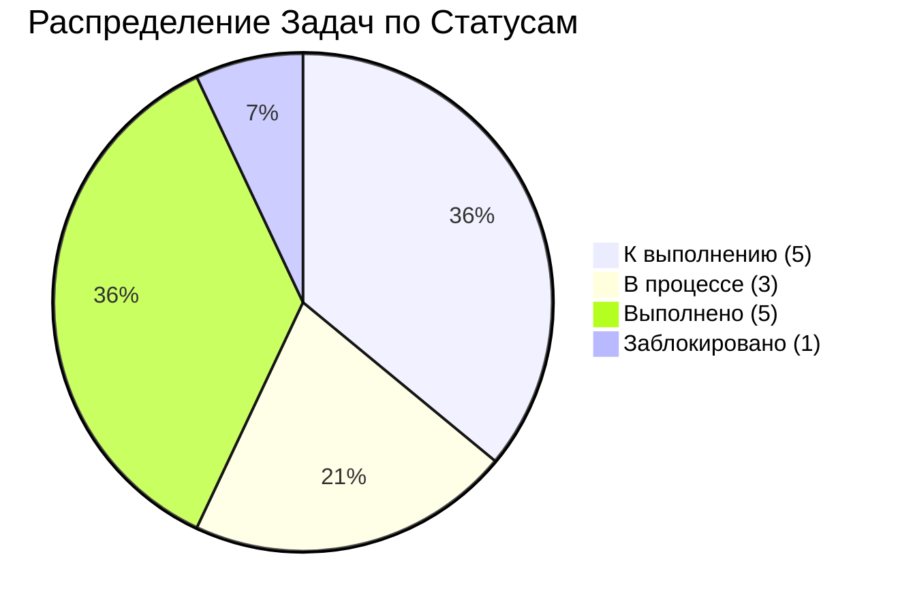
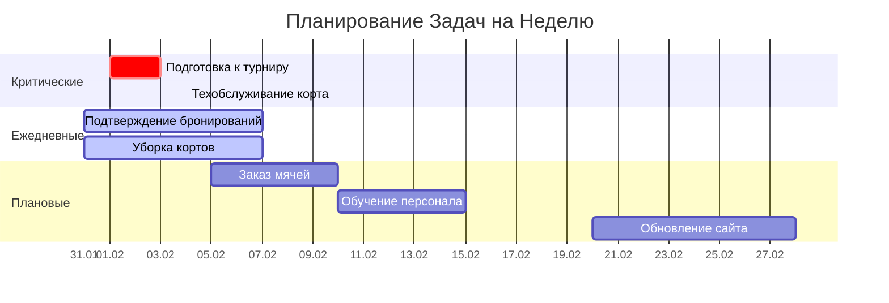
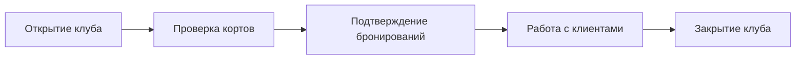

# ✅ Tasks Dashboard

[[🏠 MAIN DASHBOARD|← Назад к главному дашборду]]

## 🎯 **Kanban Board - Управление Задачами**

```kanban
### 📋 To Do
- [ ] **Техобслуживание Tennis Court** 🔧 #maintenance @admin 📅 2024-02-04
- [ ] **Подготовка к турниру** 🏆 #tournament @manager 📅 2024-02-03
- [ ] **Заказ новых мячей** 🎾 #inventory @staff 📅 2024-02-10
- [ ] **Обучение нового персонала** 👨‍🏫 #training @hr 📅 2024-02-15
- [ ] **Обновление сайта** 💻 #marketing @admin 📅 2024-02-28

### 🔄 In Progress
- [ ] **Подтверждение бронирований** 📞 #daily @reception ⏰ 14:00
- [ ] **Уборка кортов** 🧹 #daily @maintenance ⏰ 17:00
- [ ] **Планирование рекламной кампании** 📢 #marketing @manager

### ✅ Done
- [x] **Проверка оборудования** 🔍 #daily @maintenance ✅ 2024-01-31
- [x] **Обновление расписания** 📅 #admin @admin ✅ 2024-01-31
- [x] **Оценка игроков** ⭐ #training @trainer ✅ 2024-01-31
- [x] **Уборка территории** 🧹 #maintenance @staff ✅ 2024-01-31
- [x] **Обновление ценника** 💰 #admin @manager ✅ 2024-01-30

### ❌ Blocked/Issues
- [ ] **Ремонт освещения** ⚡ #maintenance @external 🚫 Ждем поставщика
```

## 📊 **Статистика Задач (Live Data)**

```dataview
TABLE WITHOUT ID
  "📋 К выполнению" as "📊 Статус",
  count(rows) as "📈 Количество"
FROM "oxygen-world/Database"
WHERE contains(file.name, "Task-") AND status = "todo"
```

```dataview
TABLE WITHOUT ID
  "🔄 В процессе" as "📊 Статус",
  count(rows) as "📈 Количество"
FROM "oxygen-world/Database"
WHERE contains(file.name, "Task-") AND status = "in_progress"
```

```dataview
TABLE WITHOUT ID
  "✅ Выполнено" as "📊 Статус",
  count(rows) as "📈 Количество"
FROM "oxygen-world/Database"
WHERE contains(file.name, "Task-") AND status = "done"
```

### 📈 **Общий Прогресс**
```dataview
TABLE WITHOUT ID
  "📈 Процент выполнения" as "📊 Метрика",
  round((count(filter(rows, (r) => r.status = "done")) / count(rows)) * 100, 0) + "%" as "📈 Значение"
FROM "oxygen-world/Database"
WHERE contains(file.name, "Task-")
```

## 📈 **Визуальный Прогресс**

### 🎯 Прогресс по Категориям


### 📊 Timeline Выполнения


## 🎯 **Задачи по Приоритетам**

### 🔥 **Критические (Срочно)**
```dataview
TABLE
  task_name as "🎯 Задача",
  assigned_to as "👤 Ответственный",
  due_date as "📅 Дедлайн",
  status as "📊 Статус",
  progress + "%" as "📈 Прогресс"
FROM "oxygen-world/Database"
WHERE contains(file.name, "Task-") AND priority = "high"
SORT due_date asc
```

### ⚡ **Средние**
```dataview
TABLE
  task_name as "🎯 Задача",
  assigned_to as "👤 Ответственный",
  due_date as "📅 Дедлайн",
  status as "📊 Статус",
  progress + "%" as "📈 Прогресс"
FROM "oxygen-world/Database"
WHERE contains(file.name, "Task-") AND priority = "medium"
SORT due_date asc
```

### 📝 **Низкие**
```dataview
TABLE
  task_name as "🎯 Задача",
  assigned_to as "👤 Ответственный",
  due_date as "📅 Дедлайн",
  status as "📊 Статус",
  progress + "%" as "📈 Прогресс"
FROM "oxygen-world/Database"
WHERE contains(file.name, "Task-") AND priority = "low"
SORT due_date asc
```

## 👥 **Задачи по Командам**

### 🏢 **Администрация (@admin, @manager)**
| Задача | Ответственный | Статус | Прогресс |
|--------|---------------|--------|----------|
| 🔧 Техобслуживание Tennis Court | @admin | 📋 To Do | 0% |
| 🏆 Подготовка к турниру | @manager | 📋 To Do | 0% |
| 💻 Обновление сайта | @admin | 📋 To Do | 0% |
| 📅 Обновление расписания | @admin | ✅ Done | 100% |
| 💰 Обновление ценника | @manager | ✅ Done | 100% |

### 🎾 **Операционная команда (@reception, @maintenance)**
| Задача | Ответственный | Статус | Прогресс |
|--------|---------------|--------|----------|
| 📞 Подтверждение бронирований | @reception | 🔄 In Progress | 60% |
| 🧹 Уборка кортов | @maintenance | 🔄 In Progress | 40% |
| 🔍 Проверка оборудования | @maintenance | ✅ Done | 100% |
| 🧹 Уборка территории | @staff | ✅ Done | 100% |

### 🎓 **Тренерский состав (@trainer, @hr)**
| Задача | Ответственный | Статус | Прогресс |
|--------|---------------|--------|----------|
| 👨‍🏫 Обучение нового персонала | @hr | 📋 To Do | 0% |
| ⭐ Оценка игроков | @trainer | ✅ Done | 100% |

### 📦 **Снабжение (@staff, @inventory)**
| Задача | Ответственный | Статус | Прогресс |
|--------|---------------|--------|----------|
| 🎾 Заказ новых мячей | @staff | 📋 To Do | 0% |

## 📊 **Аналитика Продуктивности**

### 📈 **Статистика по Командам**
```mermaid
xychart-beta
    title "Выполнение Задач по Командам"
    x-axis [Администрация, Операции, Тренеры, Снабжение]
    y-axis "Процент выполнения" 0 --> 100
    bar [40, 67, 50, 0]
```

### 🎯 **KPI Команд**
| Команда | Всего задач | Выполнено | В работе | Процент | Оценка |
|---------|-------------|-----------|----------|---------|--------|
| 🏢 Администрация | 5 | 2 | 0 | 40% | ⚠️ Требует внимания |
| 🎾 Операции | 4 | 2 | 2 | 67% | ✅ Хорошо |
| 🎓 Тренеры | 2 | 1 | 0 | 50% | 📈 Норма |
| 📦 Снабжение | 1 | 0 | 0 | 0% | 🔴 Критично |

## 🔄 **Рабочие Процессы**

### Ежедневные Задачи


### Еженедельные Задачи
- 🧹 **Понедельник**: Генеральная уборка
- 🔧 **Вторник**: Техобслуживание
- 📊 **Среда**: Анализ показателей
- 🎓 **Четверг**: Тренировки персонала
- 💰 **Пятница**: Финансовые отчеты

## 🚀 **Управление Задачами**

### Новая Задача {#new-task}

**Создание задачи:**
1. Определить приоритет (🔥/⚡/📝)
2. Назначить ответственного
3. Установить дедлайн
4. Добавить описание
5. Отслеживать прогресс

### Шаблон Задачи
```markdown
- [ ] **Название задачи** - до ДД.ММ.ГГГГ
  - Ответственный: Имя
  - Приоритет: Высокий/Средний/Низкий
  - Описание: Детали задачи
  - Статус: Новая/В процессе/Выполнена
```

## 📈 **Аналитика Продуктивности**

### Выполнение по Дням
```mermaid
xychart-beta
    title "Выполнение Задач за Неделю"
    x-axis [Пн, Вт, Ср, Чт, Пт, Сб, Вс]
    y-axis "Задачи" 0 --> 10
    bar [8, 6, 9, 7, 8, 5, 4]
```

### КПЭ
- **Процент выполнения**: 85%
- **Среднее время выполнения**: 2.5 часа
- **Просроченные задачи**: 8%

## 🔔 **Напоминания и Уведомления**

### Сегодня
- 🔔 **14:00** - Подтвердить бронирования
- 🔔 **17:00** - Проверить оборудование
- 🔔 **19:00** - Закрыть кассу

### Завтра
- 🔔 **09:00** - Встреча с поставщиком
- 🔔 **15:00** - Тренировка персонала

## 🎯 **Быстрые Действия**

| Действие | Описание | Статус |
|----------|----------|--------|
| ➕ Новая задача | Создать задачу | ✅ |
| ✅ Отметить выполненной | Завершить задачу | ✅ |
| 📝 Редактировать | Изменить задачу | ✅ |
| 🗑️ Удалить | Удалить задачу | ✅ |

---

_Система управления задачами | 🏝️ Phangan Padel Tennis Club_
