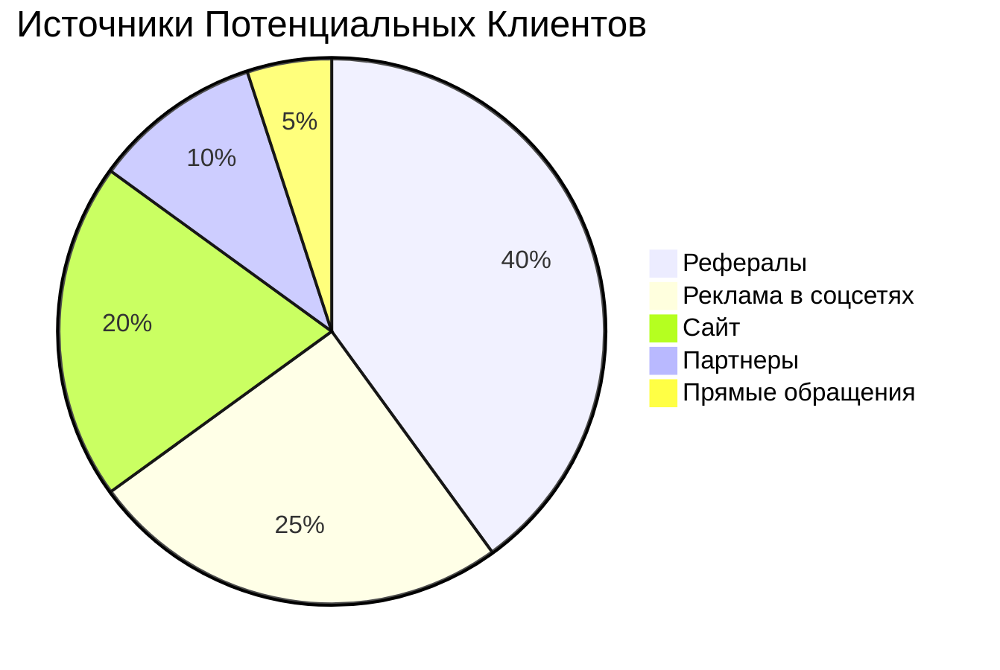
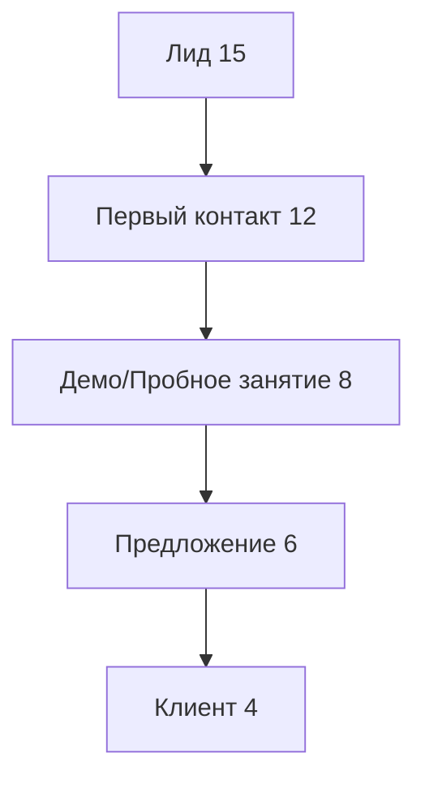

# 👥 All Contacts Dashboard

[[🏠 MAIN DASHBOARD|← Назад к главному дашборду]]

## 📊 **Обзор Контактов**

### Статистика
- **Всего контактов**: 47
- **Активных клиентов**: 12
- **Потенциальных клиентов**: 15
- **Партнеров**: 8
- **Поставщиков**: 12

## 🎯 **Категории Контактов**

### 👤 Клиенты (12)
```dataview
TABLE
  first_name + " " + last_name as "👤 Имя",
  email as "✉️ Email",
  phone as "📞 Телефон",
  user_role as "🎭 Роль",
  last_active as "📅 Активность"
FROM "oxygen-world/Database"
WHERE contains(file.name, "User-") AND user_role = "player"
SORT last_active desc
```

### 🎓 Тренеры (3)
```dataview
TABLE
  first_name + " " + last_name as "👤 Тренер",
  email as "✉️ Email",
  phone as "📞 Телефон",
  favorite_sport as "🎾 Специализация",
  current_rating as "⭐ Рейтинг"
FROM "oxygen-world/Database"
WHERE contains(file.name, "User-") AND user_role = "trainer"
SORT current_rating desc
```

### 🤝 Потенциальные Клиенты (15)
| Имя | Контакт | Источник | Статус | Дата |
|-----|---------|----------|--------|------|
| **Alex Thompson** | +66-89-555-0101 | Реклама | 🔥 Горячий | 30.01.2024 |
| **Sarah Wilson** | sarah.w@email.com | Рефералы | ⚡ Теплый | 28.01.2024 |
| **Mike Johnson** | +66-89-555-0102 | Соцсети | 🔥 Горячий | 27.01.2024 |
| **Lisa Brown** | lisa.b@email.com | Сайт | 📝 Холодный | 25.01.2024 |
| **Tom Davis** | +66-89-555-0103 | Рефералы | ⚡ Теплый | 24.01.2024 |

## 🏢 **Бизнес Контакты**

### 🤝 Партнеры (8)
| Организация | Контактное Лицо | Телефон | Тип Партнерства |
|-------------|-----------------|---------|-----------------|
| **Phangan Hotels Group** | Mr. Somchai | +66-77-123-456 | Корпоративные клиенты |
| **Island Sports Store** | Ms. Niran | +66-89-234-567 | Оборудование |
| **Koh Phangan Tourism** | Mr. David | +66-77-345-678 | Маркетинг |
| **Local Fitness Centers** | Ms. Anna | +66-89-456-789 | Кросс-промо |
| **Phangan Restaurants** | Mr. John | +66-77-567-890 | Питание |
| **Transport Services** | Ms. Maria | +66-89-678-901 | Трансфер |
| **Medical Center** | Dr. Smith | +66-77-789-012 | Медуслуги |
| **Event Management** | Mr. Wilson | +66-89-890-123 | Мероприятия |

### 📦 Поставщики (12)
| Поставщик | Товары/Услуги | Контакт | Статус |
|-----------|---------------|---------|--------|
| **Tennis Pro Equipment** | Ракетки, мячи | +66-2-123-4567 | ✅ Активный |
| **Court Maintenance Co** | Обслуживание кортов | +66-2-234-5678 | ✅ Активный |
| **Sports Apparel Ltd** | Одежда, обувь | +66-2-345-6789 | ✅ Активный |
| **Cleaning Services** | Уборка | +66-77-456-7890 | ✅ Активный |
| **Security Systems** | Безопасность | +66-2-567-8901 | ✅ Активный |
| **IT Solutions** | Техподдержка | +66-2-678-9012 | ✅ Активный |

## 🔍 **Поиск и Фильтры**

### По Типу Контакта
- **Клиенты**: [[#👤 Клиенты (12)|Перейти к клиентам]]
- **Потенциальные**: [[#🤝 Потенциальные Клиенты (15)|Посмотреть лиды]]
- **Партнеры**: [[#🤝 Партнеры (8)|Бизнес-партнеры]]
- **Поставщики**: [[#📦 Поставщики (12)|Поставщики]]

### По Активности
```dataview
TABLE
  contact_name as "👤 Контакт",
  contact_type as "🏷️ Тип",
  last_contact as "📅 Последний контакт",
  next_action as "🎯 Следующее действие"
FROM "oxygen-world/Database"
WHERE contains(file.name, "Contact-")
SORT last_contact desc
LIMIT 10
```

## 📞 **CRM Активности**

### Сегодняшние Задачи
- [ ] **Позвонить Alex Thompson** - Горячий лид
- [ ] **Отправить предложение Sarah Wilson** - Заинтересована в тренировках
- [x] **Встреча с Phangan Hotels** - Корпоративный договор ✅

### На неделе
- [ ] **Обзвон холодных лидов** (5 контактов)
- [ ] **Отправка newsletter** (всем клиентам)
- [ ] **Переговоры с новым поставщиком** оборудования

## 📈 **Аналитика Контактов**

### Источники Лидов


### Конверсия
- **Лиды → Клиенты**: 35%
- **Среднее время конверсии**: 12 дней
- **Лучший источник**: Рефералы (60% конверсия)

## 🎯 **Управление Лидами**

### Воронка Продаж


### Статусы Лидов
- 🔥 **Горячие** (готовы к покупке): 3
- ⚡ **Теплые** (заинтересованы): 7
- 📝 **Холодные** (первичный контакт): 5

## 📱 **Коммуникации**

### Каналы Связи
- **WhatsApp**: 85% клиентов
- **Email**: 100% клиентов
- **Телефон**: 60% клиентов
- **LINE**: 40% клиентов

### Предпочтения
- **Утро (9-12)**: 30%
- **День (12-17)**: 45%
- **Вечер (17-20)**: 25%

## 🎉 **События и Мероприятия**

### Планируемые
- **Open Day** - 15.02.2024 (приглашены 25 лидов)
- **Турнир для новичков** - 01.03.2024
- **Корпоративный день** - 10.03.2024

### Прошедшие
- **Новогодний турнир** - 95% участников довольны
- **Мастер-класс** - 12 новых лидов

## 🚀 **Быстрые Действия**

### Управление Контактами

| Действие | Описание | Статус |
|----------|----------|--------|
| ➕ Новый контакт | Добавить в базу | ✅ |
| 📞 Запланировать звонок | Назначить время | ✅ |
| 📧 Отправить email | Массовая рассылка | ✅ |
| 🎯 Создать задачу | CRM активность | ✅ |

### Шаблоны Сообщений
- **Приветствие новому лиду**
- **Приглашение на пробное занятие**
- **Напоминание о бронировании**
- **Благодарность за визит**

## 📊 **Отчеты и Метрики**

### Ключевые Показатели
- **Новых контактов/месяц**: 8
- **Конверсия лид→клиент**: 35%
- **Средняя стоимость привлечения**: ₿ 450
- **Lifetime Value клиента**: ₿ 12,000

### Цели на Месяц
- [ ] 15 новых лидов
- [ ] 5 новых клиентов
- [ ] 90% ответов на обращения
- [ ] Конверсия 40%+

## 🔔 **Напоминания**

### Сегодня
- 📞 **14:00** - Звонок Alex Thompson
- 📧 **16:00** - Email Sarah Wilson
- 🤝 **18:00** - Встреча с партнером

### Завтра
- 📞 **10:00** - Обзвон холодных лидов
- 📧 **15:00** - Newsletter всем клиентам

---

_Система управления контактами | 🏝️ Phangan Padel Tennis Club_
