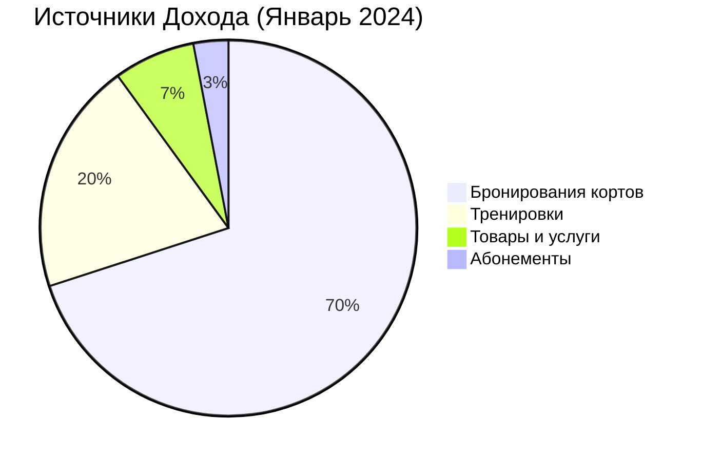
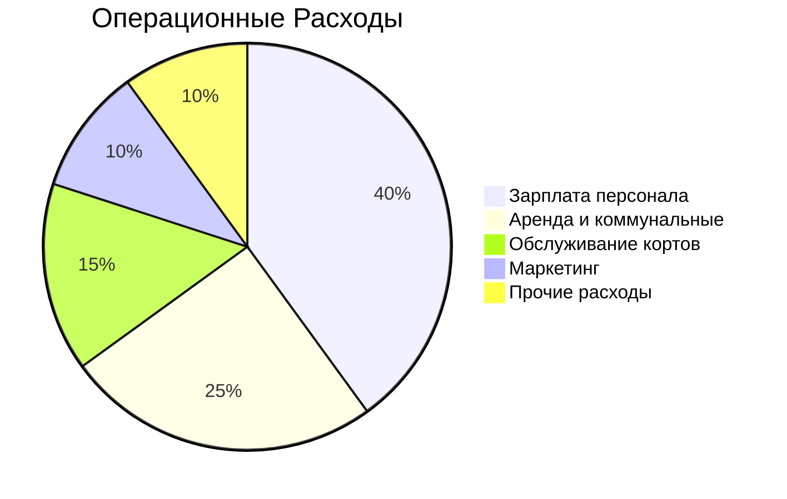

# 💰 Finance Dashboard

[[🏠 MAIN DASHBOARD|← Назад к главному дашборду]]

## 💰 **Финансовый Обзор (Live Data)**

### Сегодня (31.01.2024)
```dataview
TABLE WITHOUT ID
  "Доход от бронирований" as "📊 Метрика",
  sum(total_amount) + " THB" as "📈 Значение"
FROM "oxygen-world/Database"
WHERE contains(file.name, "Booking-Today-")
```

```dataview
TABLE WITHOUT ID
  "Количество транзакций" as "📊 Метрика",
  count(rows) as "📈 Значение"
FROM "oxygen-world/Database"
WHERE contains(file.name, "Payment-")
```

### За Месяц (Прогноз)
- **Валовый доход**: ₿ 185,000
- **Операционные расходы**: ₿ 45,000
- **Чистая прибыль**: ₿ 140,000
- **Рентабельность**: 75.7%

## 📊 **Структура Доходов**



### Детализация
- **Бронирования**: ₿ 129,500 (70%)
- **Тренировки**: ₿ 37,000 (20%)
- **Товары**: ₿ 12,950 (7%)
- **Абонементы**: ₿ 5,550 (3%)

## 💳 **Платежи и Транзакции (Live Data)**

### Способы Оплаты
```dataview
TABLE
  payment_method as "💳 Способ",
  count(rows) as "📊 Количество",
  sum(amount) + " THB" as "💰 Сумма"
FROM "oxygen-world/Database"
WHERE contains(file.name, "Payment-")
GROUP BY payment_method
```

### Последние Транзакции (Connected Data)
```dataview
TABLE
  user_name as "👤 Клиент",
  amount + " THB" as "💰 Сумма",
  payment_method as "💳 Способ",
  payment_type as "🏷️ Тип",
  booking_id as "🔗 Бронирование",
  status as "📊 Статус"
FROM "oxygen-world/Database"
WHERE contains(file.name, "Payment-")
SORT created_at desc
LIMIT 10
```

### 🔗 **Payment-Booking Relationship**
```dataview
TABLE
  P.user_name as "👤 Клиент",
  P.amount as "💰 Платеж (THB)",
  P.payment_method as "💳 Способ",
  B.court_name as "🏓 Корт",
  B.total_amount as "💰 Бронирование (THB)",
  choice(P.amount = B.total_amount, "✅ Совпадает", "❌ Не совпадает") as "🔍 Проверка"
FROM "oxygen-world/Database" as P
WHERE contains(P.file.name, "Payment-")
FLATTEN (
  filter(
    file("oxygen-world/Database"),
    (f) => contains(f.file.name, "Booking-Today-") AND
           f.booking_id = P.booking_id
  )
) as B
SORT P.created_at desc
```

### Статистика по Типам Платежей
```dataview
TABLE
  payment_type as "🏷️ Тип",
  count(rows) as "📊 Количество",
  sum(amount) + " THB" as "💰 Общая сумма",
  round(average(amount), 0) + " THB" as "📈 Средний чек"
FROM "oxygen-world/Database"
WHERE contains(file.name, "Payment-")
GROUP BY payment_type
```

## 📈 **Динамика Доходов**

### По Дням Недели
```mermaid
xychart-beta
    title "Доходы по Дням Недели (THB)"
    x-axis [Пн, Вт, Ср, Чт, Пт, Сб, Вс]
    y-axis "Доход" 0 --> 8000
    line [4200, 3800, 5100, 4650, 6200, 7800, 6900]
```

### Тренд за Месяц
- **Неделя 1**: ₿ 42,000
- **Неделя 2**: ₿ 45,500
- **Неделя 3**: ₿ 48,200
- **Неделя 4**: ₿ 49,300
- **Рост**: +17.4%

## 💸 **Расходы**

### Структура Расходов


### Детализация
- **Персонал**: ₿ 18,000 (40%)
- **Аренда**: ₿ 11,250 (25%)
- **Обслуживание**: ₿ 6,750 (15%)
- **Маркетинг**: ₿ 4,500 (10%)
- **Прочее**: ₿ 4,500 (10%)

## 🎯 **Ценообразование**

### Текущие Тарифы

#### Бронирование Кортов
| Корт | Пиковое время | Обычное время | Скидка |
|------|---------------|---------------|--------|
| **Tennis** | ₿ 1,000/час | ₿ 800/час | -20% |
| **Padel** | ₿ 800/час | ₿ 600/час | -25% |

#### Тренировки
| Тип | Цена | Длительность |
|-----|------|--------------|
| **Групповая** | ₿ 800 | 60 мин |
| **Индивидуальная** | ₿ 1,500 | 60 мин |
| **Детская** | ₿ 600 | 45 мин |

#### Абонементы
| Пакет | Цена | Включает |
|-------|------|----------|
| **8 занятий** | ₿ 6,000 | Групповые тренировки |
| **4 корта** | ₿ 3,000 | Бронирование кортов |
| **VIP** | ₿ 12,000 | Все услуги + скидки |

## 💰 **Обработка Платежей** {#new-payment}

### Новый Платеж
**Создание платежа:**
1. Создать файл `Payment-YYYYMMDD-XXX.md`
2. Заполнить данные клиента
3. Указать сумму и способ оплаты
4. Подтвердить транзакцию

### Быстрые Действия

| Действие | Описание | Статус |
|----------|----------|--------|
| ➕ Новый платеж | Обработать оплату | ✅ |
| 💳 Возврат | Вернуть средства | ✅ |
| 📊 Отчет | Создать отчет | ✅ |
| 📧 Чек | Отправить чек | ✅ |

## 📊 **Финансовые Отчеты**

### Ежедневный Отчет
- **Доходы**: ₿ 4,650
- **Расходы**: ₿ 1,200
- **Кассовые операции**: 8
- **Средний чек**: ₿ 581

### Еженедельный Отчет
- **Доходы**: ₿ 32,500
- **Расходы**: ₿ 8,400
- **Прибыль**: ₿ 24,100
- **ROI**: 287%

### Месячный Отчет
- **Валовый доход**: ₿ 185,000
- **Чистая прибыль**: ₿ 140,000
- **Налоги**: ₿ 28,000
- **К выплате**: ₿ 112,000

## 🏦 **Банковские Операции**

### Счета
- **Основной счет**: ₿ 245,000
- **Резервный фонд**: ₿ 50,000
- **Налоговый счет**: ₿ 35,000

### Движения
- **Поступления сегодня**: ₿ 4,650
- **Списания сегодня**: ₿ 1,200
- **Остаток**: ₿ 248,450

## 📈 **Прогнозы и Планы**

### Прогноз на Февраль
- **Ожидаемый доход**: ₿ 220,000 (+19%)
- **Планируемые расходы**: ₿ 48,000
- **Прогноз прибыли**: ₿ 172,000

### Инвестиционные Планы
- **Новый корт**: ₿ 500,000 (Q2 2024)
- **Обновление оборудования**: ₿ 100,000 (Q1 2024)
- **Маркетинг**: ₿ 50,000 (Q1 2024)

## 🎯 **КПЭ и Цели**

### Месячные Цели
- [x] Доход ₿ 180,000+ ✅ (₿ 185,000)
- [x] Прибыльность 70%+ ✅ (75.7%)
- [ ] Средний чек ₿ 600+ (₿ 581)
- [x] Рост 15%+ ✅ (17.4%)

### Квартальные Цели
- [ ] Доход ₿ 600,000
- [ ] Открытие нового корта
- [ ] Запуск программы лояльности
- [ ] Автоматизация платежей

## 🔔 **Финансовые Уведомления**

### Сегодня
- 💰 **Крупный платеж**: David Smith - ₿ 1,500
- 📊 **Отчет готов**: Ежедневный отчет

### Предстоящие
- 📅 **Налоговая отчетность**: 15.02.2024
- 💳 **Оплата аренды**: 01.02.2024
- 💰 **Выплата зарплат**: 05.02.2024

---

_Финансовая система управления | 🏝️ Phangan Padel Tennis Club_
