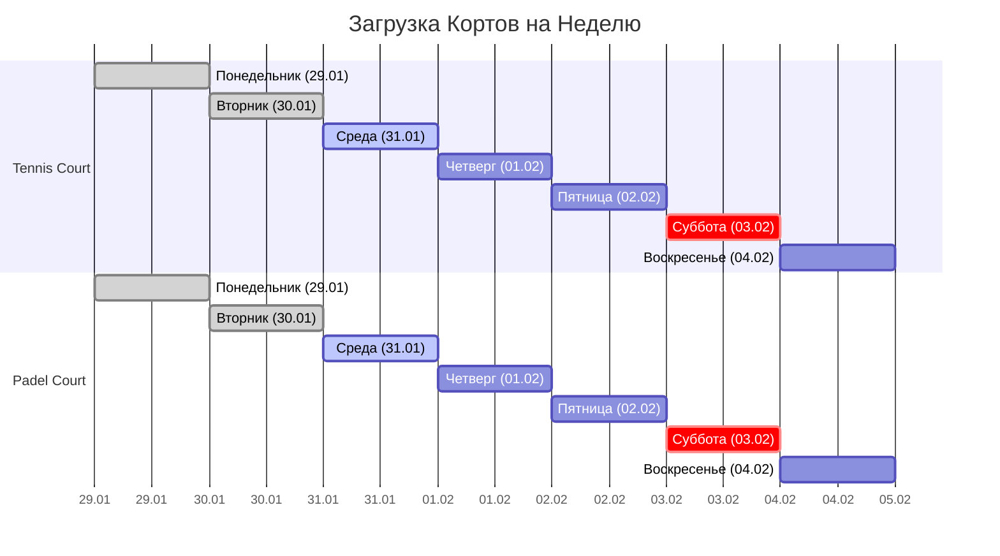

# 📅 Calendar Dashboard

[[🏠 MAIN DASHBOARD|← Назад к главному дашборду]]

## 📅 **Визуальный Календарь - Сегодня (31.01.2024)**

### 🏓 **Расписание Кортов (Timeline View)**

```mermaid
gantt
    title Расписание Кортов на Сегодня
    dateFormat  HH:mm
    axisFormat %H:%M

    section Tennis Court
    David Smith (Singles)     :active, 09:00, 10:30
    Anna Johnson (Training)   :10:30, 11:30
    Free Time                 :11:30, 14:00
    Mark Johnson (Doubles)    :crit, 14:00, 15:30
    Free Time                 :15:30, 17:00
    Tournament Match          :done, 17:00, 18:30
    Siriporn Kaewsai (Party)  :18:30, 20:00

    section Padel Court
    Maria Rodriguez (Training) :active, 08:00, 09:00
    Free Time                 :09:00, 10:30
    Carlos Mendez (Match)     :10:30, 12:00
    Free Time                 :12:00, 15:00
    Anna Johnson (Class)      :15:00, 16:00
    Free Time                 :16:00, 17:00
    Sarah Brown (Training)    :17:00, 18:00
    Private Party             :crit, 18:00, 20:00
```



### 📊 **Недельный Обзор (29.01 - 04.02.2024)**



### 🎯 **Календарная Сетка (Февраль 2024)**

| Пн | Вт | Ср | Чт | Пт | Сб | Вс |
|----|----|----|----|----|----|----|
| 29 | 30 | **31** | 1 | 2 | 3 | 4 |
| 📅 5 | 📅 6 | 📅 7 | 📅 8 | 📅 9 | 🏆 10 | 📅 11 |
| 📅 12 | 📅 13 | 📅 14 | 📅 15 | 📅 16 | 📅 17 | 📅 18 |
| 📅 19 | 📅 20 | 📅 21 | 📅 22 | 📅 23 | 📅 24 | 📅 25 |
| 📅 26 | 📅 27 | 📅 28 | 📅 29 | | | |

**Легенда:** 📅 Обычный день • 🏆 Турнир • **31** Сегодня

## 📋 **Детальное Расписание на Сегодня (Live Data)**

```dataview
TABLE
  start_time as "⏰ Время",
  end_time as "🏁 Конец",
  court_name as "🏓 Корт",
  user_name as "👤 Клиент",
  participants as "👥 Участники",
  booking_purpose as "🎯 Тип",
  total_amount + " THB" as "💰 Сумма",
  status as "📊 Статус"
FROM "oxygen-world/Database"
WHERE contains(file.name, "Booking-Today-")
SORT start_time asc
```

## 🎯 **Статистика Событий (Live)**

### 📊 По Типам Бронирований
```dataview
TABLE
  booking_purpose as "🎯 Тип",
  count(rows) as "📊 Количество",
  sum(total_amount) + " THB" as "💰 Доход",
  round(average(duration_minutes), 0) + " мин" as "⏱️ Ср. время"
FROM "oxygen-world/Database"
WHERE contains(file.name, "Booking-Today-")
GROUP BY booking_purpose
```

### 🏓 По Кортам
```dataview
TABLE
  court_name as "🏓 Корт",
  count(rows) as "📅 Бронирований",
  sum(total_amount) + " THB" as "💰 Доход",
  round(sum(duration_minutes) / 60, 1) + " ч" as "⏱️ Занято"
FROM "oxygen-world/Database"
WHERE contains(file.name, "Booking-Today-")
GROUP BY court_name
```

## 🎾 **Предстоящие События**

### 🏆 **Турниры и Соревнования**
- **03.02.2024** - Падел Турнир для Начинающих
- **10.02.2024** - Теннисный Турнир (Открытый)
- **17.02.2024** - Корпоративный Чемпионат

### 🎓 **Регулярные Тренировки**
- **Понедельник 16:00** - Женская группа (Падел)
- **Вторник 18:00** - Начинающие (Теннис)
- **Четверг 18:00** - Начинающие (Теннис)
- **Суббота 10:00** - Детская группа

### 🔧 **Техническое Обслуживание**
- **04.02.2024** - Замена сетки (Tennis Court)
- **05.02.2024** - Чистка стекол (Padel Court)
- **11.02.2024** - Обновление освещения

## 🚀 **Быстрые Действия**

- [[📋 Bookings Dashboard#new-booking|➕ Новое бронирование]]
- [[🎓 Classes Dashboard#new-class|🎓 Запланировать тренировку]]
- [[✅ Tasks Dashboard#new-task|✅ Добавить задачу]]

## 🔗 **Connected Data & Navigation**

### 📅 **Today's Bookings (Live Links)**
- [[Booking-Today-001|📅 David Smith - Tennis Court 09:00-10:30]]
- [[Booking-Today-002|📅 Anna Johnson - Padel Court 11:00-12:00]]
- [[Booking-Today-003|📅 Sarah Brown - Padel Court 14:00-15:00]]

### 👥 **Active Players**
- [[User-David-Smith|👤 David Smith - Top Player (2485 rating)]]
- [[User-Anna-Johnson|👤 Anna Johnson - VIP Trainer (2380 rating)]]
- [[User-Sarah-Brown|👤 Sarah Brown - Padel Enthusiast (1850 rating)]]

### 🏓 **Court Information**
- [[Court-Tennis|🏓 Tennis Court - Premium Court]]
- [[Court-Padel|🏓 Padel Court - Glass Court]]

### 📊 **Related Dashboards**
- [[🏠 MAIN DASHBOARD|🏠 Main Dashboard]]
- [[💰 Finance Dashboard|💰 Finance & Payments]]
- [[📊 Analytics Dashboard|📊 Analytics & Reports]]
- [[📋 Tasks Dashboard|📋 Tasks & Operations]]

### 📁 **Data Sources**
- [[Bookings-Data|📅 All Bookings Data]]
- [[👥 Users Data - Oxygen Padel Club Thailand|👥 All Users Data]]
- [[Courts-Data|🏓 All Courts Data]]

---

_Обновляется автоматически | 🏝️ Phangan Padel Tennis Club_
