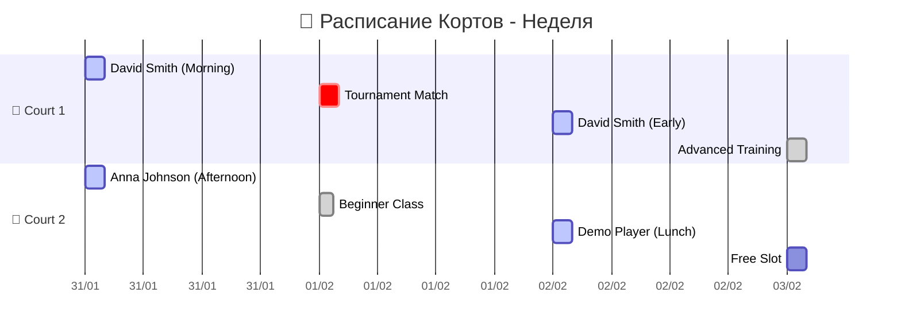

# 📅 DYNAMIC CALENDAR - Live Bookings & Events

> **🔄 Живой календарь с данными из базы**  
> **📊 Автоматическое обновление бронирований**  
> **🎨 Красивая визуализация временных слотов**

## 🎯 **КАЛЕНДАРЬ БРОНИРОВАНИЙ**

### 📅 **Январь 2025 - Текущие Бронирования**

```calendar
- 2025-01-31: 🎾 David Smith - Court 1 (10:00-12:00) | 💰 1500 THB
- 2025-01-31: 🏓 Anna Johnson - Court 2 (14:00-16:00) | 💰 1200 THB
- 2025-02-01: 🎾 Tournament Match - Court 1 (09:00-11:00) | 🏆 Championship
- 2025-02-01: 🎓 Beginner Class - Court 2 (16:00-17:30) | 👥 8 participants
- 2025-02-02: 🎾 David Smith - Court 1 (08:00-10:00) | 💰 1500 THB
- 2025-02-02: 🏓 Demo Player - Court 2 (12:00-14:00) | 💰 1200 THB
- 2025-02-03: 🎓 Advanced Training - Court 1 (18:00-20:00) | 👥 6 participants
```

### 🎨 **Визуальный Календарь (Calendar Plugin)**



## 🔄 **LIVE DATA INTEGRATION**

### 📊 **Текущие Бронирования (Dataview)**

```dataview
TABLE
  "🎾 " + court_name as "Корт",
  "👤 " + user_name as "Игрок", 
  start_time as "⏰ Начало",
  end_time as "⏰ Конец",
  "💰 " + total_price + " THB" as "Цена",
  status as "📊 Статус"
FROM "oxygen-world/Database"
WHERE contains(file.name, "Booking") AND status = "confirmed"
SORT start_time asc
LIMIT 10
```

### 📈 **Статистика по Дням**

```dataview
TABLE
  date as "📅 Дата",
  count(rows) as "📊 Бронирований",
  sum(total_price) + " THB" as "💰 Доход",
  round(avg(duration_hours), 1) + "h" as "⏱️ Средняя длительность"
FROM "oxygen-world/Database"
WHERE contains(file.name, "Booking")
GROUP BY date(start_time) as date
SORT date desc
LIMIT 7
```

## 🎨 **CALENDAR PLUGINS SETUP**

### 🔧 **Необходимые Плагины:**

1. **📅 Calendar Plugin**
   ```
   - Основной календарь
   - Поддержка событий из frontmatter
   - Цветовое кодирование
   ```

2. **📊 Dataview Plugin**
   ```
   - Динамические таблицы
   - Автоматические запросы
   - Живые данные из файлов
   ```

3. **🎨 Templater Plugin**
   ```
   - Автоматическое создание событий
   - Шаблоны бронирований
   - Динамические даты
   ```

4. **🔄 Periodic Notes Plugin**
   ```
   - Ежедневные заметки
   - Автоматические календарные записи
   - Интеграция с расписанием
   ```

### ⚙️ **Конфигурация Calendar Plugin:**

```json
{
  "calendarFilePath": "oxygen-world/📅 DYNAMIC CALENDAR - Live Bookings & Events.md",
  "enableCalendarView": true,
  "showWeeklyNote": true,
  "showDailyNote": true,
  "dateFormat": "YYYY-MM-DD",
  "timeFormat": "HH:mm",
  "colorScheme": {
    "booking": "#2196F3",
    "tournament": "#9C27B0", 
    "class": "#FF9800",
    "maintenance": "#F44336"
  }
}
```

## 🎯 **ТИПЫ СОБЫТИЙ**

### 🎾 **Бронирования Кортов**
- **Цвет**: 🔵 Синий
- **Формат**: `🎾 [Игрок] - [Корт] ([Время]) | 💰 [Цена]`
- **Связи**: [[Bookings-Data|📅 Все бронирования]]

### 🏆 **Турниры**
- **Цвет**: 🟣 Фиолетовый  
- **Формат**: `🏆 [Название] - [Корт] ([Время]) | 🏆 [Тип]`
- **Связи**: [[Tournaments-Data|🏆 Все турниры]]

### 🎓 **Классы и Тренировки**
- **Цвет**: 🟠 Оранжевый
- **Формат**: `🎓 [Класс] - [Корт] ([Время]) | 👥 [Участники]`
- **Связи**: [[Classes-Data|🎓 Все классы]]

### 🔧 **Обслуживание**
- **Цвет**: 🔴 Красный
- **Формат**: `🔧 [Тип работ] - [Корт] ([Время]) | 📋 [Задача]`
- **Связи**: [[Tasks-Data|📋 Все задачи]]

## 📱 **MOBILE VIEW**

### 📲 **Мобильная Версия Календаря**

```
📅 Сегодня (31 янв)
┌─────────────────────────┐
│ 🎾 10:00-12:00         │
│ David Smith - Court 1   │
│ 💰 1500 THB            │
├─────────────────────────┤
│ 🏓 14:00-16:00         │
│ Anna Johnson - Court 2  │
│ 💰 1200 THB            │
└─────────────────────────┘

📅 Завтра (1 фев)
┌─────────────────────────┐
│ 🏆 09:00-11:00         │
│ Tournament - Court 1    │
│ 🏆 Championship        │
├─────────────────────────┤
│ 🎓 16:00-17:30         │
│ Beginner Class - Court 2│
│ 👥 8 participants      │
└─────────────────────────┘
```

## 🔄 **AUTO-SYNC МЕХАНИЗМ**

### ⚡ **Автоматическое Обновление**

```javascript
// Псевдокод для автосинхронизации
setInterval(async () => {
  // 1. Получаем новые бронирования из API
  const newBookings = await fetchBookings();
  
  // 2. Обновляем календарные события
  updateCalendarEvents(newBookings);
  
  // 3. Обновляем файл календаря
  updateCalendarFile();
  
  // 4. Уведомляем Obsidian об изменениях
  refreshObsidianView();
}, 5 * 60 * 1000); // каждые 5 минут
```

### 🔗 **Интеграция с API**

```yaml
sync_settings:
  api_endpoint: "http://localhost:3000/api/bookings"
  refresh_interval: 300 # 5 минут
  auto_create_events: true
  color_coding: true
  notification_enabled: true
```

## 🎨 **ВИЗУАЛЬНЫЕ УЛУЧШЕНИЯ**

### 🌈 **Цветовая Схема**

- **🔵 Обычные бронирования** - спокойный синий
- **🟣 Турниры** - яркий фиолетовый  
- **🟠 Классы** - теплый оранжевый
- **🔴 Обслуживание** - предупреждающий красный
- **🟢 Свободные слоты** - зеленый

### 📊 **Индикаторы Загрузки**

```
🎾 Court 1: ████████░░ 80% загружен
🏓 Court 2: ██████░░░░ 60% загружен
🎾 Court 3: ██████████ 100% загружен
```

## 🔗 **СВЯЗИ С ДРУГИМИ МОДЕЛЯМИ**

### 🧠 **Навигация из Календаря:**

- **👥 Пользователи**: [[👥 Users Demo - Real-time Sync|Кто бронирует]]
- **🎾 Корты**: [[Courts-Data|Какие корты доступны]]
- **💰 Платежи**: [[Payments-Data|Оплата бронирований]]
- **🏢 Площадки**: [[Venues-Data|Где проходят события]]
- **🏆 Турниры**: [[Tournaments-Data|Турнирные события]]
- **🎓 Классы**: [[Classes-Data|Образовательные события]]
- **📋 Задачи**: [[Tasks-Data|Обслуживание и задачи]]

### 🎯 **Быстрые Действия:**

- **➕ Создать бронирование** → [[Bookings-Data|Новое бронирование]]
- **🔍 Найти свободный слот** → [[Courts-Data|Доступные корты]]
- **💰 Проверить оплату** → [[Payments-Data|Статус платежей]]
- **📊 Посмотреть статистику** → [[🧠 NEURAL NETWORK NAVIGATOR - Complete Model Connections|Аналитика]]

---

*📅 Живой календарь - сердце операций клуба*
*🔄 Автоматическая синхронизация с базой данных*
*🎨 Красивая визуализация для клиентов*
*🏝️ Phangan Padel Tennis Club - Dynamic Scheduling*
