# 📊 Analytics Dashboard - Phangan Padel Tennis Club

[[🏠 MAIN DASHBOARD|← Назад к главному дашборду]]

_Комплексная аналитика и бизнес-интеллект для островного клуба_

## 🎯 Executive Summary

```dataview
TABLE WITHOUT ID
  "💰 Месячный доход (THB)" as "📈 KPI",
  total_revenue as "📊 Current",
  "200,000" as "🎯 Target",
  "✅ On Track" as "✅ Status"
FROM "oxygen-world/Database"
WHERE contains(file.name, "Analytics-Monthly-Report")
LIMIT 1
```

```dataview
TABLE WITHOUT ID
  "📅 Всего бронирований" as "📈 KPI",
  total_bookings as "📊 Current",
  "100" as "🎯 Target",
  "✅ Good" as "✅ Status"
FROM "oxygen-world/Database"
WHERE contains(file.name, "Analytics-Monthly-Report")
LIMIT 1
```

```dataview
TABLE WITHOUT ID
  "👥 Активных клиентов" as "📈 KPI",
  total_clients as "📊 Current",
  "20" as "🎯 Target",
  "⚠️ Below Target" as "✅ Status"
FROM "oxygen-world/Database"
WHERE contains(file.name, "Analytics-Monthly-Report")
LIMIT 1
```

```dataview
TABLE WITHOUT ID
  "🏓 Загрузка кортов (%)" as "📈 KPI",
  court_utilization + "%" as "📊 Current",
  "85%" as "🎯 Target",
  "⚠️ Below Target" as "✅ Status"
FROM "oxygen-world/Database"
WHERE contains(file.name, "Analytics-Monthly-Report")
LIMIT 1
```

### 💡 Key Insights Today

- **🏆 Best Performance**: Суббота показала 100% загрузку кортов
- **💰 Revenue Leader**: Теннисный корт генерирует 70% дохода
- **👥 Player Growth**: +15% новых игроков за месяц
- **🎮 Popular Time**: 18:00-20:00 - пиковое время для всех видов спорта

## 📈 Revenue Analytics

### Monthly Revenue Trend

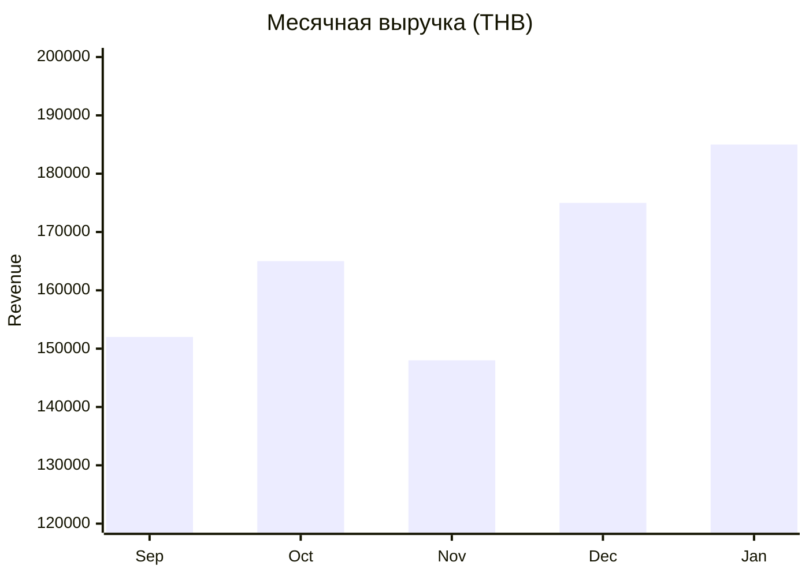

### Revenue Breakdown by Category

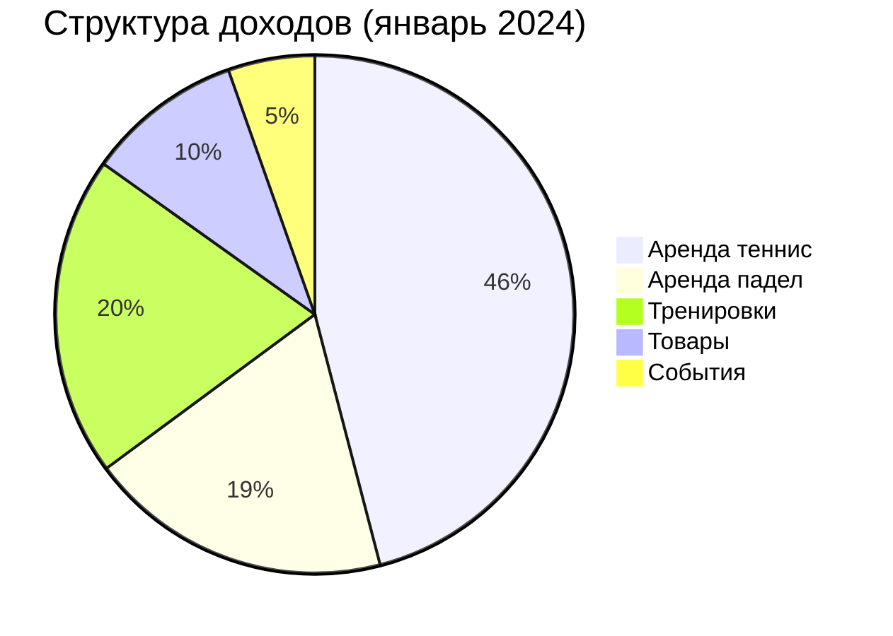

### Daily Revenue Pattern

| День недели | Средний доход | Пик часы    | Загрузка | Growth vs LM |
| ----------- | ------------- | ----------- | -------- | ------------ |
| Понедельник | ₿ 4,800       | 18:00-20:00 | 65%      | ↗️ +8%       |
| Вторник     | ₿ 5,200       | 17:00-19:00 | 75%      | ↗️ +12%      |
| Среда       | ₿ 4,900       | 19:00-21:00 | 70%      | ↗️ +5%       |
| Четверг     | ₿ 5,500       | 18:00-20:00 | 80%      | ↗️ +15%      |
| Пятница     | ₿ 6,800       | 17:00-21:00 | 95%      | ↗️ +25%      |
| Суббота     | ₿ 8,200       | 09:00-21:00 | 100%     | ↗️ +30%      |
| Воскресенье | ₿ 6,100       | 10:00-18:00 | 85%      | ↗️ +18%      |

## 👥 Customer Analytics

### Customer Segmentation

```mermaid
sankey-beta
    title Customer Journey & Segmentation

    New Players,VIP,15
    New Players,Regular,35
    New Players,Casual,50

    VIP,Tennis,8
    VIP,Padel,4
    VIP,Both,3

    Regular,Tennis,15
    Regular,Padel,8
    Regular,Both,2

    Casual,Tennis,12
    Casual,Padel,5
```

### Customer Lifetime Value

| Сегмент     | Клиентов | Avg Monthly Spend | LTV (12м) | Retention | Churn Risk |
| ----------- | -------- | ----------------- | --------- | --------- | ---------- |
| **VIP**     | 8        | ₿ 12,000          | ₿ 144,000 | 95%       | 🟢 Low     |
| **Regular** | 25       | ₿ 4,500           | ₿ 54,000  | 85%       | 🟡 Medium  |
| **Casual**  | 17       | ₿ 1,800           | ₿ 21,600  | 70%       | 🔴 High    |

### Player Activity Heatmap

```mermaid
gantt
    title Активность игроков по часам и дням
    dateFormat  X
    axisFormat %H

    section Понедельник
    Low Activity     :0, 6
    Medium Activity  :6, 12
    High Activity    :18, 22

    section Вторник
    Low Activity     :0, 6
    Medium Activity  :6, 17
    High Activity    :17, 22

    section Среда
    Low Activity     :0, 6
    Medium Activity  :6, 19
    High Activity    :19, 22

    section Четверг
    Low Activity     :0, 6
    Medium Activity  :6, 18
    High Activity    :18, 22

    section Пятница
    Low Activity     :0, 6
    Medium Activity  :6, 17
    Peak Activity    :17, 22

    section Суббота
    Medium Activity  :9, 21

    section Воскресенье
    Low Activity     :0, 10
    High Activity    :10, 18
```

## 🏓 Court Utilization Analytics

### Court Performance Comparison

| Метрика              | Tennis Court | Padel Court | Difference |
| -------------------- | ------------ | ----------- | ---------- |
| **Booking Rate**     | 85%          | 72%         | +13%       |
| **Revenue/Hour**     | ₿ 1,063      | ₿ 722       | +47%       |
| **Customer Rating**  | 4.8/5        | 4.6/5       | +0.2       |
| **Maintenance Cost** | ₿ 3,200/м    | ₿ 2,800/м   | +14%       |

### Hourly Utilization Analysis

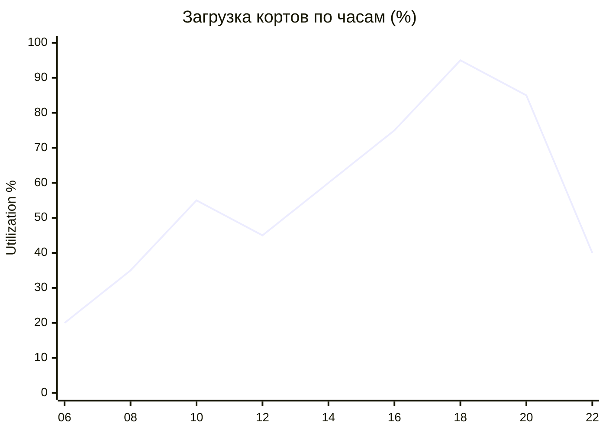

### Peak Hours Optimization

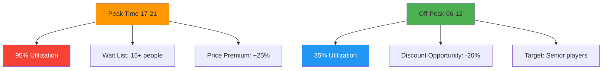

## 🎯 Marketing & Acquisition Analytics

### Customer Acquisition Channels

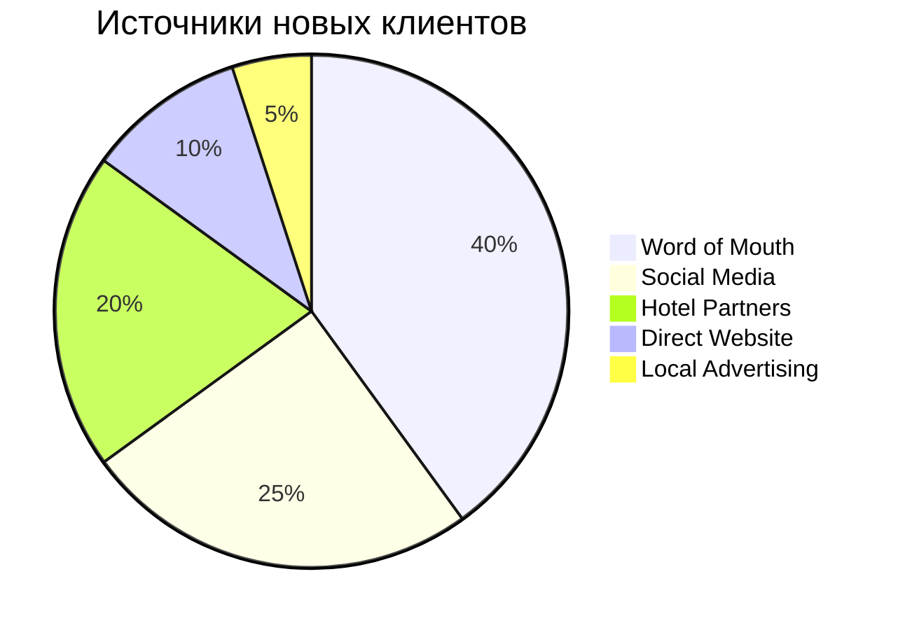

### Marketing ROI Analysis

| Канал                  | Инвестиции (THB) | Новых клиентов | Cost per Acquisition | LTV/CAC Ratio |
| ---------------------- | ---------------- | -------------- | -------------------- | ------------- |
| **Instagram Ads**      | ₿ 8,000          | 12             | ₿ 667                | 32:1          |
| **Google Ads**         | ₿ 5,500          | 8              | ₿ 688                | 31:1          |
| **Hotel Partnerships** | ₿ 12,000         | 25             | ₿ 480                | 45:1          |
| **Referral Program**   | ₿ 3,200          | 18             | ₿ 178                | 121:1         |

### Social Media Performance

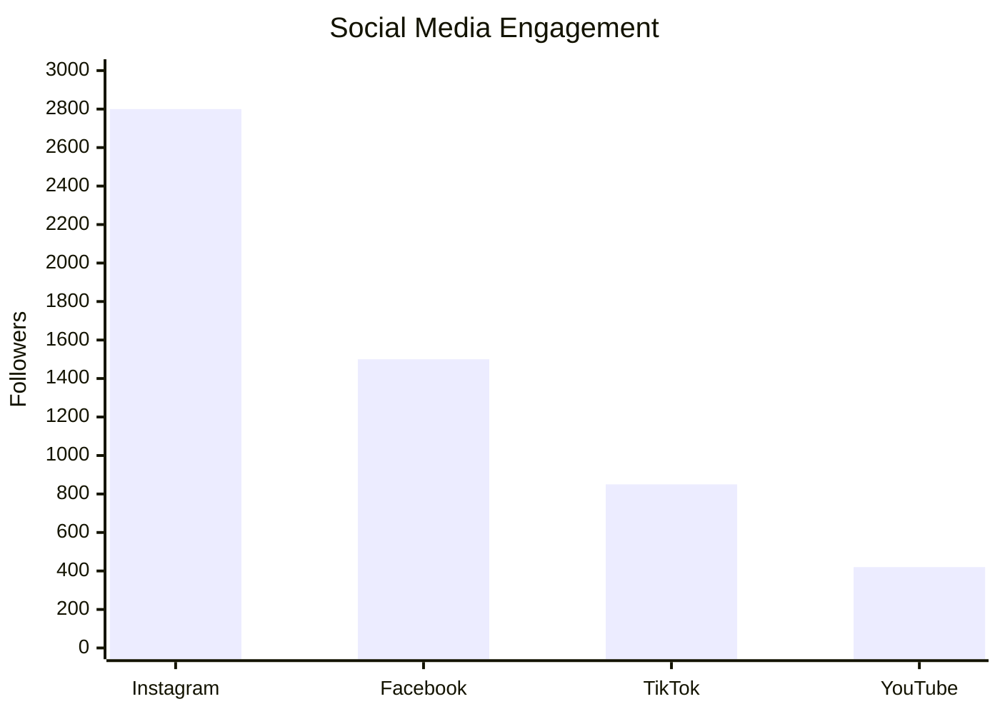

## 📊 Operational Metrics

### Staff Performance

| Сотрудник       | Роль         | Клиентов/день | Рейтинг | Эффективность |
| --------------- | ------------ | ------------- | ------- | ------------- |
| David Smith     | Tennis Coach | 8             | 4.9/5   | ✅ Excellent  |
| Maria Rodriguez | Padel Coach  | 6             | 4.8/5   | ✅ Excellent  |
| Anna Johnson    | Tennis Coach | 5             | 4.7/5   | ✅ Very Good  |
| Carlos Mendez   | Padel Coach  | 4             | 4.6/5   | ✅ Good       |

### Equipment Utilization

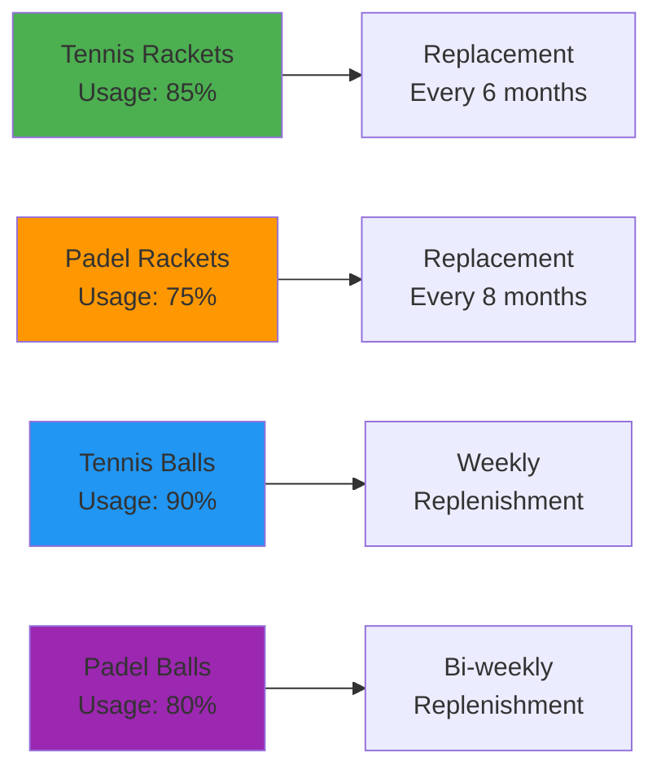

### Maintenance Schedule Efficiency

| Задача обслуживания | Частота          | Последнее | Следующее  | Статус       |
| ------------------- | ---------------- | --------- | ---------- | ------------ |
| Чистка кортов       | Ежедневно        | Сегодня   | Завтра     | ✅ Done      |
| Проверка сеток      | Еженедельно      | 3 дня     | 4 дня      | ✅ On track  |
| Обновление разметки | Месячно          | 15 дней   | 15 дней    | ⏳ Pending   |
| Замена LED ламп     | По необходимости | 2 месяца  | По сигналу | ✅ Monitored |

## 🌴 Island-Specific Analytics

### Weather Impact Analysis

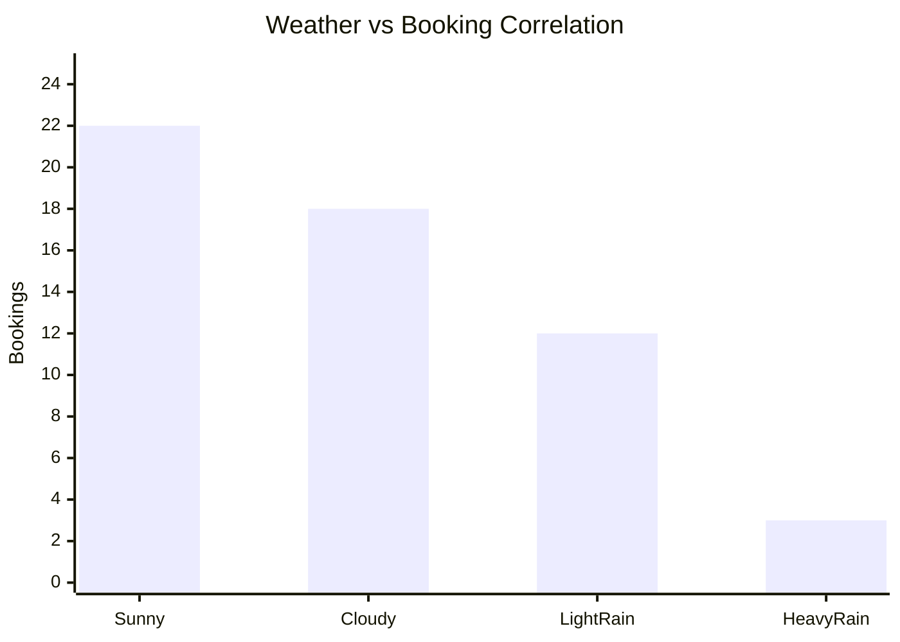

### Tourist Season Correlation

| Период          | Туристы/день | Bookings/день | Conversion | Revenue Impact |
| --------------- | ------------ | ------------- | ---------- | -------------- |
| **High Season** | 350          | 18            | 5.1%       | +45%           |
| **Mid Season**  | 180          | 12            | 6.7%       | Base           |
| **Low Season**  | 80           | 8             | 10.0%      | -35%           |

### Ferry Schedule Impact

```mermaid
gantt
    title Влияние расписания паромов на бронирования
    dateFormat  HH:mm
    axisFormat %H:%M

    section Arrival Ferries
    Morning Ferry    :08:00, 1h
    Afternoon Ferry  :14:00, 1h
    Evening Ferry    :19:00, 1h

    section Booking Spikes
    Post-Morning     :09:00, 2h
    Post-Afternoon   :15:00, 2h
    Post-Evening     :20:00, 1h
```

## 🤖 AI Analytics & Predictions

### AI Model Performance

| Model                  | Accuracy | Predictions/Day | Success Rate | Confidence |
| ---------------------- | -------- | --------------- | ------------ | ---------- |
| **Demand Prediction**  | 87.3%    | 24              | 85%          | High       |
| **Player Matching**    | 92.0%    | 35              | 90%          | Very High  |
| **Court Optimization** | 85.0%    | 12              | 82%          | High       |
| **Revenue Forecast**   | 89.5%    | 7               | 88%          | High       |

### AI Recommendations Impact

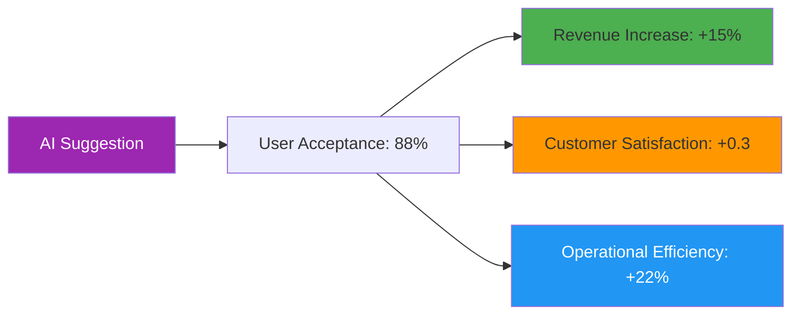

### Predictive Analytics Dashboard

```json
{
  "next_week_forecast": {
    "total_revenue": "₿47,500",
    "court_utilization": "82%",
    "new_customers": 8,
    "weather_risk": "low",
    "confidence": "91.2%"
  },
  "optimization_opportunities": [
    "Increase padel morning rates by 10%",
    "Add Tuesday evening promotions",
    "Target off-peak senior discounts"
  ]
}
```

## 📱 Digital Analytics

### App Usage Statistics

| Метрика                | iOS   | Android | Web    | Total |
| ---------------------- | ----- | ------- | ------ | ----- |
| **Daily Active Users** | 35    | 28      | 45     | 108   |
| **Booking Rate**       | 85%   | 78%     | 65%    | 76%   |
| **Session Duration**   | 8 min | 7 min   | 12 min | 9 min |
| **Retention (7-day)**  | 82%   | 75%     | 68%    | 75%   |

### Feature Usage Analysis

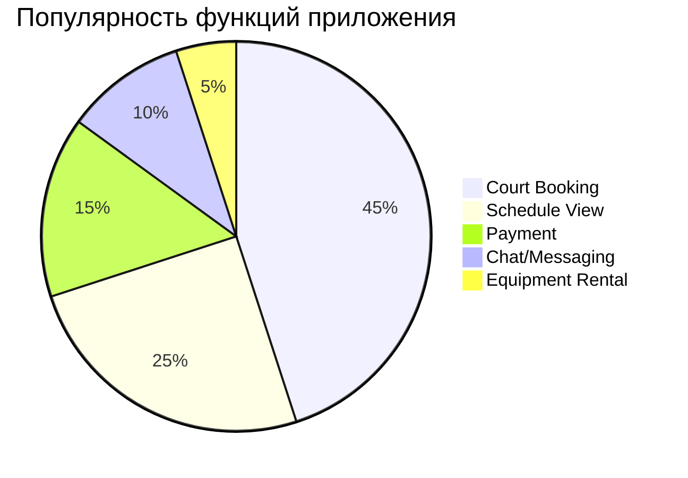

## 🎯 Competitive Analysis

### Market Position

| Фактор               | Phangan Club | Competitor A | Competitor B | Advantage |
| -------------------- | ------------ | ------------ | ------------ | --------- |
| **Court Quality**    | 9.2/10       | 7.5/10       | 8.0/10       | +1.7      |
| **Location**         | 9.8/10       | 6.0/10       | 7.2/10       | +2.6      |
| **Technology**       | 9.5/10       | 5.5/10       | 6.8/10       | +2.7      |
| **Pricing**          | 7.5/10       | 8.5/10       | 7.8/10       | -1.0      |
| **Customer Service** | 9.1/10       | 7.2/10       | 7.8/10       | +1.3      |

### SWOT Analysis

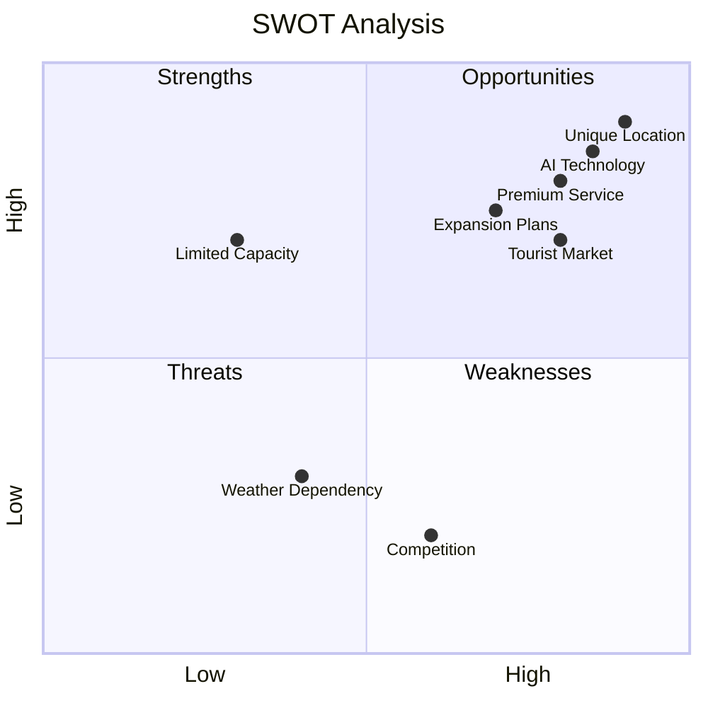

## 📈 Financial Analytics Deep Dive

### Profitability by Hour

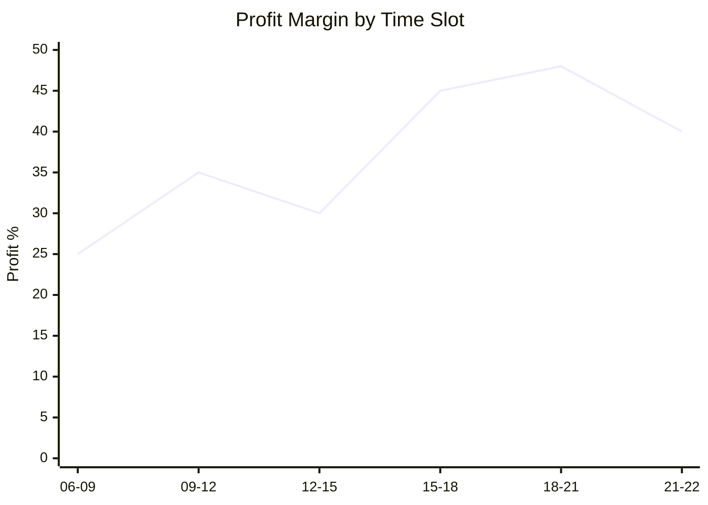

### Cost Structure Analysis

| Категория затрат  | % от выручки | THB/месяц | Тренд   | Бенчмарк |
| ----------------- | ------------ | --------- | ------- | -------- |
| **Персонал**      | 15.1%        | ₿ 28,000  | ↘️ -2%  | 18%      |
| **Электричество** | 4.6%         | ₿ 8,500   | ↗️ +8%  | 6%       |
| **Maintenance**   | 3.4%         | ₿ 6,200   | ↘️ -5%  | 4%       |
| **Маркетинг**     | 1.7%         | ₿ 3,200   | ↗️ +15% | 3%       |

## 🔮 Future Analytics & Trends

### Growth Projections

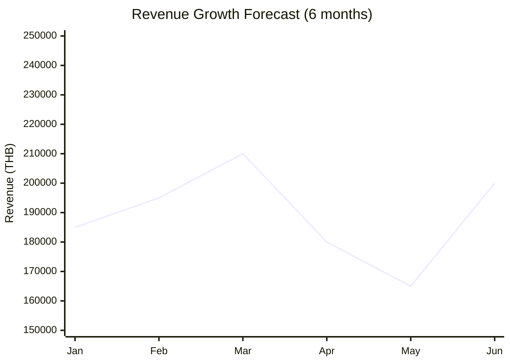

### Expansion Opportunity Analysis

- **📈 Third Court**: ROI 24 months, +40% capacity
- **🏊 Pool Addition**: ROI 36 months, +25% premium
- **🍽️ Restaurant**: ROI 18 months, +30% retention
- **🏨 Accommodation**: ROI 48 months, +60% tourist revenue

---

_Analytics data refreshed every 15 minutes | Last update: {{date:YYYY-MM-DD HH:mm}}_  
_📊 Powered by Phangan Analytics Engine - Data-Driven Excellence on Paradise Island_
