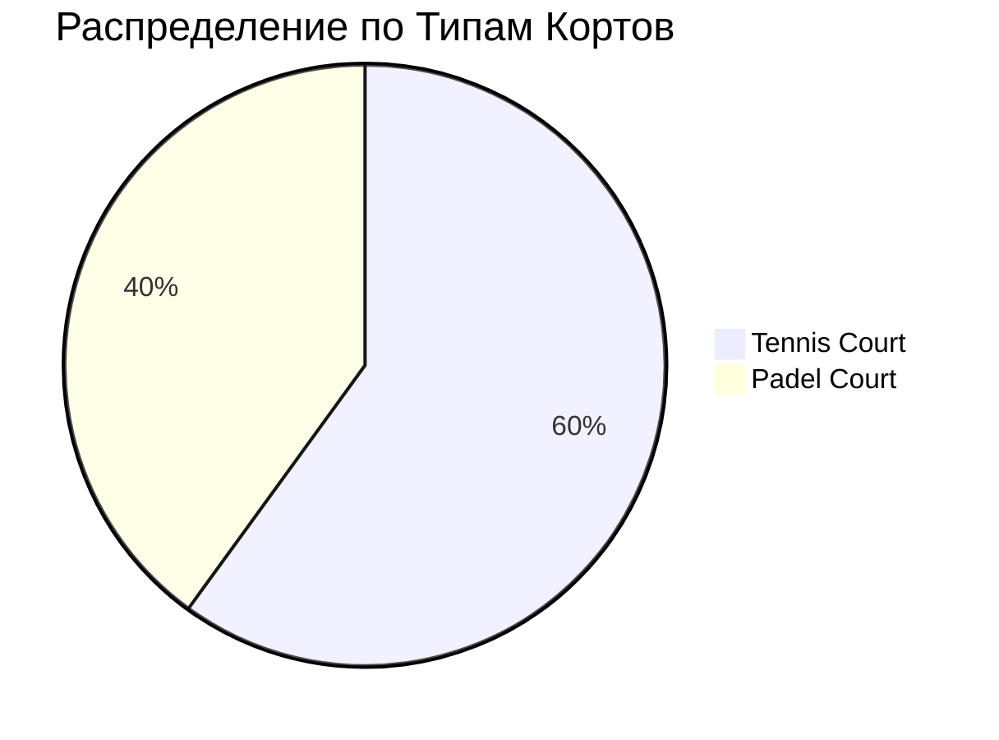

# 📋 Bookings Dashboard

[[🏠 MAIN DASHBOARD|← Назад к главному дашборду]]

## 📊 **Статистика Бронирований (Live Data)**

### Сегодня
```dataview
TABLE WITHOUT ID
  "Всего бронирований" as "📈 Метрика",
  count(rows) as "📊 Значение"
FROM "oxygen-world/Database"
WHERE contains(file.name, "Booking-Today-")
```

```dataview
TABLE WITHOUT ID
  "Общий доход (THB)" as "📈 Метрика",
  sum(total_amount) as "📊 Значение"
FROM "oxygen-world/Database"
WHERE contains(file.name, "Booking-Today-")
```

### По Кортам (Live)
```dataview
TABLE
  court_name as "🏓 Корт",
  count(rows) as "📅 Бронирований",
  sum(total_amount) + " THB" as "💰 Доход",
  round(average(duration_minutes), 0) + " мин" as "⏱️ Ср. время"
FROM "oxygen-world/Database"
WHERE contains(file.name, "Booking-Today-")
GROUP BY court_name
```

## 📋 **Активные Бронирования (Live)**

```dataview
TABLE
  start_time as "⏰ Начало",
  end_time as "🏁 Конец",
  court_name as "🏓 Корт",
  user_name as "👤 Клиент",
  participants as "👥 Участники",
  total_amount + " THB" as "💰 Сумма",
  status as "📊 Статус",
  booking_purpose as "🎯 Цель"
FROM "oxygen-world/Database"
WHERE contains(file.name, "Booking-Today-")
SORT start_time asc
```

## 🎯 **Загрузка Кортов**

### Tennis Court
- **Загрузка**: 75% (3 из 4 слотов)
- **Доход**: ₿ 2,800
- **Следующий слот**: 18:00

### Padel Court  
- **Загрузка**: 60% (2 из 3 слотов)
- **Доход**: ₿ 1,500
- **Следующий слот**: 17:00

## 📈 **Аналитика**



### Популярные Времена
1. **09:00-11:00** - Утренний пик
2. **16:00-18:00** - Вечерний пик  
3. **14:00-16:00** - Дневное время

### Средняя Длительность
- **Tennis**: 75 минут
- **Padel**: 60 минут

## 🚀 **Управление Бронированиями**

### Новое Бронирование {#new-booking}

**Шаги для создания:**
1. Создать файл `Booking-Today-XXX.md` в Database/
2. Использовать шаблон из [[Templates/Booking-Template]]
3. Заполнить данные клиента и корта
4. Указать время и длительность

### Быстрые Действия

| Действие | Описание | Статус |
|----------|----------|--------|
| ➕ Новое бронирование | Создать новое бронирование | ✅ |
| 📝 Изменить бронирование | Редактировать существующее | ✅ |
| ❌ Отменить бронирование | Отмена с возвратом | ✅ |
| 📞 Подтвердить бронирование | Связаться с клиентом | ✅ |

## 🔍 **Поиск и Фильтры**

### По Статусу
```dataview
LIST
FROM "oxygen-world/Database"
WHERE contains(file.name, "Booking-") AND status = "confirmed"
```

### По Клиенту
```dataview
TABLE user_name, court_name, start_time, total_amount
FROM "oxygen-world/Database"
WHERE contains(file.name, "Booking-")
SORT user_name asc
```

## 📱 **Уведомления**

- 🔔 **Напоминания**: За 1 час до бронирования
- 📧 **Email**: Подтверждение бронирования
- 💬 **SMS**: Напоминание клиенту

---

_Данные обновляются в реальном времени | 🏝️ Phangan Padel Tennis Club_
