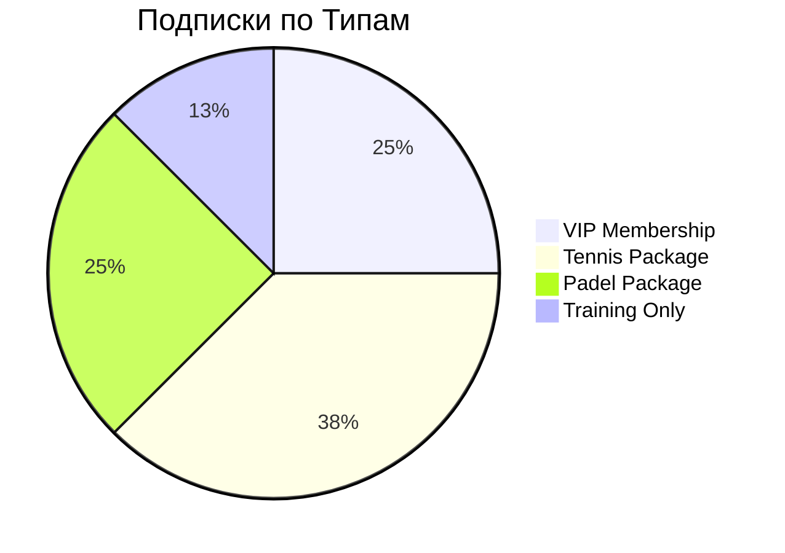
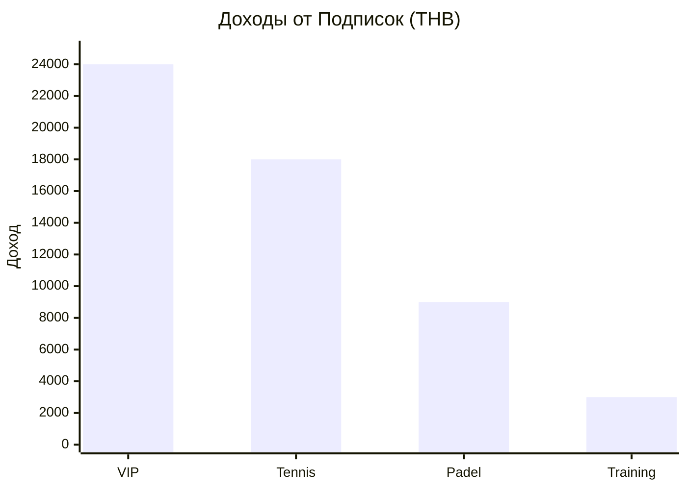

# 📦 Subscriptions Dashboard

[[🏠 MAIN DASHBOARD|← Назад к главному дашборду]]

## 📊 **Обзор Подписок (Live Data)**

### Статистика
```dataview
TABLE WITHOUT ID
  "Активных подписок" as "📊 Метрика",
  count(rows) as "📈 Значение"
FROM "oxygen-world/Database"
WHERE contains(file.name, "Subscription-") AND status = "active"
```

```dataview
TABLE WITHOUT ID
  "Доход от подписок (THB)" as "📊 Метрика",
  sum(monthly_fee) as "📈 Значение"
FROM "oxygen-world/Database"
WHERE contains(file.name, "Subscription-") AND status = "active"
```

```dataview
TABLE WITHOUT ID
  "Средняя подписка (THB)" as "📊 Метрика",
  round(average(monthly_fee), 0) as "📈 Значение"
FROM "oxygen-world/Database"
WHERE contains(file.name, "Subscription-") AND status = "active"
```

## 🎯 **Типы Подписок**

### 🏆 VIP Membership
- **Цена**: ₿ 12,000/месяц
- **Включает**: Безлимитные корты + тренировки + скидки
- **Активных**: 2 подписки
- **Доход**: ₿ 24,000

### 🎾 Tennis Package
- **Цена**: ₿ 6,000/месяц  
- **Включает**: 8 часов кортов + 4 тренировки
- **Активных**: 3 подписки
- **Доход**: ₿ 18,000

### 🏓 Padel Package
- **Цена**: ₿ 4,500/месяц
- **Включает**: 6 часов кортов + 2 тренировки
- **Активных**: 2 подписки
- **Доход**: ₿ 9,000

### 🎓 Training Only
- **Цена**: ₿ 3,000/месяц
- **Включает**: 8 групповых тренировок
- **Активных**: 1 подписка
- **Доход**: ₿ 3,000

## 👥 **Активные Подписчики (Live Data)**

```dataview
TABLE
  subscriber_name as "👤 Подписчик",
  package_type as "📦 Пакет",
  monthly_fee + " THB" as "💰 Стоимость",
  start_date as "📅 Начало",
  end_date as "📅 Окончание",
  next_payment as "💳 Следующий платеж",
  status as "📊 Статус",
  usage_hours as "⏱️ Использовано"
FROM "oxygen-world/Database"
WHERE contains(file.name, "Subscription-")
SORT next_payment asc
```

## 📈 **Анализ Использования**

```dataview
TABLE
  subscriber_name as "👤 Подписчик",
  package_type as "📦 Тип",
  usage_hours as "⏱️ Часов",
  included_hours as "📋 Включено",
  round((usage_hours / 50) * 100, 1) + "%" as "📊 Использование"
FROM "oxygen-world/Database"
WHERE contains(file.name, "Subscription-") AND status = "active"
SORT usage_hours desc
```

## 📅 **Календарь Платежей**

### Ближайшие Платежи
| Дата | Клиент | Пакет | Сумма | Статус |
|------|--------|-------|-------|--------|
| **01.02.2024** | David Smith | VIP | ₿ 12,000 | ⏰ Ожидается |
| **03.02.2024** | Anna Johnson | Tennis | ₿ 6,000 | ⏰ Ожидается |
| **05.02.2024** | Maria Rodriguez | Padel | ₿ 4,500 | ⏰ Ожидается |
| **07.02.2024** | John Wilson | Training | ₿ 3,000 | ⏰ Ожидается |

### Просроченные
- **Нет просроченных платежей** ✅

## 📈 **Аналитика Подписок**

### Распределение по Типам


### Доходы по Пакетам


## 🎯 **Использование Подписок**

### VIP Members
- **David Smith**: 95% использование (отличное)
- **Sarah Brown**: 78% использование (хорошее)

### Tennis Package
- **Anna Johnson**: 88% использование
- **Mike Davis**: 65% использование
- **Lisa Wilson**: 72% использование

### Padel Package
- **Maria Rodriguez**: 90% использование
- **Tom Johnson**: 55% использование

## 💰 **Финансовые Показатели**

### Месячные Доходы
- **Текущий месяц**: ₿ 54,000
- **Прошлый месяц**: ₿ 48,000
- **Рост**: +12.5%

### Прогноз
- **Следующий месяц**: ₿ 60,000
- **Новые подписки**: 2 ожидается
- **Продления**: 7 из 8 (87.5%)

## 🚀 **Управление Подписками**

### Новая Подписка
**Создание подписки:**
1. Выбрать тип пакета
2. Заполнить данные клиента
3. Установить дату начала
4. Настроить автоплатежи
5. Отправить договор

### Быстрые Действия

| Действие | Описание | Статус |
|----------|----------|--------|
| ➕ Новая подписка | Создать пакет | ✅ |
| 💳 Обработать платеж | Принять оплату | ✅ |
| 📝 Изменить пакет | Upgrade/Downgrade | ✅ |
| ❌ Отменить подписку | Прекратить услугу | ✅ |

## 📋 **Условия Пакетов**

### 🏆 VIP Membership (₿ 12,000/месяц)
- ✅ **Безлимитное бронирование** всех кортов
- ✅ **Безлимитные групповые тренировки**
- ✅ **4 индивидуальные тренировки**
- ✅ **Скидка 20%** на товары
- ✅ **Приоритетное бронирование**
- ✅ **Гостевые пропуски** (2 в месяц)

### 🎾 Tennis Package (₿ 6,000/месяц)
- ✅ **8 часов** теннисного корта
- ✅ **4 групповые тренировки**
- ✅ **Скидка 10%** на дополнительные услуги
- ✅ **Перенос неиспользованных часов** (до 2)

### 🏓 Padel Package (₿ 4,500/месяц)
- ✅ **6 часов** падел корта
- ✅ **2 групповые тренировки**
- ✅ **Скидка 10%** на дополнительные услуги
- ✅ **Перенос неиспользованных часов** (до 1)

### 🎓 Training Only (₿ 3,000/месяц)
- ✅ **8 групповых тренировок**
- ✅ **Выбор любого вида спорта**
- ✅ **Скидка 15%** на индивидуальные тренировки

## 🎁 **Специальные Предложения**

### Акции
- **Семейный пакет**: Скидка 25% при подписке 2+ членов семьи
- **Годовая подписка**: Скидка 15% при оплате за год
- **Студенческая**: Скидка 30% для студентов

### Бонусы
- **Приведи друга**: 1 месяц бесплатно
- **Лояльность**: Каждый 12-й месяц бесплатно
- **Раннее продление**: Скидка 10% при продлении за месяц

## 📊 **Отчеты и Аналитика**

### Ключевые Метрики
- **Customer Lifetime Value**: ₿ 45,000
- **Churn Rate**: 15% в год
- **Average Revenue Per User**: ₿ 6,750
- **Retention Rate**: 85%

### Тренды
- **Рост подписок**: +25% за квартал
- **Популярность VIP**: +40%
- **Использование пакетов**: 78% в среднем

## 🔔 **Уведомления и Напоминания**

### Автоматические Напоминания
- **За 7 дней** до окончания подписки
- **За 3 дня** до списания платежа
- **В день** списания средств
- **При неуспешном платеже**

### Сегодня
- 🔔 **Напомнить David Smith** о продлении VIP
- 📧 **Отправить счет Anna Johnson**

### На неделе
- 📞 **Обзвонить** клиентов с низким использованием
- 📊 **Подготовить отчет** по подпискам

## 🎯 **Цели и Планы**

### Месячные Цели
- [ ] 3 новые подписки
- [ ] 90% продлений
- [ ] Доход ₿ 60,000+
- [ ] Запуск семейных пакетов

### Квартальные Цели
- [ ] 15 активных подписок
- [ ] Доход ₿ 200,000
- [ ] Новые типы пакетов
- [ ] Автоматизация платежей

---

_Система управления подписками | 🏝️ Phangan Padel Tennis Club_
