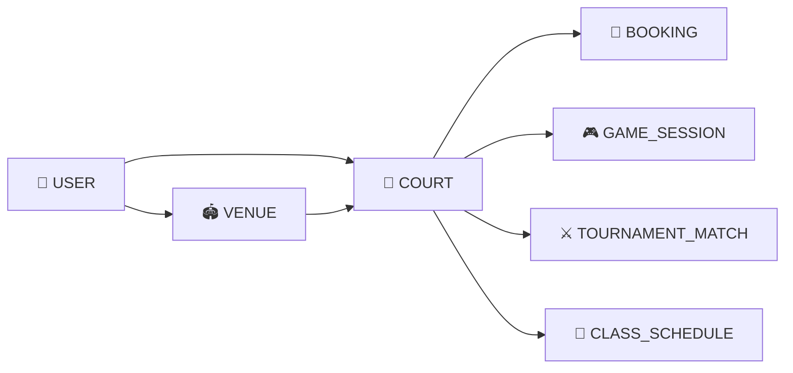
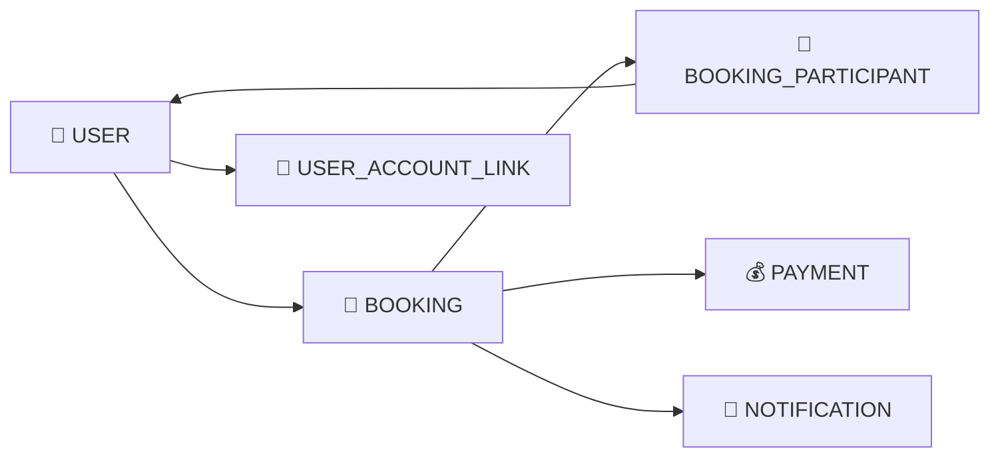
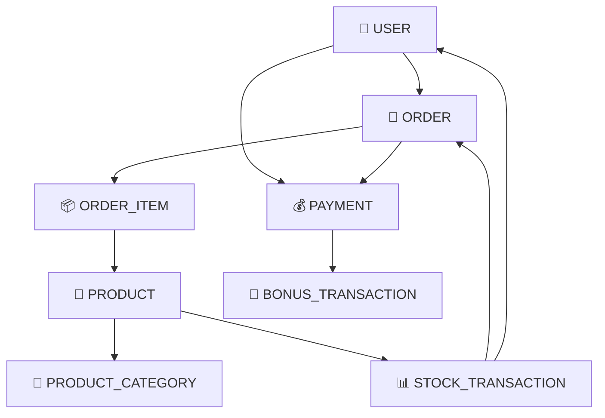
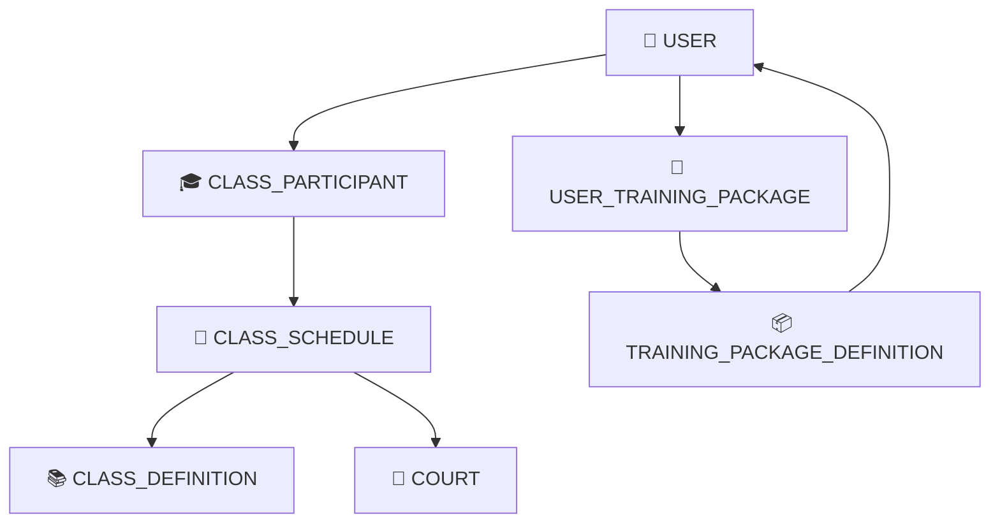
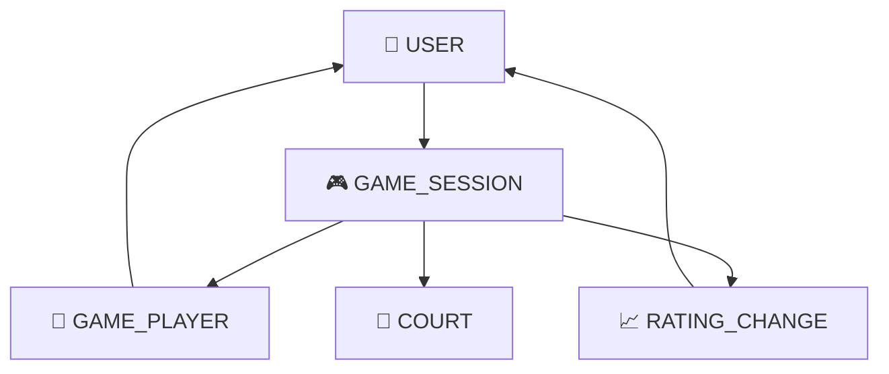
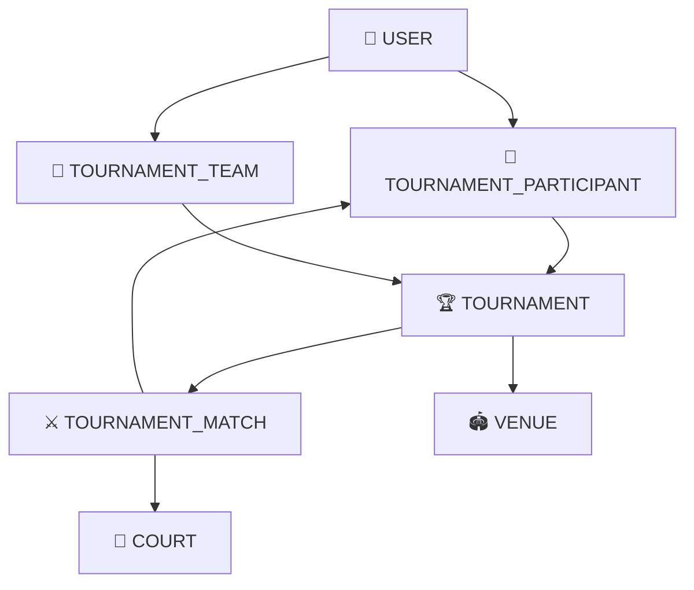
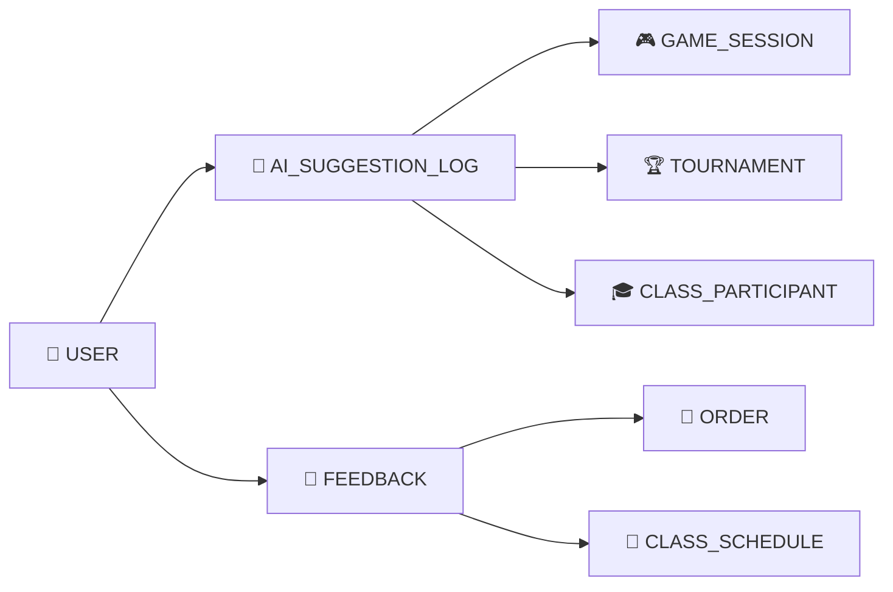
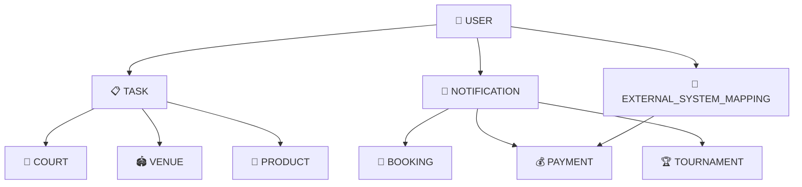

# 🧠 NEURAL NETWORK VISUALIZATION
## Полная Карта Связей Всех 31 Модели

## 🎯 **ЦЕНТРАЛЬНЫЙ НЕЙРОН - USER**

### 👥 **USER (Central Neuron)** - Связан со ВСЕМИ моделями:

```mermaid
graph TD
    USER[👥 USER - Central Neuron] --> BOOKING[📅 BOOKING]
    USER --> PAYMENT[💰 PAYMENT]
    USER --> GAME_SESSION[🎮 GAME_SESSION]
    USER --> TOURNAMENT_PARTICIPANT[🥇 TOURNAMENT_PARTICIPANT]
    USER --> CLASS_PARTICIPANT[🎓 CLASS_PARTICIPANT]
    USER --> USER_TRAINING_PACKAGE[🎯 USER_TRAINING_PACKAGE]
    USER --> ORDER[🛒 ORDER]
    USER --> FEEDBACK[💭 FEEDBACK]
    USER --> AI_SUGGESTION[🤖 AI_SUGGESTION_LOG]
    USER --> NOTIFICATION[🔔 NOTIFICATION]
    USER --> TASK[📋 TASK]
    USER --> EXTERNAL_SYSTEM[🔄 EXTERNAL_SYSTEM_MAPPING]
    USER --> USER_ACCOUNT_LINK[🔗 USER_ACCOUNT_LINK]
    USER --> VENUE[🏟️ VENUE]
    USER --> TOURNAMENT_TEAM[👥 TOURNAMENT_TEAM]
```



## 🔗 **ПОЛНАЯ КАРТА СВЯЗЕЙ ПО СЛОЯМ**

### 🔵 **CORE LAYER - Ядро Системы**



### 🟢 **BUSINESS LAYER - Бизнес Процессы**



### 💰 **FINANCIAL LAYER - Финансовые Потоки**



### 🎓 **EDUCATION LAYER - Образовательные Процессы**



### 🎮 **GAMING LAYER - Игровая Активность**



### 🏆 **TOURNAMENT LAYER - Турнирная Система**



### 🤖 **AI LAYER - Искусственный Интеллект**



### ⚙️ **SYSTEM LAYER - Системные Процессы**



## 🌐 **ПОЛНАЯ НЕЙРОННАЯ СЕТЬ - ВСЕ 31 МОДЕЛЬ**

```mermaid
graph TB
    %% ЦЕНТРАЛЬНЫЙ НЕЙРОН
    USER[👥 USER<br/>Central Neuron]
    
    %% CORE LAYER
    COURT[🎾 COURT<br/>Resource Node]
    VENUE[🏟️ VENUE<br/>Spatial Hub]
    
    %% BUSINESS LAYER
    BOOKING[📅 BOOKING<br/>Temporal Node]
    BOOKING_PARTICIPANT[👤 BOOKING_PARTICIPANT<br/>Relation Node]
    USER_ACCOUNT_LINK[🔗 USER_ACCOUNT_LINK<br/>Identity Node]
    
    %% FINANCIAL LAYER
    PAYMENT[💰 PAYMENT<br/>Transaction Node]
    BONUS_TRANSACTION[🎁 BONUS_TRANSACTION<br/>Reward Node]
    STOCK_TRANSACTION[📊 STOCK_TRANSACTION<br/>Inventory Node]
    ORDER[🛒 ORDER<br/>Commerce Node]
    ORDER_ITEM[📦 ORDER_ITEM<br/>Detail Node]
    PRODUCT[🎯 PRODUCT<br/>Catalog Node]
    PRODUCT_CATEGORY[📂 PRODUCT_CATEGORY<br/>Classification Node]
    
    %% EDUCATION LAYER
    CLASS_DEFINITION[📚 CLASS_DEFINITION<br/>Program Node]
    TRAINING_PACKAGE_DEFINITION[📦 TRAINING_PACKAGE_DEFINITION<br/>Package Node]
    CLASS_SCHEDULE[📅 CLASS_SCHEDULE<br/>Session Node]
    CLASS_PARTICIPANT[🎓 CLASS_PARTICIPANT<br/>Learning Node]
    USER_TRAINING_PACKAGE[🎯 USER_TRAINING_PACKAGE<br/>Progress Node]
    
    %% GAMING LAYER
    GAME_SESSION[🎮 GAME_SESSION<br/>Activity Node]
    GAME_PLAYER[🏓 GAME_PLAYER<br/>Participant Node]
    RATING_CHANGE[📈 RATING_CHANGE<br/>Performance Node]
    
    %% TOURNAMENT LAYER
    TOURNAMENT[🏆 TOURNAMENT<br/>Competition Node]
    TOURNAMENT_PARTICIPANT[🥇 TOURNAMENT_PARTICIPANT<br/>Competitor Node]
    TOURNAMENT_TEAM[👥 TOURNAMENT_TEAM<br/>Group Node]
    TOURNAMENT_MATCH[⚔️ TOURNAMENT_MATCH<br/>Event Node]
    
    %% AI LAYER
    AI_SUGGESTION_LOG[🤖 AI_SUGGESTION_LOG<br/>Intelligence Node]
    FEEDBACK[💭 FEEDBACK<br/>Quality Node]
    
    %% SYSTEM LAYER
    TASK[📋 TASK<br/>Operational Node]
    NOTIFICATION[🔔 NOTIFICATION<br/>Communication Node]
    EXTERNAL_SYSTEM_MAPPING[🔄 EXTERNAL_SYSTEM_MAPPING<br/>Integration Node]
    
    %% ОСНОВНЫЕ СВЯЗИ ОТ USER
    USER --> BOOKING
    USER --> PAYMENT
    USER --> ORDER
    USER --> GAME_SESSION
    USER --> TOURNAMENT_PARTICIPANT
    USER --> TOURNAMENT_TEAM
    USER --> CLASS_PARTICIPANT
    USER --> USER_TRAINING_PACKAGE
    USER --> FEEDBACK
    USER --> AI_SUGGESTION_LOG
    USER --> TASK
    USER --> NOTIFICATION
    USER --> EXTERNAL_SYSTEM_MAPPING
    USER --> USER_ACCOUNT_LINK
    USER --> VENUE
    
    %% CORE CONNECTIONS
    VENUE --> COURT
    COURT --> BOOKING
    COURT --> GAME_SESSION
    COURT --> TOURNAMENT_MATCH
    COURT --> CLASS_SCHEDULE
    
    %% BUSINESS CONNECTIONS
    BOOKING --> BOOKING_PARTICIPANT
    BOOKING_PARTICIPANT --> USER
    BOOKING --> PAYMENT
    
    %% FINANCIAL CONNECTIONS
    ORDER --> ORDER_ITEM
    ORDER_ITEM --> PRODUCT
    PRODUCT --> PRODUCT_CATEGORY
    PRODUCT --> STOCK_TRANSACTION
    ORDER --> PAYMENT
    PAYMENT --> BONUS_TRANSACTION
    STOCK_TRANSACTION --> ORDER
    
    %% EDUCATION CONNECTIONS
    CLASS_PARTICIPANT --> CLASS_SCHEDULE
    CLASS_SCHEDULE --> CLASS_DEFINITION
    CLASS_SCHEDULE --> COURT
    USER_TRAINING_PACKAGE --> TRAINING_PACKAGE_DEFINITION
    
    %% GAMING CONNECTIONS
    GAME_SESSION --> GAME_PLAYER
    GAME_PLAYER --> USER
    GAME_SESSION --> RATING_CHANGE
    RATING_CHANGE --> USER
    
    %% TOURNAMENT CONNECTIONS
    TOURNAMENT_PARTICIPANT --> TOURNAMENT
    TOURNAMENT_TEAM --> TOURNAMENT
    TOURNAMENT --> TOURNAMENT_MATCH
    TOURNAMENT_MATCH --> TOURNAMENT_PARTICIPANT
    TOURNAMENT_MATCH --> COURT
    TOURNAMENT --> VENUE
    
    %% AI CONNECTIONS
    AI_SUGGESTION_LOG --> GAME_SESSION
    AI_SUGGESTION_LOG --> TOURNAMENT
    AI_SUGGESTION_LOG --> CLASS_PARTICIPANT
    FEEDBACK --> ORDER
    FEEDBACK --> CLASS_SCHEDULE
    
    %% SYSTEM CONNECTIONS
    TASK --> COURT
    TASK --> VENUE
    TASK --> PRODUCT
    NOTIFICATION --> BOOKING
    NOTIFICATION --> PAYMENT
    NOTIFICATION --> TOURNAMENT
    EXTERNAL_SYSTEM_MAPPING --> PAYMENT
```



## 📊 **СТАТИСТИКА СВЯЗЕЙ**

### 🎯 **Связность по Моделям**
| Модель | Входящие связи | Исходящие связи | Общая связность |
|--------|----------------|-----------------|-----------------|
| **USER** | 0 | 31 | **МАКСИМАЛЬНАЯ** |
| **BOOKING** | 3 | 4 | Высокая |
| **PAYMENT** | 4 | 3 | Высокая |
| **COURT** | 2 | 5 | Высокая |
| **TOURNAMENT** | 3 | 3 | Средняя |
| **PRODUCT** | 2 | 3 | Средняя |
| **GAME_SESSION** | 2 | 3 | Средняя |
| **Остальные** | 1-2 | 1-2 | Базовая |

### 🌟 **Центральность Узлов**
1. **USER** - Центральный нейрон (связан со всеми)
2. **BOOKING** - Основной бизнес-процесс
3. **PAYMENT** - Финансовый хаб
4. **COURT** - Ресурсный центр
5. **TOURNAMENT** - Событийный центр

## 🔄 **ЦИКЛЫ СВЯЗНОСТИ**

### 💰 **Финансовый Цикл**
```
USER → ORDER → ORDER_ITEM → PRODUCT → STOCK_TRANSACTION → PAYMENT → BONUS_TRANSACTION → USER
```

### 🎓 **Образовательный Цикл**
```
USER → CLASS_PARTICIPANT → CLASS_SCHEDULE → CLASS_DEFINITION → TRAINING_PACKAGE_DEFINITION → USER_TRAINING_PACKAGE → USER
```

### 🏆 **Турнирный Цикл**
```
USER → TOURNAMENT_PARTICIPANT → TOURNAMENT → TOURNAMENT_MATCH → RATING_CHANGE → AI_SUGGESTION_LOG → USER
```

### 🎮 **Игровой Цикл**
```
USER → GAME_SESSION → GAME_PLAYER → RATING_CHANGE → FEEDBACK → AI_SUGGESTION_LOG → USER
```

## ✅ **ПРОВЕРКА СВЯЗНОСТИ**

### 🎯 **Все 31 модель связаны через:**
1. **Прямые связи с USER** (центральный нейрон)
2. **Межслойные связи** (между различными слоями)
3. **Внутрислойные связи** (внутри одного слоя)
4. **Циклические связи** (замкнутые циклы)

### 🔗 **Нет изолированных узлов:**
- Каждая модель имеет минимум 2 связи
- Все модели достижимы от USER
- Все модели участвуют в бизнес-процессах
- Полная интеграция данных

---

*🧠 Единая Нейронная Сеть - Каждый Узел Важен*
*🏝️ Phangan Padel Tennis Club - Complete Neural Architecture*
